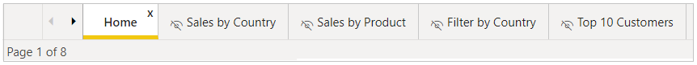
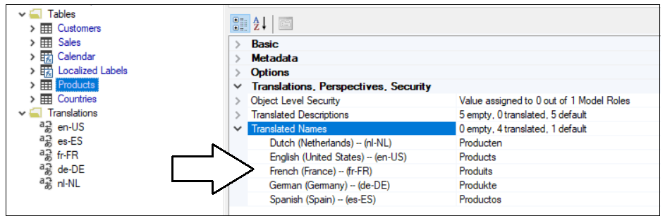
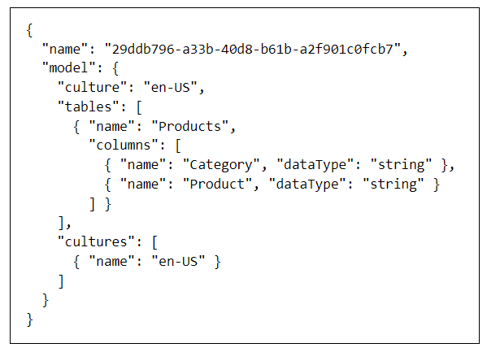
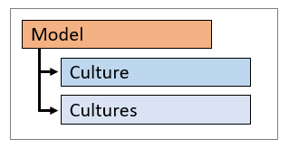
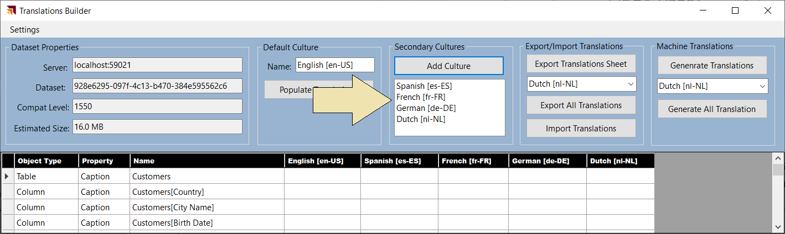

# Building Multi-language Reports in Power BI

Power BI provides Internationalization and localization features which
make it possible to build multi-language reports. For example, you can
design a Power BI report that renders in English for some users while
rendering in Spanish, French, German or Dutch for other users. If a
company or organization has the requirement of building Power BI reports
that support multiple languages, it's no longer necessary to clone and
maintain a separate PBIX project file for each language. Instead, they
can increase reuse and lower report maintenance by designing and
implementing multi-language reports.

Updated: July 27, 2021  
Ted Pattison  
Power BI Customer Advisory Team (PBICAT)

# Contents

[Building Multi-language Reports in Power BI
[1](#building-multi-language-reports-in-power-bi)](#building-multi-language-reports-in-power-bi)

[Overview of Multi-language Report Development
[2](#overview-of-multi-language-report-development)](#overview-of-multi-language-report-development)

[Metadata Translations versus Data Translations
[3](#metadata-translations-versus-data-translations)](#metadata-translations-versus-data-translations)

[The Multi-language Report Development Process
[3](#the-multi-language-report-development-process)](#the-multi-language-report-development-process)

[The ProductSales.pbix Developer Sample
[4](#the-productsales.pbix-developer-sample)](#the-productsales.pbix-developer-sample)

[Prepare Datasets and Reports for Localization
[7](#prepare-datasets-and-reports-for-localization)](#prepare-datasets-and-reports-for-localization)

[Avoid Report Design Techniques that Do Not Support Localization
[7](#avoid-report-design-techniques-that-do-not-support-localization)](#avoid-report-design-techniques-that-do-not-support-localization)

[Create the Localized Labels Table
[8](#create-the-localized-labels-table)](#create-the-localized-labels-table)

[Display Localized Labels using Power BI Core Visuals
[9](#display-localized-labels-using-power-bi-core-visuals)](#display-localized-labels-using-power-bi-core-visuals)

[Display Localized Labels using a Custom Visual
[10](#display-localized-labels-using-a-custom-visual)](#display-localized-labels-using-a-custom-visual)

[Add Support for Page Navigation
[12](#add-support-for-page-navigation)](#add-support-for-page-navigation)

[Add Metadata Translations to a Dataset Definition
[13](#add-metadata-translations-to-a-dataset-definition)](#add-metadata-translations-to-a-dataset-definition)

[Install the Tabular Editor
[14](#install-the-tabular-editor)](#install-the-tabular-editor)

[Add Metadata Translations by Hand using Tabular Editor
[14](#add-metadata-translations-by-hand-using-tabular-editor)](#add-metadata-translations-by-hand-using-tabular-editor)

[Save a Dataset Definition as a BIM File
[16](#save-a-dataset-definition-as-a-bim-file)](#save-a-dataset-definition-as-a-bim-file)

[Program with Advanced Scripting in Tabular Editor
[19](#program-with-advanced-scripting-in-tabular-editor)](#program-with-advanced-scripting-in-tabular-editor)

[Create an External Tool for Adding Metadata Translations
[22](#create-an-external-tool-for-adding-metadata-translations)](#create-an-external-tool-for-adding-metadata-translations)

[The TranslationsBuilder External Tool Developer Sample
[22](#the-translationsbuilder-external-tool-developer-sample)](#the-translationsbuilder-external-tool-developer-sample)

[Program with TOM in an External Tool
[24](#program-with-tom-in-an-external-tool)](#program-with-tom-in-an-external-tool)

[Use Annotations to Store Custom Property Values
[27](#use-annotations-to-store-custom-property-values)](#use-annotations-to-store-custom-property-values)

[Add Secondary Cultures to a Dataset
[30](#add-secondary-cultures-to-a-dataset)](#add-secondary-cultures-to-a-dataset)

[Add Metadata Translations to a Dataset Object
[31](#add-metadata-translations-to-a-dataset-object)](#add-metadata-translations-to-a-dataset-object)

[Generate Machine Translations using Azure Translator Service
[33](#generate-machine-translations-using-azure-translator-service)](#generate-machine-translations-using-azure-translator-service)

[Enable Human Workflows for Translation using Export and Import
[36](#enable-human-workflows-for-translation-using-export-and-import)](#enable-human-workflows-for-translation-using-export-and-import)

[Embed Power BI Reports with Specific Languages and Locales
[38](#embed-power-bi-reports-with-specific-languages-and-locales)](#embed-power-bi-reports-with-specific-languages-and-locales)

[Design and Implement a Data Translations Strategy
[39](#design-and-implement-a-data-translations-strategy)](#design-and-implement-a-data-translations-strategy)

[Determine Whether Your Solution Requires Data Translations
[39](#determine-whether-your-solution-requires-data-translations)](#determine-whether-your-solution-requires-data-translations)

[Modify the Dataset Design to Support Data Translations
[40](#modify-the-dataset-design-to-support-data-translations)](#modify-the-dataset-design-to-support-data-translations)

[Use Power Query to Generate Data Translations Rows
[41](#use-power-query-to-generate-data-translations-rows)](#use-power-query-to-generate-data-translations-rows)

[Load Reports using Bookmarks to Filter Data Translations
[46](#load-reports-using-bookmarks-to-filter-data-translations)](#load-reports-using-bookmarks-to-filter-data-translations)

[Setting the Language for Current User using RLS and UserCulture
[47](#setting-the-language-for-current-user-using-rls-and-userculture)](#setting-the-language-for-current-user-using-rls-and-userculture)

[Summary [49](#summary)](#summary)

## Overview of Multi-language Report Development

Power BI provides the features required to design and implement
multi-language reports. However, the path to success is not overly
intuitive. The purpose of this article is to explain how to use the
Power BI features for Internationalization and localization from the
ground up and to provide guidance for building reports that support
multiple languages.

The primary feature in Power BI used to build multi-language reports is
known as **metadata translations**. Power BI inherited this feature from
its predecessor, Analysis Services, which introduced metadata
translations to add localization support to the data model associated
with a tabular database or a multidimensional database. In Power BI,
metadata translations support has been integrated at the dataset level.

A metadata translation represents the property for a dataset object
that's been translated for a specific language. Consider a simple
example. If your dataset contains a table with an English name of
**Products**, you can add translations for the **Caption** property of
this table object to provide alternative names for when the report is
rendered in a different language. The types of dataset objects that
support metadata translations include **Table**, **Column**,
**Measure**, **Hierarchy** and **Level**. In addition to the **Caption**
property which tracks an object's display name, dataset objects also
support adding metadata translations for two other properties which are
**Description** and **DisplayFolder**.

Keep in mind that the Power BI support for metadata translations only
applies to dataset objects. Power BI does not support adding
translations for text values stored as part of the report layout.

Think about a common scenario where you add a textbox or a button to a
Power BI report and then you type in literal text for a string value
displayed to the user. That text value is stored in the report layout
and cannot be localized. Therefore, you must avoid using textboxes and
buttons that include literal text when designing multi-language reports.
As a second example, page tabs in a Power BI report are also problematic
because their display names cannot be localized. Therefore, you must
design multi-language reports so that page tabs are never displayed to
the user.

A little later in this article you learn about the nitty-gritty details
of building multi-language reports in Power BI Desktop. At this point,
however, it's possible to make a high-level observation. For someone
experienced with report building in Power BI Desktop, the challenge of
learning how to build multi-language reports isn't as much about
learning ***what to do*** but more about learning ***what not to do***.
There are lots of popular Power BI report design techniques that cannot
be localized and therefore cannot be used when building multi-language
reports.

Before you dive into the details of building multi-language report,
there are two important issues to consider. These issues are important
because they could become serious showstoppers if you are attempting to
follow the guidance in this article. The first issue is that
multi-language reports must run in a dedicated capacity. That means you
must be working with either Power BI Premium or the Power BI Embedded
service in Microsoft Azure. Multi-language reports will not work
correctly when loaded into a Power BI workspace in the shared capacity.

The second issue is that Power BI Apps don't support localization and
can't be used to distribute multi-language reports. That means you will
have to find an alternative approach to making multi-language reports
accessible to users. This isn't a problem in a PaaS scenario when you're
developing with Power BI embedding. In a SaaS scenario where licensed
users are accessing reports using the Power BI Service, you can use an
alternative to Power BI Apps such as report sharing, direct workspace
access or secure embed.

### Metadata Translations versus Data Translations

Metadata translations are used to localize the text for dataset object
property values such as the names of tables, columns and measures. While
metadata translations help to localize the names of tables and columns,
they don't offer any assistance when it comes to localizing text values
in the data itself. If your dataset has a **Products** table, how do you
localize the text-based product names that exist in the individual rows
of the **Products** table?

While adding metadata translations to your dataset is an essential first
step, it doesn't always provide a complete solution by itself. A
complete solution might require going further to localize the text-based
content stored in table rows such as product names, product categories
and country names. In certain reporting scenarios, the use of metadata
translations must be complimented by a dataset schema designed to
support **data translations**.

While every multi-language report will require metadata translations,
it's is not as clear whether they will also require data translations.
Some projects will require data translations while other projects will
not. The final section of this article examines the important issues to
consider when deciding whether to take on the extra work to implement
data translations. This article waits until the end to discuss data
translations because it is something that will not be required in every
multi-language reporting project.

### The Multi-language Report Development Process

Now that you understand high-level concepts of building multi-language
reports, it's time to move forward and discuss the multi-language report
development process. The first step here is to decide how to package
your dataset definitions and report layouts for distribution. Let's
examine three popular approaches that are commonly used by Power BI
customers.

In the first approach, the goal is to keep things simple by creating a
single PBIX project file which contains both a dataset definition and a
report layout. You can easily deploy this solution by importing the PBIX
project file into a Power BI workspace. If you need to update the
dataset definition or the report layout after they have been deployed,
you can perform an upgrade operation by importing an updated version of
the PBIX project file.

The single PBIX file approach doesn't always provide the flexibility you
need. Imagine a scenario where one team is responsible for creating and
updating dataset definitions while other teams are responsible for
building reports. For a scenario like this, it makes sense to split out
dataset definitions and report layouts into separate PBIX project files.

To use the shared dataset approach, you create one PBIX project file
with a dataset definition and an empty report which remains unused. Once
this dataset has been deployed to the Power BI Service, report builders
can connect to it using Power BI Desktop to create report-only PBIX
files. This makes it possible for the teams building reports to build
PBIX project files with report layouts which can be deployed and updated
independently of the underlying dataset.

While many customers use Power BI Desktop to create and maintain Power
BI dataset definitions, it's not the only option. There is an
alternative approach which makes it possible to take advantage of
advanced data modeling features not available through Power BI Desktop.
For example, you can use the Tabular Editor to create and maintain
dataset definitions which can be saved in a JSON-file format with a .BIM
extension as shown in the following diagram.

From the perspective of adding multi-language support to a Power BI
solution, it really doesn't matter which of these three approaches you
choose. The techniques and disciplines used to build multi-language
reports remain the same whether you decide to build your solution using
a single PBIX project file or with a combination of PBIX project files
and a BIM dataset definition file. There are specific tasks you need to
perform at the dataset level and other tasks you must perform when
building report layouts in Power BI Desktop.

The multi-language report development process can be broken down into a
few distinct phases. Each of these phases will be examined in detail in
this article.

1.  Add the **Localized Labels** table to the dataset definition

2.  Prepare the report layouts for localization

3.  Add metadata translations to the dataset definition

4.  Design and implement a data translations strategy (if required)

### The ProductSales.pbix Developer Sample

This article is accompanied by a developer sample based on a single PBIX
file solution named **ProductSales.pbix**. This developer sample
demonstrates building a multi-language report for Power BI which
supports English, Spanish, French, German and Dutch. The PBIX project
files for this developer solution and all the supporting resources used
to build them are available to download or to view online from a GitHub
repository at the following URL:

<https://github.com/PowerBiDevCamp/Multilanguage-Reports>

If you navigate to the home page for this GitHub repository, you will
see several top-level folders.

This GitHub repository provides a [PBIX
folder](https://github.com/PowerBiDevCamp/Multilanguage-Reports/tree/main/PBIX)
which contains several different versions of the **ProductSales.pbix**
project file so you can see how the PBIX project looks at various stages
of the multi-language report development process. This GitHub repository
also contains a few other development projects including a Power BI
custom visual named
[**LocalizedLabel**](https://github.com/PowerBiDevCamp/Multilanguage-Reports/tree/main/CustomVisuals/localizedLabel)
and a .NET application named
[**TranslationsBuilder**](https://github.com/PowerBiDevCamp/Multilanguage-Reports/tree/main/TranslationsBuilder)
which demonstrates how to create an external tool which can be used
alongside Power BI Desktop to automate the process of adding and
updating metadata translations.

While the **ProductSales.pbix** developer sample is based on a single
PBIX project file approach, you should be able to use the exact same
concepts and techniques to build multi-language reports in scenarios
where your solution contains multiple PBIX files and optionally a
dataset definition maintained using a BIM file.

In addition to the project files and resources available in the GitHub
repository, this developer sample also includes a live version which
allows you to experience the completed multi-language report in action.

<https://multilanguagereportdemo.azurewebsites.net>

If you navigate to the live version of the report in a browser, you will
see the completed solution for **ProductSales.pbix** displayed using
it's default language of English. There are buttons in the left-hand
navigation with captions such as **Home**, **Sales by Country** and
**Sales by Product** which make it possible for the user to navigate
from page to page. Experiment by clicking the buttons in the left-hand
navigation to move form page to page.

At the top of the web page above the embedded report, you will see a set
of radio buttons that allow you to reload the report using a different
language including Spanish, French, German and Dutch.

Experiment by clicking these radio buttons to load the report using
different langauges. For example, click on the radio button with the
caption of **German**. When you do, there is JavaScript behind this page
that responds by reloading the report using the language of German
intead of English. You can see that all the button captions in the
left-hand navigation and text-based values in the visuals on the page
now display their German translations instead of English.

When creating a report for Power BI, it's a common practice to add
text-based labels for report elements such as titles, headings and
button captions. However, this creates an unexpected bump in the road
when building multi-language reports in Power BI Desktop. The problem is
that you cannot create labels for a report using the standard approach
where you add textboxes and buttons to the report. That's because any
text you add for a property value of a textbox or a button is stored in
the report layout and, therefore, cannot be localized.

As discussed earlier in this article, the Power BI localization features
are supported at the dataset definition level but not at the report
layout level. At first you might ask the question ***how can I localize
text-based values that are not stored inside the dataset definition?***
The answer to this question is that you cannot.

A better question to ask is ***how can I add the text-based values for
labels so they become part of the dataset definition?*** Once the
text-based values for labels become part of the dataset definition, then
they can be localized. This leads to an innovative approach of creating
the **Localized Labels** table. This design technique will be discussed
in detail in the next section of this article.

The **ProductSales.pbix** developer sample demonstrates how to implement
localized labels in the left navigation menu. The following screenshot
shows the how button captions are translated when loaded with five
different languages including English, Spanish, French, German and
Dutch.

The **ProductSales.pbix** developer sample also demonstrates how to
implement data translations. With metadata translations, you can see the
names of columns and measures change as you switch between languages.
Data translations go further to localize the product names in rows of
the **Products** table. The following screenshot shows how the
**ProductSales.pbix** developer sample provides data translations for
product names as well.

## Prepare Datasets and Reports for Localization

So far you've learned about essential concepts and background
information you'll need to build multi-language reports. Now, it's time
to move ahead and discuss the actual development process. We'll start by
discussing a few general topics associated with software localization.
After that, we'll move on to topics that are specific to Power BI and
designing reports in Power BI Desktop.

When it comes to localizing software, there are some universal
principals to keep in mind. The first is to plan for localization from
the start of any project. It's significantly harder to add localization
support to an existing dataset or report that was initially built
without any regard for Internationalization or localization. This is
especially true with Power BI reports because there are so many popular
design techniques that do not support localization. You might find that
much of the work for adding localization support to existing Power BI
reports involves moving backward and undoing the things that do not
support localization before you can move forward with design techniques
that do support localization.

Another important concept in localization is to plan for growth. A label
that's 400 pixels wide when displayed in English could require a much
greater width when translated into another language. If you optimize the
width of your labels for text in English, you might find that
translations in other languages introduce unexpected line breaks or get
cut off which, in turn, creates a compromised user experience.

Adding a healthy degree of padding to localized labels is the norm when
developing Internationalized software and it's essential that you test
your reports with each language you plan to support. In essence, you
need to ensure your report layouts looks the way you expect with any
language you have chosen to support.

### Avoid Report Design Techniques that Do Not Support Localization

If you have experience with Power BI Desktop, it's critical that you
learn which report design techniques to avoid when you begin building
multi-language reports. Let's begin with the obvious things which cause
problems due to a lack of localization support.

- Using textboxes or buttons with literal text

- Adding literal text for the title of a visual

- Displaying page tabs to the user

The key point here is that any literal text that gets added to the
report layout cannot be localized. Consider the case where you add a
column chart to your report. By default, a Cartesian visual such as a
column chart is assigned a dynamic value to its **Title** property which
is parsed together using the names of the columns and measures that have
been added into the data roles such of **Axis**, **Legend** and
**Values**.

There is good news here. The default **Title** property for a Cartesian
visual is dynamically parsed together in a fashion that supports
localization. As long as you supply metadata translations for the names
of columns and measures in the underlying dataset definition (e.g.
**Sales Revenue**, **Country** and **Year**), the **Title** property of
the visual will use the translations for whatever language has been used
to load the report. The following table shows how the default **Title**
property of this visual is updated for each language supported by the
**ProductSales.pbix** developer sample.

| Language        | Visual Title                         |
|-----------------|--------------------------------------|
| English (en-US) | Sales Revenue by Country and Year    |
| Spanish (es-ES) | Ingresos por ventas por país y año   |
| French (fr-FR)  | Chiffre d’affaires par pays et année |
| German (de-DE)  | Umsatz nach Land und Jahr            |
| Dutch (nl-NL)   | Omzet per land en jaar               |

Even if you don’t like the dynamically-generated visual **Title**, you
must resist the temptation to replace it with a literal text value. Any
literal text you type into the **Title** property of the visual will be
added to the report layout and cannot be localized. Therefore, you
should either leave the visual **Title** property with its default value
or hide the title so it is not displayed.

### Create the Localized Labels Table

When designing reports, it's a common practice to use text-based labels
for report elements such as titles, headings and button captions. You've
learned that any text value stored in a report layout cannot be
localized. If you want to localize the text-based labels which are
displayed on a Power BI report, then those labels must be defined inside
the dataset. This leads to the innovative technique of creating a
specialized table in the dataset definition for localized labels.

The idea behind the **Localized Labels** table is pretty simple. You can
localize the name of any measure inside a dataset. When you need a text
label for a report title, you can add a new measure to the **Localized
Labels** table and then give the measure a name for the English label
such as **European Sales Report**. Since the label is a measure name,
you can add metadata translations to supply a localized version of this
label for each language.

There are several different techniques that can be used in Power BI
Desktop to create a new table for localized labels. One quick way to
accomplish this is to click on the **New table** button on the **Table
tools** tab and then add a DAX expressions with the **DATATABLE**
function to create a new table named **Localized Labels**.

Below is the full DAX expressions that creates the **Localized Label**
table. The **DATATABLE** function requires that you create a least one
column. Therefore the table is created with a single column named
**z_ignore** which can be hidden from report view.

Localized Labels = DATATABLE("z_ignore", STRING, {{}})

Once you have created the **Localized Labels** table, you can begin to
add new measures just as you would in any other Power BI Desktop
project.

When creating a measure for a localized label, you can add the label
text as the measure name and then set the DAX expression for this
measure to a static value of **0**. This value of **0** has no
significance and is only added because each measure must be created with
a DAX expression.

The **ProductSales.pbix** developer sample demonstrates creating a
**Localized Labels** table to provide a set of localized labels for all
titles, headings and button captions used throughout the report.

Now that you've seen how to create the **Localized Labels** table, it's
time to move ahead and learn how to surface the measure name for a
localized label on a Power BI report.

### Display Localized Labels using Power BI Core Visuals

The technique used to display measure names from the **Localized
Labels** table in a Power BI report is neither straightforward nor
intuitive. You can start by adding a Cartesian visual such as the
Stacked Barchart visual to a page and then adding the measure for the
desired localized label into the **Values** data role. After that, you
can adjust the visual's width and height so only the visual **Title**
property can be seen by the user.

After you have added the visual to a report page to display a localized
label, you can adjust the font formatting for the label in the **Title**
section of the **Format** pane as shown in the following screenshot.

In summary, you can use one of the Power BI core visuals such as the
Stacked Barchart to display localized labels for titles, headings and
button captions. However, most report authors find that the design
experience is pretty limited when formatting a localized label using any
of the Power BI core visuals. For example, you cannot configure padding
for the label or center its text vertically. In the next section, we
will discuss creating a custom visual to provide a better design
experience for formatting the display of localized labels on a Power BI
report.

### Display Localized Labels using a Custom Visual

The previous section discussed using a Stacked Barchart visual to
display a localized label. While this technique can be used reliably to
create multi-language reports, it is clear that none of the Power BI
core visuals were designed to support this scenario. The reason this
technique works is really a more of a coincidence than a planned
outcome. Furthermore, there is extra overhead due to the visual
implementation being designed to do far more then just display a title.
These issues combine together to provide a motivation to create a custom
visual project that is explicitly designed to support the scenario of
displaying localized labels in a multi-language report.

The **Multilanguage-Reports** GitHub repository contains a
[CustomVisuals](https://github.com/PowerBiDevCamp/Multilanguage-Reports/tree/main/CustomVisuals/localizedLabel)
folder. Inside the **CustomVisuals** folder, there is a child folder
with a custom visual project named
[**localizedLabel**](https://github.com/PowerBiDevCamp/Multilanguage-Reports/tree/main/CustomVisuals/localizedLabel).
If you have experience with custom visual development, you can open the
[localizedLabel project source
code](https://github.com/PowerBiDevCamp/Multilanguage-Reports/blob/main/CustomVisuals/localizedLabel/src/visual.ts#L33)
in Visual Studio Code to see how this custom visual is implemented. The
**CustomVisuals** folder also contains a custom visual distribution file
for the **localizedLabel** project named
[localizedLabe.1.0.0.pbiviz](https://github.com/PowerBiDevCamp/Multilanguage-Reports/raw/main/CustomVisuals/localizedLabel.1.0.0.pbiviz).
You can import this custom visual distribution file directly into a
Power BI Desktop project to begin using this custom visual to display
localized labels.

Once you have imported the custom visual distribution file named
[localizedLabe.1.0.0.pbiviz](https://github.com/PowerBiDevCamp/Multilanguage-Reports/raw/main/CustomVisuals/localizedLabel.1.0.0.pbiviz)
into a Power BI Desktop project, you should be able to begin using it.
After you have added an instance of the **Localized Label** visual to a
report, you can then populate the **Localized Label** data role using
one of the measures in the **Localized Labels** table as shown in the
following screenshot.

After you have configured the **Localized Label** data role with a
measure from the **Localized Labels** table, you can then configure the
font and background formatting of the visual in the **Label Properties**
section of the Format Pane.

### Add Support for Page Navigation

As you recall, you cannot display Power BI report page tabs to the user
in a multi-language report because page tabs do not support
localization. Therefore, you must provide some other means for users to
navigate from page to page. This can be accomplished using a design
technique where you add shapes to a report which act as buttons. When
the user clicks on a shape, the shape will apply a bookmark to navigate
to another page. Let's step through the process of building a navigation
menu that supports localization using measures from the **Localized
Labels** table.

The first thing you need to do is to hide every page in the report
except for the first page which acts as the landing page.

Next, create a set of bookmarks. Each bookmark should be created to
navigate to a specific page. The **ProductSales.pbix** developer sample
demonstrates this technique by adding a bookmark for each page supported
by the navigation menu.

Remember, that you cannot add a button with literal text to a
multi-language report. Instead, you must be a bit more creative and use
a technique that supports localizing button captions. This can be
accomplished by using a shape which is overlaid on top of a localized
label visual. The shape should be configured as completely transparent
without a border or any background color. The shape should also be
configured with an action to trigger one of the bookmarks.

From a design perspective, the user sees the localized label with the
button caption but does not see the shape. When the user clicks on the
localized label visual, the invisible shape on top acts as a button and
responds to the user’s click action by applying a bookmark to navigate
to the target page.

At this point, you've learned how to create the **Localized Labels**
table in a dataset and you've learned how to prepare a Power BI report
for localization. These are the localization techniques you will
continue to use as you create and maintain reports that must support
multiple languages. Now it's time to move on and examine the topic of
extending a Power BI dataset with metadata translations. Once you learn
to do this, you can then add support for whatever languages you need in
your multi-language reporting solutions.

## Add Metadata Translations to a Dataset Definition

The previous section discussed how to prepare Power BI datasets and
reports for localization. In this section we'll discuss how to extend a
dataset definition by adding metadata translations. This is a task you
can accomplish by hand using an external tool named **Tabular Editor**.
Alternatively, you can write custom code to automate the process of
adding metadata translations to Power BI datasets using the **Tabular
Object Model (TOM)**. With either approach you can work directly on a
PBIX project file that is open in Power BI Desktop. You also have the
flexibility to work with datasets defined in BIM files or live datasets
running in Azure Analysis Services (AAS) or the Power BI Service.

While Power BI Desktop doesn't offer direct support for adding and
managing metadata translations, it is still often used in the
multi-language report development process. Once you've opened a PBIX
project file in Power BI Desktop, the dataset defined inside is loaded
into memory and becomes accessible to both the Tabular Editor and to
custom code you write for an external tool using TOM.

While the Tabular Editor and external tools you develop using TOM can
update a dataset loaded into memory in a session of Power BI Desktop,
they do not have the ability to actually save their changes to the
underlying PBIX file. After you have updated a dataset using Tabular
Editor or custom code in an external tool, you will need to return to
Power BI Desktop and invoke the **Save** command so your changes are
actually persisted into the underlying PBIX project file. If you close
the PBIX project file session in Power BI Desktop without saving, all
your changes will be discarded.

This preceding diagram shows how you can add metadata translations to a
dataset loaded into Power BI Desktop. This works well in a scenario
where you're building a PBIX project file and preparing to distribute it
for the first time. However, You should also understand that it's also
possible to access a Power BI dataset directly in the Power BI Service.
That means you can connect to a production dataset and manage its
metadata translations using the exact same techniques as shown in the
following diagram.

Access to a Power BI dataset running in the Power BI Service is routed
through the XMLA endpoint which requires that the hosting workspace is
in a dedicated capacity. In other words, you must ensure your workspace
has a diamond when viewed in the Power BI Service. This requirement can
be met with either Power BI Premium, Power BI Premium Per User or one of
the A SKUs for the Power BI Embedded Service in Microsoft Azure.

### Install the Tabular Editor

If you plan to work with metadata translations, you should become
familiar with the Tabular Editor. Even if your plan is to eventually
write your own custom code to manage translations, working with the
Tabular Editor is a great way to get started as you begin to learn how
translations are stored within the metadata for a Power BI dataset
definition. You can download the open source version of Tabular Editor
(version 2) for free from the web page at following URL:

<https://github.com/otykier/TabularEditor>

The Tabular Editor provides first-class support for managing dataset
translations. However, this is just one of the many areas in which this
tool shines. In addition to its metadata translations support, Tabular
Editor provides a comprehensive toolset for advanced data modeling that
go far beyond the data modeling support available in Power BI Desktop.
Tabular Editor is currently recognized by industry experts as the
premiere tool for building and optimizing large-scale Power BI datasets.

The Tabular Editor was created and continues to be maintained by a
talented developer in the Power BI community named Daniel Otykier. While
the open source version of Tabular Editor is available for free, Daniel
has recently introduced Tabular Editor version 3 which is based on a
paid licensing model. This article will cover using the free version of
Tabular Editor which provides support to add and manage metadata
translations. You must purchase Tabular Editor version 3 to take
advantage of the newer advanced data modeling and dataset management
features not available in the free version. You can get more info about
Tabular Editor version 3 at <https://tabulareditor.com>.

After you've installed Tabular Editor, Power BI Desktop displays a tile
to launch it on the **External Tools** tab in the ribbon. Clicking on
the **Tabular Editor** tile in Power BI Desktop will launch Tabular
Editor and automatically open the dataset definition for the current
PBIX project file.

### Add Metadata Translations by Hand using Tabular Editor

The Tabular Editor provides an advanced user experience for viewing and
modifying dataset objects such as tables, columns and measures. If you
expand the **Tables** node in the left navigation, you can select a
dataset object and then view its properties in a property sheet on the
right. The following screenshot demonstrates selecting a calculated
table named **Calendar** in the **ProductSales.pbix** developer sample.
Once you've selected a dataset object, you can view or modify any of its
properties including the DAX expression used to create the calculated
table.

Underneath the **Tables** node in the Tabular Editor, there is another
top-level node named **Translations**. This node contains all the
**Culture** objects which have been added to the current dataset
definition. By default, every new dataset definition contains a single
**Culture** object based on a default language and a default locale. The
**ProductSales.pbix** developer sample has default **Culture** object
based on **English (en)** as its language and the **United States (US)**
as its locale. That's why this default culture is tagged with an
identifier of **en-US**.

If you examine the property sheet in the Tabular Editor for a dataset
object, you will see there is a **Translated Names** section which
tracks the value of the **Caption** property. In a new dataset
definition, the default **Culture** object will be empty and contain no
metadata translations. If you want to add metadata translations
manually, you can copy the **Name** of a dataset object and then paste
that text value into the default Culture in the **Translated Names**
section.

To add support for secondary languages, you must add one or more new
**Culture** objects to the dataset definition. This task can be
accomplished by right-clicking the **Translations** node and selecting
the **New Translation** menu command.

When you invoke the **New Translation** command, you'll be prompted with
the **Select Culture** dialog which makes it possible to find and add a
new **Culture** object for a specific language and locale.

The dataset for **ProductSales.pbix** has been extended with four
**Culture** objects to add metadata translation support for four
secondary languages including Spanish (es-ES), French (fr-FR), German
(de-DE) and Dutch (nl-NL).

Once you have added a **Culture** object for each language you need to
support, the **Translated Names** section of the property sheet for each
dataset object will provide the ability to add a new translation for
each language. The following screenshot shows how the metadata
translations have been added to supply translated names for the
**Products** table.

The **ProductSales.pbix** developer sample also contains translations
for all the measures in the **Localized Labels** table.

### Save a Dataset Definition as a BIM File

The Tabular Editor provides a **Save As** command which can be used to
save the current dataset definition in a JSON file format. By
convention, a JSON file with a tabular dataset definition is created
with a **\*.BIM** extension. You can build up your understanding of how
translations work by saving a dataset definition as a **BIM** file and
then inspecting the JSON inside. Let's begin by examining the JSON for a
simple a dataset definition which contains a table with two columns.

The previous screenshot shows a dataset definition with a default
culture of **en-US**. However, the default **Culture** object is created
in an empty state without no metadata translations inside. You must
populate the default **Culture** object with metadata translations
yourself. This can be done either by hand or by writing code to automate
the process. Once you have populated the default **Culture** object with
metadata translations, they are tracked on an object-by-object basis in
the **tables** collection using the **translatedCaption** property as
shown in the following JSON code listing.

As you begin to add translations for other languages, they're tracked in
a similar fashion in a separate **Culture** object.

Think about what happens when you add metadata translations by hand in
Tabular Editor. Behind the scenes, Tabular Editor adds metadata
translations by populating **Culture** objects in the dataset
definition.

Tabular Editor supports exporting and importing translations using a
JSON file format. This can be a useful feature when you need to
integrate human translators into the multi-language report development
process. Imagine a scenario where you have just finished creating a
dataset in Power BI Desktop by adding the tables, columns and measures.
Next, you can open the dataset definition in Tabular Editor and populate
the metadata translations for default Culture. After that, you can
export the translations in a JSON file formatting using the **Export
Translations…** menu command.

The exported JSON file with the metadata translations has the exact same
JSON layout as the **Culture** object in a **BIM** dataset definition
file. The difference is that the JSON file with exported translations
omits any metadata from the dataset definition that does not involve
metadata translations. The exported JSON file can then be extended with
other **Culture** objects containing the translations for secondary
languages. Once the JSON file has been extended with **Culture** objects
for each language, the updated file with the translations can then be
imported back into Tabular Editor to eliminate the need to add metadata
translations by hand.

So far, you've learned the Tabular Editor provides a simple way to add
and manage metadata translations by hand. While adding translations by
hand with the Tabular Editor is a great way to learn about translations,
it can become more tedious as the number of database objects requiring
translations increases.

If the number of tables and fields in a dataset is small, you can add
metadata translations by hand. But what happens when you're working with
a large dataset which contains 30 tables, 500 columns and 250 measures?
It can take you 3-4 hours of tedious copy-and-paste operations just to
populate the metadata translations for the default **Culture** object in
Tabular Editor. The need to add and maintain metadata translations in a
more scalable manner provides motivation for learning how to automate
the process by writing custom code which uses the Tabular Object Model
(TOM).

### Program with Advanced Scripting in Tabular Editor

Behind the scenes, the Tabular Editor uses the Tabular Object Model
(TOM) to create and manage dataset objects and to read and update
dataset object properties. The Tabular Editor also provides an Advanced
Scripting feature which makes it possible to write and run batches of C#
code which program against TOM. The purpose of this section is to get
you started with a few quick samples which demonstrate automating the
process of creating and managing translations.

The first thing to understand about the Advanced Scripting features is
that you're not really programming directly against TOM. Instead,
Tabular Editor provides a set of TOM wrapper objects. You program
against the TOM wrapper objects and these wrapper objects, in turn, make
calls into TOM on your behalf. If you plan to become productive with
Advanced Scripting, you should start off by reading the [Advanced
Scripting
documentation](https://docs.tabulareditor.com/Advanced-Scripting.html).

The Tabular Editor provides a programming model with a few essential
top-level objects. First, there is a **Model** object that provides
access to all the objects within the current dataset definition. The
**Model** object makes it possible to enumerate through every table in
order to examine or modify the columns and measures inside. There is
also a **Selected** object which makes it possible to execute code
against any object or objects that are selected in the treeview control
of the left navigation menu. Finally, there is an **Output** object that
makes it possible to display a debugging message in a model dialog.

The Advanced Editor is great because it provides instant gratification.
Start by typing in a simple batch of C# code.

String message = "Hello Advanced Scripting";

Output(message);

Click the green arrow button on the **Advanced Scripting** toolbar or
press the **{F5}** key to execute your code. When the code executes, it
should display a model dialog with your message.

Congratulations. You can now tell all your friends that you use Advanced
Scripting in Tabular Editor!

The **Selected** object makes it possible to write generic batches of C#
code that program against whatever dataset object is selected in the
treeview control of the left-hand navigation menu. For example, you can
experiment by writing the following C# code which displays the name of
the **Selected** dataset object.

var SelectedObject = Selected;

Output(SelectedObject.Name);

Now select a table in the treeview and execute the C# code. Your code is
able to access the dataset object for whatever table, column or measure
is selected in the treeview control and to retrieve the value of the
**Name** property.

Now let's write some C# code to populate a dataset object with the
metadata translations for the default culture. The first thing you need
to determine in this scenario is the default culture name for the
current dataset definition. Culture names are stored as a string value
which specifies a language and a locale. For example, a culture name of
**en-US** specifies the culture language is English and the culture
locale is the United States. Your code can dynamically determine the
default culture name by examining the **Culture** property of the
top-level **Model** object.

When using Advanced Scripting, the TOM wrapper classes for dataset
objects provide two important convenience collections named
**TranslatedNames** and **TranslatedDescriptions**. These collections
are implemented as dictionaries which make it easy to add or overwrite a
metadata translation for a dataset object using the culture name as a
key.

Selected.Table.TranslatedNames\["en-US"\] = "Customers";

Now, let's say you want to write C# code which programs against a
**Table** object selected in the left-hand treeview and add metadata
translations for the default culture. First, you must determine the name
of the default culture using **Model.Culture**. Next, you can copy the
**Name** property and **Description** property of the **Selected.Table**
object and add them to the **TranslatedNames** collection and the
**TranslatedDescriptions** collection.

Selected.Table.TranslatedNames\[Model.Culture\] = Selected.Table.Name;

Selected.Table.TranslatedDescriptions\[Model.Culture\] =
Selected.Table.Description;

This code demonstrates a pattern for programming dataset objects that
populates the default culture with translations. You can observe how
values for the **Name** property and the **Description** property can be
used to add metadata translations into the default culture using the
convenience collections **TranslatedNames** and
**TranslatedDescriptions**.

When using Advanced Scripting, all dataset objects provide the two
convenience collections named **TranslatedNames** and
**TranslatedDescriptions**. When you program against columns, measures
and hierarchies, you have access to a third convenience collection named
**TranslatedDisplayFolders** as shown in the following code listing.

Selected.Measure.TranslatedNames\[Model.Culture\] =
Selected.Measure.Name;

Selected.Measure.TranslatedDescriptions\[Model.Culture\] =
Selected.Measure.Description;

Selected.Measure.TranslatedDisplayFolders\[Model.Culture\] =
Selected.Measure.DisplayFolder;

Once again, this code follows the pattern shown earlier where
translations for the default culture are created from dataset object
properties which in this scenario are **Name**, **Description** and
**DisplayFolder**. While you could copy and paste these property values
by hand in the Tabular Editor, automating these tasks with code is a
much better approach.

Now let's take this example one step further so you don't have to
execute the code on each dataset object individually. You can write an
outer **foreach** loop that enumerates through the **Tables** collection
of the **Model** object. You can typically avoid hidden tables as their
columns and measures will not require localization. Inside the outer
**foreach** loop, you can add inner **foreach** loops to enumerate
through the three main collections for each table named **Columns**,
**Measures** and **Hierarchies**. You must add one more **foreach** loop
inside to hierarchies **foreach** loop to enumerate through the
**Levels** collection for each **Hierarchy** object.

foreach(Table table in Model.Tables) {

if(!table.IsHidden){

// (1) add translation for table name

table.TranslatedNames\[Model.Culture\] = table.Name;

// (2) enumerate through each column to add translations for column name

foreach (Column column in table.Columns) {

column.TranslatedNames\[Model.Culture\] = column.Name;

};

// (3) enumerate through each measure to add translation for measure
name

foreach (Measure measure in table.Measures) {

measure.TranslatedNames\[Model.Culture\] = measure.Name;

};

// (4) enumerate through each hierachy to add translation for hierachy
name

foreach (Hierarchy hierarchy in table.Hierarchies) {

hierarchy.TranslatedNames\[Model.Culture\] = hierarchy.Name;

// (5) enumerate through each hierachy level to add translation for
level name

foreach(Level level in hierarchy.Levels){

level.TranslatedNames\[Model.Culture\] = level.Name;

}

};

}

}

Now, it’s time to move beyond the Tabular Editor and examine writing a
.NET application which can be integrated with Power BI Desktop as an
External Tool. This approach will provide greater flexibility then using
the Advanced Scripting features in Tabular Editor mainly due to the fact
that the code in the next section will program against TOM directly.

If you'd like to use the Advanced Scripting features to automate tasks
associated with localization, your next step is to learn how to save
your C# code as [custom
actions](https://docs.tabulareditor.com/Custom-Actions.html). This will
make it possible for you to create a library of reusable code snippets
that can be shared across a team and used in the multi-language report
development process.

## Create an External Tool for Adding Metadata Translations

In the previous section we examined using the Advanced Scripting
features of Tabular Editor to automate tasks involved with localization
and the multi-language report development process. In this section we'll
examine a different approach for writing custom code to add and manage
metadata translations that will provide greater flexibility. This
approach will involve writing a .NET application using C# that can be
integrated with Power BI Desktop as an external tool.

When developing a .NET application with C#, you can add a reference to
the [Analysis Management Object (AMO)
library](https://docs.microsoft.com/en-us/analysis-services/amo/developing-with-analysis-management-objects-amo?view=asallproducts-allversions)
which makes it possible to program against the Tabular Object Model
(TOM). TOM allows your code to establish a direct connection to the
model for a dataset loaded into Power BI Desktop. This provides the most
direct approach for writing custom code to automate the process of
managing metadata translations within a Power BI dataset.

This article assume that the reader already has experience programming
with TOM. If you are not already familiar with TOM, you should consider
reading through [Programming Datasets with the Tabular Object Model
(TOM)](https://www.powerbidevcamp.net/articles/programming-datasets-with-TOM/)
to learn more about the fundamentals of TOM before continuing with the
material in the following section. This article will focus on the
aspects of writing code with TOM that is specific to working with
metadata translations.

### The TranslationsBuilder External Tool Developer Sample

The [GitHub
repository](https://github.com/PowerBiDevCamp/Multilanguage-Reports/tree/main/PBIX)
for the **ProductSales** developer sample includes a .NET application
named
[TranslationsBuilder](https://github.com/PowerBiDevCamp/Multilanguage-Reports/tree/main/TranslationsBuilder)
which demonstrates how to develop an external tool for Power BI Desktop.
As you will see, deploying a custom .NET application as an external tool
for Power BI Desktop provides a simple and effective strategy to
automate localization tasks in the multi-language report development
process.

The **TranslationsBuilder** developer sample is a .NET application built
using C# which programs against TOM to automate adding secondary
cultures and metadata translations to a Power BI dataset. The
**TranslationsBuilder** application is similar to the Tabular Editor in
that it uses the .NET support for [Windows
Forms](https://docs.microsoft.com/en-us/dotnet/desktop/winforms/overview/?view=netdesktop-5.0)
to provide an interactive user experience. You can open the
**TranslationsBuilder** project using either Visual Studio or Visual
Studio Code if you'd like to examine the code inside or test this
application running inside the .NET debugger.

The high-level structure of the **TranslationsBuilder** project is shown
in the following screenshot. **TranslationsBuilder** is a desktop
application loads its primary form named **FormMain** at application
startup. In addition to **FormMain**, there are also a few other forms
in the project that are used as dialogs to interact with the application
user.

The **TranslationsBuilder** project has been created using the [external
tools integration
support](https://docs.microsoft.com/en-us/power-bi/transform-model/desktop-external-tools)
for Power BI Desktop. Once the **TranslationsBuilder** application has
been deploy on a Windows computer, you can launch it directly from Power
BI Desktop using the **External Tools** tab in the ribbon.

You can deploy **TranslationsBuilder** as an external tool on a computer
where you've already installed Power BI Desktop. You deploy an external
tool by copying a JSON file with an extension of **pbitool.json** into a
well-known folder location which is inspected by Power BI Desktop at
startup. The **TranslationsBuilder** project contains a JSON deployment
file named **translationsbuilder.pbitool.json**.

Let's walk through the steps to deploy **TranslationsBuilder** as an
external tool for Power BI Desktop, First, you must build the project to
generate the executable program file named **TranslationsBuilder.exe**.
Next, you must update the **path** property in
**translationsbuilder.pbitool.json** so it points to the location path
for **TranslationsBuilder.exe**. Third, you must copy the file named
**translationsbuilder.pbitool.json** to the **External Tools** folder
located at the following path.

C:\Program Files (x86)\Common Files\Microsoft Shared\Power BI
Desktop\External Tools

The **External Tools** folder might already contain other deployment
files for other external tools such as Tabular Editor.

Once you have copied the **translationsbuilder.pbitool.json** file to
the **External Tools** folder, the **TranslationsBuilder** tile should
appear in Power BI Desktop on the **External Tools** tab in the ribbon.
Note that you must restart Power BI Desktop before you can see the
effect. After a restart, you should see **TranslationsBuilder** in the
**External Tools** tab in the ribbon.

When you launch an external tool like **TranslationsBuilder**, the
application is passed startup parameters including a connection string
which can be used to establish a connection back to the dataset that's
loaded in Power BI Desktop. This allows **TranslationsBuilder** to
display dataset information and to provide commands to automate adding
metadata translations. **TranslationsBuilder** also provides a table
grid down below which displays all the non-hidden dataset objects and
their associated metadata translations.

### Program with TOM in an External Tool

**TranslationsBuilder** is a developer sample created to demonstrate
programming metadata translations using TOM. The **TranslationsBuilder**
project contains a C# class named
[**TranslationsManager**](https://github.com/PowerBiDevCamp/Multilanguage-Reports/blob/main/TranslationsBuilder/Services/TranslationsManager.cs)
which contains the custom C# code which programs with TOM to create
secondary cultures and to add metadata translations.

Whenever you open a PBIX file with a dataset definition, Power BI
Desktop launches a local instance of Analysis Services. The programming
model of TOM provides a top-level **Server** object which you can think
of as your connection to a local instance of the Analysis Services. The
**Server** object provides a **Databases** collection of **Database**
objects. Each **Database** object has a **Model** property which
provides access to tables, cultures and metadata translations.

Each time Power BI Desktop starts a local instance of Analysis Service
to load a dataset, it assigns what seems like a random port number (e.g.
**50001**). You can construct a connection string using a path of
**localhost** followed by the port number in a format that follows the
pattern of **localhost:50001**. Once you know the port number of the
local instance of Analysis Services, you can connect to the dataset
loaded in that instance using the following code.

// connect to local Analysis Services engine running in Power BI Desktop
session

Server server = new Server();

server.Connect("localhost:50001");

// With Power BI Desktop, server will contain extactly one database

Database dataset = server.Databases\[0\];

Model model = server.Databases\[0\].Model;

When using TOM to connect to Power BI Desktop, the **Databases**
collection will always contain a single **Database** object. Therefore,
you can access the **Database** object representing a dataset loaded
into Power BI Desktop using **Datasets\[0\]**. Things are different when
using TOM to connect to a workspace in the Power BI Service. In this
case the **Server** object represents a Power BI workspace which can
have more than one dataset. In this case, the **Datasets** collection
can have more than one dataset so the syntax of **Datasets\[0\]** cannot
be used reliably. Instead, you must access datasets by name.

Now let's examine how an external tool like **TranslationsBuilder** is
able to obtain the connection string to connect to the **Server**
object. When Power BI Desktop launches an external tool, it passes
startup parameters which a connection string for the **Server** object
and the **Database** name which is passed as a GUID.

Since **TranslationsBuilder** has been deployed as an **External Tool**,
the application can examine its startup parameters to dynamically
discover the **Server** connect string. The **TranslationsManager**
class provides a [static
constructor](https://github.com/PowerBiDevCamp/Multilanguage-Reports/blob/main/TranslationsBuilder/Services/TranslationsManager.cs#L19)
that uses properties of the **AppSettings** class to initialize the a
**Server** object and a **Model** object for the dataset that's open in
the current session of Power BI Desktop.

Once you acquire a reference to the **Model** object, it can be used to
access dataset objects of type **Table**, **Column**, **Measure**,
**Hierarchy** and **Level**. The **Model** contains a **Tables**
collection. Each **Table** object contains three collections named
**Columns**, **Measures** and **Hierarchies**. A **Hierarchy** object
contains a **Levels** collection with **Level** objects.

You can enumerate through the **Tables** collection of a **Model**
object to discover what tables exist in a dataset definition. Within a
**Table** object, you can further enumerate through three collections
named **Columns**, **Measures** and **Hierarchies**. With a
**Hierarchy** object, you can enumerate through the **Levels**
collection to access **Level** objects.

foreach (Table table in model.Tables) {

// (1) enumerate through tables one by one

Console.WriteLine("Table: " + table.Name);

// (2) enumerate through columns

foreach (Column column in table.Columns) {

Console.WriteLine("Column: " + column.Name);

};

// (3) enumerate through measures

foreach (Measure measure in table.Measures) {

Console.WriteLine("Measure: " + measure.Name);

};

// (4) enumerate through hierarchies

foreach (Hierarchy hierarchy in table.Hierarchies) {

Console.WriteLine("Hierarchy: " + hierarchy.Name);

// (5) enumerate through hierarchy levels

foreach(Level level in hierarchy.Levels) {

Console.WriteLine("Hierarchy: " + level.Name);

}

};

}

It is important that you understand how to enumerate tables, columns,
measures, hierarchies and levels in this fashion when you need to add
metadata translations. That's because **Table**, **Column**,
**Measure**, **Hierarchy** and **Level** objects are the primary types
of dataset objects which will require you to add metadata translations.

The **TranslationsBuilder** application has been designed to store and
retrieve persistent application settings using the [Application Settings
support in Windows
Forms](https://docs.microsoft.com/en-us/dotnet/desktop/winforms/advanced/application-settings-for-windows-forms?view=netframeworkdesktop-4.8).
The **TranslationsBuilder** application provides a top-level
**AppSettings** class with a set of static properties as shown in the
following screenshot. If you are curious, you can examine the
implementation of these static properties in the
[**AppSettings**](https://github.com/PowerBiDevCamp/Multilanguage-Reports/blob/main/TranslationsBuilder/AppSettings.cs#L10)
class to see how to store and retrieve persistent property settings in a
desktop application created using .NET.

The **Server** property and **Database** property are used to track the
target dataset to open. There are two other properties named
**TranslationsOutboxFolderPath** and **TranslationsInboxFolderPath**
which allow the user to customize where translation files are stored in
the file system of the local computer. There are also two addition
properties named **AzureTranslatorServiceKey** and
**AzureTranslatorServiceLocation** used to store credentials for
communicating with the Microsoft Translator service. The purpose of all
of these properties in the **AppSettings** class will be explained in
later sections of this article.

The **TranslationsBuilder** application makes it possible for a user to
modify any of these application settings by invoking the **Configure
Settings…** command from the **Settings** menu to display the
**Configuration Options** dialog.

The **Configuration Options** dialog interacts with the user using a
simple form which can be used to view or update any of the application
settings. There is also a **Save Changes** button which allows the user
to persist their changes locally.

### Use Annotations to Store Custom Property Values

Before diving further into programming metadata translations, it's time
to examine using the [Annotations
feature](https://docs.microsoft.com/en-us/dotnet/api/microsoft.analysisservices.tabular.annotation?view=analysisservices-dotnet)
made available through TOM. Let's begin by asking a simple question.
***What is an annotation?***

You can think of an annotation as a custom property or custom tag that
you add into a dataset definition. You can add an annotation to a
dataset object such as a **Table**, **Column**, **Measure**,
**Hierarchy** or **Level**. You can also add an annotation directly to
the **Model** object if you'd like to create a custom property that is
tracked at the dataset level. Here's an example of creating a new
**Annotation** object and adding it to the **Annotations** collection of
the **Model** object.

Annotation annotation1 = new Annotation { Name = "MyFirstAnnotation",
Value = "Hello Annotations" }

model.Annotations.Add(annotation1);

model.SaveChanges();

As you can see, an annotation is really just a name/value pair that can
be added to a dataset object to create a custom property. The use of
annotations can lead to innovative designs where you're able to track
whatever custom metadata you need within a dataset definition. The
**TranslationsBuilder** application demonstrates the use of annotations
by adding support to track a friendly dataset name so users do not have
to rely upon dataset names in the form of GUIDs.

If you examine the code inside the **TranslationsManager** class, you
can see it contains a const string field named
[**DatasetAnnotationName**](https://github.com/PowerBiDevCamp/Multilanguage-Reports/blob/main/TranslationsBuilder/Services/TranslationsManager.cs#L27)
and a static property named
[**DatasetName**](https://github.com/PowerBiDevCamp/Multilanguage-Reports/blob/main/TranslationsBuilder/Services/TranslationsManager.cs#L29)
as shown in the following code listing.

const string DatasetAnnotationName = "FriendlyDatasetName";

public static string DatasetName {

get {

if (model.Annotations.Contains(DatasetAnnotationName)) {

return model.Annotations\[DatasetAnnotationName\].Value;

}

else {

return model.Database.Name;

}

}

set {

if (model.Annotations.Contains(DatasetAnnotationName)) {

model.Annotations\[DatasetAnnotationName\].Value = value;

}

else {

model.Annotations.Add(new Annotation { Name = DatasetAnnotationName,
Value = value});

}

model.SaveChanges();

}

}

Now that you have seen the completed implementation of the
**DatasetName** property, let's review the code in the **get** block and
the **set** block so you can see the general pattern involved when
programming annotations with TOM.

The **get** block of the **DatasetName** property checks to see if an
annotation with a name of **FriendlyDatasetName** has already been
created. If the annotation exists, the property returns the **Value**
property of the **Annotation** object. If there is no **Annotation**
with the name of **FriendlyDatasetName**, the property implementation
falls back on the **Name** property of the **Database** object which is
typically tracked using the less-than-friendly GUID value.

get {

if (model.Annotations.Contains(DatasetAnnotationName)) {

return model.Annotations\[DatasetAnnotationName\].Value;

}

else {

return model.Database.Name;

}

}

The **set** block of the **DatasetName** property has been written to
update the annotation value. As you can see from the following code, you
must first determine whether the annotation already exists. If the
annotation exists, you update its **Value** property. If the annotation
does not yet exist, you must create a new **Annotation** object and add
it to the **Annotations** collection of the **Model** object.

set {

if (model.Annotations.Contains(DatasetAnnotationName)) {

model.Annotations\[DatasetAnnotationName\].Value = value;

}

else {

model.Annotations.Add(new Annotation { Name = DatasetAnnotationName,
Value = value});

}

model.SaveChanges();

}

**IMPORTANAT**: Calling **SaveChanges** only updates the dataset loaded
into memory in a session of Power BI Desktop. You must go to Power BI
Desktop and save your work there for the changes to be persisted to the
underlying PBIX file.

When you add an annotation in this fashion, the annotation becomes part
of the metadata for the dataset definition. The following screenshot
shows how this annotation is serialized within the **BIM** file for a
dataset definition.

From this screenshot, you can see that Power BI Desktop uses annotations
to track its own custom properties within a dataset definition with
annotations such as **PBIDesktopVersion**, **PBI_QueryOrder** and
**\_\_PBI_TimeIntelligenceEnabled**.

Now, let's examine how using an annotation like this can improve the
user experience of an external tool. When you first open a dataset in
the **TranslationsBuilder** application, the **Dataset** name will be
displayed as a GUID value.

The vast majority of humans have trouble memorizing or recognizing GUID
values and would generally prefer more friendly names. Therefore, the
**TranslationsBuilder** application provides the ability to replace the
GUID for the dataset name with a more friendly name. To change the
dataset name, you can invoke the **Set Friendly Dataset Name** command
from the **Settings** menu to display the **Set Dataset Name** dialog.

When promoted by the **Set Dataset Name** dialog, you can add a friendly
dataset name and then click **Save**.

When you click **Save**, the **TranslationsBuilder** application will
save the **Name** value as an annotation and display this friendly name
instead of the GUID.

Remember TOM code can update the dataset loaded into memory in Power BI
Desktop. However, it cannot persist the changes to the underlying PBIX
file. You must save your changes to in Power BI Desktop to update the
PBIX file.

As you will see later, the **TranslationsBuilder** application uses the
dataset name when it generates file names during the translation export
process. This makes it possible to generate files with more meaningful
names like this.

ProductSales-Translations-Spanish.csv

You can see why this is better than generating file names with GUIDs
that looks like this.

e4287640-d84c-4cb9-abce-443568c5be64-Translations-Spanish.csv.

Let's summarize what you have learned in this section. Annotations
provide a great way to track custom properties inside a dataset
definition. In the **TranslationsBuilder** application, annotations are
used to track a friendly dataset name. However, annotations can also be
used to track custom property values for objects of type **Table**,
**Column**, **Measure**, **Hierarchy** or **Level**. Your takeaway
should be that annotations provide a very powerful design dimension that
is really only limited by your imagination.

### Add Secondary Cultures to a Dataset

The set of dataset objects that support adding metadata translations
include **Table** objects, **Column** objects, **Measure** objects,
**Hierarchy** objects and **Level** objects. With dataset objects, you
can add translations using three different properties which include the
**Caption** property, the **Description** property and the
**DisplayFolder** property. You can think of the **Caption** property of
a dataset object as the display name which is seen by users.

Before you can begin to add metadata translations to a dataset
definition, you must understand the purpose of **Culture** objects. In a
new dataset definition, there will be a single **Culture** object based
on a default language and a default locale. In the TOM programming
model, the **Model** object contains a text-based **Culture** property
with the name of the default culture and a **Cultures** collection which
contains a set of one or more **Culture** objects.

The **ProductSales.pbix** developer sample has default culture name of
**en-US**. If you want to determine the default culture name of a
dataset, you can examine the **Culture** property of the **Model**
object.

string defaultCultureName = model.Culture;

Let's say you need to obtain a reference to the **Culture** object for
the default culture. You can write code to access the default
**Culture** object by accessing it through the **Cultures** collection
using the **Culture** property value as an index key.

Culture defaultCulture = model.Cultures\[model.Culture\];

In a new dataset definition, the **Cultures** collection contain a
single **Culture** object based on the default culture. You must
explicitly add new **Culture** objects to the **Cultures** collection to
support secondary languages. Here is an example of adding a secondary
culture to support adding metadata translations in Spanish.

model.Cultures.Add( new Culture { Name = "es-ES" } );

model.SaveChanges();

Remember that calling **SaveChanges** doesn't update the PBIX project
file. After making changes to a dataset using an external tool such as
**TranslationsBuilder**, you still need to return to Power BI Desktop
and save your changes there. OK, now you’ve been told several times to
save your changes in Power BI Desktop. This is your last warning.

The **TranslationsBuilder** application allows the user to add secondary
cultures. To accomplish this, click the **Add Culture** button to
display the **Add Culture** dialog. Next, select a culture from the list
and click the **Add Culture** button.

After adding new cultures to a dataset definition, you should be able to
see them in the list box in the **Secondary Cultures** section. You
should also notice that a new column appears for each culture in the
table grid shown below.

**TranslationsBuilder** uses the following code to discover which
secondary cultures exist within the current dataset.

public static List\<string\> GetSecondaryCulturesInDataModel() {

List\<string\> secondaryCultures = new List\<string\>();

// enumerate through Cultures collection

foreach (var culture in model.Cultures) {

// include every culture except for the default culture

if (!culture.Name.Equals(model.Culture)) {

secondaryCultures.Add(culture.Name);

}

}

return secondaryCultures;

}

### Add Metadata Translations to a Dataset Object

A key point to understand is that every metadata translation must be
added within the scope of a **Culture** object that already exists in
the current dataset definition. Each **Culture** object provides a
collection property named **ObjectTranslations** which exposes a
**SetTranslation** method which is used to add new metadata
translations.

When calling the **SetTranslation** method, you must pass three
parameters including the target dataset object, the target property and
the value of the metadata translation. Let's start with the easiest case
when adding a metadata translation to the default culture for a dataset
object such as a table.

// acquire reference to datase object

Table tableCustomers = model.Tables\["Customers"\];

// get default Culture object

Culture culture = model.Cultures\[model.Culture\];

// call SetTranslation to add translation for Caption property of the
dataset object

culture.ObjectTranslations.SetTranslation(tableCustomers,
TranslatedProperty.Caption, tableCustomers.Name);  
  
// save changes back to model

model.SaveChanges();

In the call to **SetTranslation** shown above, you can see that the
first parameter is passed as a **Table** object. It is also possible to
pass other types of dataset objects in the first parameter including
**Column**, **Measure**, **Hierarchy** or **Level**. The second
parameter indicates the target property type which can be passed as an
enumeration value of **Caption**, **Description** or **DisplayFolder**.
The third parameter passes the value of the translation being created.

The **TranslationsManager** class provides the
[**PopulateDefaultCultureTranslations**](https://github.com/PowerBiDevCamp/Multilanguage-Reports/blob/main/TranslationsBuilder/Services/TranslationsManager.cs#L291)
method which automates the process of adding metadata translations for
all non-hidden tables, columns, measures, hierarchies and levels in the
current dataset definition. The following listing shows a simplified
version of the **PopulateDefaultCultureTranslations** method.

public static void PopulateDefaultCultureTranslations() {

// (1) get default Culture object

Culture culture = model.Cultures\[model.Culture\];

foreach (Table table in model.Tables) {

if (!table.IsHidden) {

// (2) set translation for table

culture.ObjectTranslations.SetTranslation(table,
TranslatedProperty.Caption, table.Name);

// (3) set translations for all non-hidden columns

foreach (Column column in table.Columns) {

if (!column.IsHidden) {

culture.ObjectTranslations.SetTranslation(column,
TranslatedProperty.Caption, column.Name);

}

};

// (4) set translations for all non-hidden measures

foreach (Measure measure in table.Measures) {

if (!measure.IsHidden) {

culture.ObjectTranslations.SetTranslation(measure,
TranslatedProperty.Caption, measure.Name);

}

};

// (5) set translations for all non-hidden hierarchies

foreach (Hierarchy hierarchy in table.Hierarchies) {

if (!hierarchy.IsHidden) {

culture.ObjectTranslations.SetTranslation(hierarchy,
TranslatedProperty.Caption, hierarchy.Name);

// (6) set translations for all hierarchy levels

foreach (var level in hierarchy.Levels) {

culture.ObjectTranslations.SetTranslation(level,
TranslatedProperty.Caption, level.Name);

}

}

};

}

model.SaveChanges();

}

}

The actual implementation of **PopulateDefaultCultureTranslations**
includes extra code to add metadata translations to dataset object using
the **Description** property and the **DisplayFolder** property in
addition to the **Caption** property.

The **TranslationsBuilder** application provides a **Default Culture**
section with a **Populate Translations** button. When you click this
button, it executes **PopulateDefaultCultureTranslations**. After
clicking **Populate Translations**, you should be able to view the
metadata translations that have been added into the default culture as
shown in the table grid below.

### Generate Machine Translations using Azure Translator Service

One of the biggest challenges in building multi-language reports is
managing the language translation process. You must ensure that the
quality of translations is high and that the translated names of tables,
columns, measures and labels do not lose their meaning when translated
to another language. In most cases, acquiring quality translations will
require human translators to create or at least review translations as
part of the multi-language report development process.

While human translators are an essential part of the end-to-end process,
it can take a long time to send out translation files to a translation
team and then wait for them to come back. With all the recent industry
advances in Artificial Intelligence (AI), you also have the option to
generate machine translations using a Web API that can be called
directly from an external tool such as **TranslationsBuilder**. If you
initially generate machine translations for each secondary culture you
need to support, that will give you something to work with while waiting
for a translation team to return their high-quality human translations.

While machine translation are not always guaranteed to be high quality,
they do provide value in the multi-language report development process.
First, they can act as translation placeholders so you can begin your
testing by loading reports using secondary languages to see if there are
layout issues or unexpected line breaks. Machine translations can also
provide human translators with a better starting point as they just need
to review and correct translations instead of creating every translation
from scratch. Finally, machine translations can be used to quickly add
support for languages in scenarios where there are legal compliance
issues and organizations are facing fines or litigation for
non-compliance.

The **TranslationsBuilder** application includes support to generate
machine translations with the [Azure Translator
service](https://docs.microsoft.com/en-us/azure/cognitive-services/translator/translator-info-overview)
that is part of Azure Cognitive Services. This Web API makes it possible
to automate enumerating through dataset objects to translate dataset
object names from the default language to secondary languages. The
diagram below shows the details of executing a Translator service API
request to convert a table name from English (en) to Dutch (nl).

If you'd like to test out the support in **TranslationsBuilder** for
generating machine translations, you will require an Azure subscription.
An Azure subscription is required because you must create your own
instance of the Translator service in Microsoft Azure. Once you have
created an instance of the Translator service, you must determine its
location and acquire an application key before you can successfully call
to it from the **TranslationsBuilder** application.

The Azure Translator service does not support anonymous API calls.
Instead, you must acquire an application keys which acts as a security
credential because it allows you to execute secure Web API calls to the
Translator service. When working with an instance of the Translator
service in the Azure portal, you can navigate to the **Keys and
Endpoint** page where you can view and acquire an application key.

On the **Keys and Endpoint** page, you can copy the application key and
then paste it into the **Configuration Options** dialog in
**TranslationsBuilder**. You will also need to copy the service
**Location** and paste that value into the **Configuration Options**
dialog as well.

Once you have copy-and-pasted the application key and the location for
your Translator service instance, you can save your changes in the
**Configuration Options** dialog and begin generating machine
translations.

The **TranslationsBuilder** project contains a class named
[**TranslatorService**](https://github.com/PowerBiDevCamp/Multilanguage-Reports/blob/main/TranslationsBuilder/Services/TranslatorService.cs)
which contains code to manage the low-level details of calling the
Translator service API to translate text values from one language to
another. The **TranslatorService** class provides the public static
method named
[**TranslateContent**](https://github.com/PowerBiDevCamp/Multilanguage-Reports/blob/main/TranslationsBuilder/Services/TranslatorService.cs#L64)
which can be called to translate text values.

The **TranslateContent** method accepts two parameters. The first
parameter is a string value containing the text to be translated. The
second parameter is used to pass the target language for translation.
The implementation of **TranslateContent** abstracts calling the
Translator server Web API and does the work to translate text value from
the default culture language to the target language. Here is an example
of calling **TranslateContent** to translate a text value from the
default culture language (e.g. English) to the language of Spanish in
the locale of Spain.

String translatedSpanishName =
TranslatorService.TranslateContent("Customers", "es-ES");

The **TranslationsBuilder** application contains a **Machine
Translations** section with a **Generate Translations** button. Note
that the **Machine Translations** section will not be visible until you
have added an application key and a location for the Azure Translation
Service in the **Configuration Options** dialog. Once you have
configured **TranslationsBuilder** with an application key and a
location for your Translator service instance, you should be able to
select a target culture with the language you want and click the
**Generate Translations** button to generate machine translation for
that language.

The **TranslationsManager** class contains a static method named
[**PopulateCultureWithMachineTranslations**](https://github.com/PowerBiDevCamp/Multilanguage-Reports/blob/main/TranslationsBuilder/Services/TranslationsManager.cs#L354)
which takes a single string parameter for the target language. The
implementation of this method adds new machine-generated translations to
every non-hidden table, column, measure, hierarchy and level in the
dataset. You can walk through the following listing to see a simplified
version of this method which adds metadata translations to a secondary
culture.

public static void PopulateCultureWithMachineTranslations(string
CultureName) {

// (1) add secondary culture to model if it doesn't already exist

if (!model.Cultures.ContainsName(CultureName)) {

model.Cultures.Add(new Culture { Name = CultureName });

}

// (2) get target Culture object where metadata translations will be
added

Culture culture = model.Cultures\[CultureName\];

// (3) enumerate through all non-hidden tables, columns, measures and
hierachies

foreach (Table table in model.Tables) {

if (!table.IsHidden) {

// (4) get machine translation for table name and use it set translation
for Caption property

String translatedName = TranslatorService.TranslateContent(table.Name,
CultureName);

culture.ObjectTranslations.SetTranslation(table,
TranslatedProperty.Caption, translatedName);

// (5) get machine translations for visible column names and use them to
set translations

foreach (Column column in table.Columns) {

if (column.IsHidden) {

translatedName = TranslatorService.TranslateContent(column.Name,
CultureName);

culture.ObjectTranslations.SetTranslation(column,
TranslatedProperty.Caption, translatedName);

}

};

// (6) get machine translations for visible measure names and use them
to set translations

foreach (Measure measure in table.Measures) {

if (!measure.IsHidden) {

translatedName = TranslatorService.TranslateContent(measure.Name,
CultureName);

culture.ObjectTranslations.SetTranslation(measure,
TranslatedProperty.Caption, translatedName);

}

};

// (7) get machine translations for visible hierachy names and use them
to set translations

foreach (Hierarchy hierarchy in table.Hierarchies) {

if (!hierarchy.IsHidden) {

translatedName = TranslatorService.TranslateContent(hierarchy.Name,
CultureName);

culture.ObjectTranslations.SetTranslation(hierarchy,
TranslatedProperty.Caption, translatedName);

// (8) get machine translations for hierachy level names and use them to
set translations

foreach(var level in hierarchy.Levels) {

var translatedLevelName = TranslateContent(level.Name, CultureName);

culture.ObjectTranslations.SetTranslation(level,
TranslatedProperty.Caption, translatedLevelName);

}

}

};

}

}

// (6) Save changes to the underlying dataset

model.SaveChanges();

}

The actual implementation of **PopulateCultureWithMachineTranslations**
contains more code than is shown in this code listing. More
specifically, the actual implementation of
**PopulateCultureWithMachineTranslations** includes extra code to ensure
that metadata translation are added for any dataset object that has
non-blank property values for either its **DisplayFolder** property or
its **Description** property. Adding this extra support to localize the
property values for the **DisplayFolder** property and **Description**
property is important. This is especially true for scenarios will be
using different languages to open report in edit mode.

You now seen how the **TranslationsBuilder** application can automate
common localization tasks such as adding secondary cultures and
generating machines translations. This will allow you to reach you first
milestone of adding the first round of metadata translations so you can
begin testing them by loading a localized report with different
languages.

Once you have added metadata translations for a secondary culture, you
can test your work by publishing the dataset and report to a workspace
in the Power BI Service. Remember that the workspace must be associated
with a Premium capacity or a Power BI Embedded capacity or metadata
translations will not load as expected. To load the metadata
translations for a specific language, you can add the **language** query
string parameter at the end of the URL for a report. For example, you
can load a report with Spanish translations by adding a **language**
query string parameter of **es** or **es-ES**.

There is one important thing to note about loading reports with the
**language** query string parameter. At the time of this writing in July
of 2021, loading a report with the **language** query string parameter
does not change the behavior of the **UserCulture** function in DAX. If
you have written measures which use the **UserCulture** function to
conditionally return different values depending on the user's language
or locale, they will not work correctly. Instead you must configure the
browser setting for user language and user locale to effectively test
measures that call **UserCulture**. Alternatively, you can test reports
using Power BI embedding where you have completed control over which
language and locale is used to load a report.

### Enable Human Workflows for Translation using Export and Import

Another important consideration when building multi-language reports
involves the human aspect of translating text values from one language
to another. While it's possible to generate the first round of metadata
translations using machine translations, it's likely you will eventually
need to integrate those friendly carbon-based life forms (i.e. people)
who play the role of translators to generate high quality translations.
Furthermore, you cannot expect that people who work as professional
translators will be able to use an advanced Power BI data modeling tool
like the Tabular Editor.

While it's theoretically possible to have human translators work on
files generated by the **Export Translations** command of the Tabular
Editor, the JSON-based format will likely be rejected by professional
translator teams due to it being a non-standard file format that is hard
to work with. Once you begin writing custom code with TOM, however, you
can generate the translation files that are sent out to a translation
team using whatever file format they require.

If you are working with a professional translation team, you might be
requires to generate translation files in a standard translation format
such as RESX files or XLIFF files. Depending on the requirements of the
translator team, you might be able to generate translations files in
easy-to-use formats such as CSV files or XLSX files. The
**TranslationsBuilder** application provides an **Export Translation
Sheet** command which demonstrates how to generate a translation sheet
for a human translator using a simple CSV format.

When you click the **Export Translation Sheet** button, the
**TranslationsBuilder** application generates a CSV file for the
selected language using a naming format (e.g.
**ProductSales-Translations-German.csv**) which includes the dataset
name and the language for translation. After generating the file and
saving it to the location of **TranslationsOutboxFolderPath** the
**TranslationsBuilder** application will then open the translation sheet
in Microsoft Excel.

Once these translation files have been generated, they can be sent out
to the translation team. Once these translations files have been edited
and returned with the high-quality human translations, you can then use
the **Import Translations** command to important these human
translations which will then effectively overwrite the machine
translations.

### Embed Power BI Reports with Specific Languages and Locales

If you are developing with Power BI embedding, you can use the Power BI
JavaScript API to load reports with a specific language and locale using
the **localeSettings** parameter. The **localeSettings** parameter is an
object with a **language** property and a **formatLocale** property that
can be included as part of the **config** object that is passed in the
call to **powerbi.embed** as shown in the following code.

let config = {

type: "report",

id: reportId,

embedUrl: embedUrl,

accessToken: embedToken,

tokenType: models.TokenType.Embed,

localeSettings: { language: "de-DE", formatLocale: "de-DE" }

};

let report = powerbi.embed(reportContainer, config);

When you embed reports using an explicit value for the **formatLocale**
parameter, the **UserCulture** function will work correctly. That means
you can write and test measures that conditionally return values based
on the user's locale. This is different from the scenario in which
you’re loading reports in the Power BI Service using the **language**
query string parameter where the return value of the **UserCulture**
function does not return the expected value.

In the screenshot below, you can see a visual in the top right
displaying a text value of **de-DE**. This visual displays the value
returned by the **UserCulture** function. You can inspect this value
when loading a report into the Power BI Service or with Power BI
embedding to determine whether the **UserCulture** is returning the
language and locale you expect.

This concludes the coverage of developing an external tool with custom
code and TOM to automate the development tasks associated with creating
and maintaining metadata translations in a multi-language reporting
solution. Now it’s time to move ahead to the final section which
addresses the ***why***, ***when*** and ***how*** of implementing data
translations.

## Design and Implement a Data Translations Strategy

While all multi-language reports will require metadata translations, you
cannot assume the same for data translations. Some projects will require
data translations and others will not. In order the determine whether
your project will require data translations, you'll need to think
through the use cases you plan to support with your reporting solution.
You will find that adding support for data translations can involve a
good deal of planning and effort. You might decide to only support data
translations if they are a hard requirement for your project.

Implementing data translations is quite different from implementing
metadata translations. They are different because Power BI doesn't offer
any localization features to assist you with data translations. Instead,
you must implement a data translation strategy on your own by extending
a dataset definition with fundamental building blocks such as tables,
columns, measures and filters. This article walks through one possible
solution for implementing data translations by examining how this
requirement is met in the **ProductSales.pbix** developer solution.

### Determine Whether Your Solution Requires Data Translations

To determine whether you need to implement data translations, start by
thinking about how your reporting solution will be deployed and think
about the use case for its intended audience. That leads to a key
question. **Will you have people who speak different languages looking
at the same database instance?**

Imagine a scenario where you are developing a report template for a SaaS
application with a well-known database schema. Now let's say some
customer maintain their database instance in English while others
maintain their database instances in other languages such as Spanish or
German. There is no need to implement data translations in this use case
as the data from any database instance only needs to be viewed by users
in a single language.

The important observation is that each customer deployment uses a single
language for its database and all its users. Metadata translations must
be implemented is this use case so you can deploy a single version of
the PBIX file across all customer deployments. However, there is no need
to implement data translations when no database instance ever needs to
be viewed in multiple languages.

Now let's examine a different use case which introduces the requirement
of data translations. This is the use case for the **ProductSales.pbix**
developers sample which involves a single database instance containing
sales performance data across several European countries. This reporting
solution has the requirement to display its report in different
languages while the data being analyzed is coming from a single database
instance.

Once again, the key question to ask is whether you will have people who
speak different languages looking at the same database instance. If the
answer to that question is ***NO***, then you will not be required to
implement data translations. If the answer to that question is
***YES***, then you should ask additional questions because there are
other consideration you should think through before deciding whether it
make sense to implement data translations.

When you're considering whether to implement data translations, you
should examine the text-based columns which are candidates for
translation to determine how hard will it be to translate those text
value to secondary languages. Columns with short text values for things
like product names, product categories and country names are a good
candidates for data translations because the values are short and easy
to translate. What if you have a column for product descriptions where
each row has two to three sentences of text. While you can provide
translations for product descriptions, they will require more effort to
generate high quality translations. In general, columns with longer text
values are less ideal as candidates for data translations.

You should also consider the number of distinct column values that will
require translation. You can easily translate product names in a
database that holds 100 products. You can probably translate product
names when the number gets up to 1000. However, what happens if the
number of translated values reaches 10,000 or 100,000. Your translation
team might have trouble scaling to handle that volume of language
translation by humans.

You also have to consider that your commitment to implement data
translations often requires on-going maintenance. Every time someone
adds a new record to the underlying database, you might be required to
add new data translations for it. This is very different from
implementing metadata translations where you create a finite number of
translation for database objects and your work is done. Metadata
translations don't require on-going maintenance as long as the
underlying dataset schema remains the same.

In summary, there are many factors that go into deciding whether you
should implement data translations. You must decide whether you can
afford to spend the time and effort it takes to implement data
translations properly. You might decide that implementing metadata
translations goes far enough. If your primary goal is to make your
reporting solution compliant with laws or regulations, you might that
find implementing metadata translations is all you need.

### Modify the Dataset Design to Support Data Translations

Long before Microsoft introduced Power BI, software developers around
the world have been building multi-language applications that support
data translations. After two decades of designing and refining various
database designs, several common design patterns have emerged as
industry best practices to support data translations. Some of these
design patterns involve adding a new table column for each language
while other design patterns involve adding a new table row for each
language. Each approach has its benefits and its drawbacks when compared
to the other.

Currently, there is a data modeling limitation with DAX and the VertiPaq
engine which makes it impractical to implement a data translations
scheme based on adding a new column for each language. The specific
limitation is that calculated columns are evaluated at dataset load time
and do not yet support dynamic evaluation. While Microsoft has plans to
update DAX and the VertiPaq engine to support calculated columns with
dynamic evaluation, there is currently no timeline for when this feature
will be available in Preview or when it will reach GA.

Until dynamic column support is added to Power BI, it will be difficult
to implement an efficient data translations stategy based on adding a
column for each language. Currently, you would be required to use
measures instead of columns but that approach is very limiting because
measures do not provide row context. For example, measures cannot be
used to supply values for the axes in a bar chart or line chart.
Furthermore, measures cannot be used in the data roles of a legend or to
filter data using slicers.

When it comes to implementing data translation strategy in Power BI,
this is a new frontier for the Power BI community. Finding the best
design approach for implementing data translations for any particular
project will require innovative thinking. As an example, Chris Webb from
the Power BI Customer Advisory Team (PBICAT) wrote a [blog
post](https://blog.crossjoin.co.uk/2021/02/21/implementing-data-as-well-as-metadata-translations-in-power-bi/)
in February of 2021 which discusses an advanced design approach which
uses DirectQuery datasets and new functionality of the [composite
model](https://docs.microsoft.com/en-us/power-bi/transform-model/desktop-composite-models)
to implement a solution for data translations.

The **ProductSales.pbix** developer sample demonstrates implementing
data translations using row replication with an import-mode dataset.
Consider a simple example of this pattern. Let's say the **Products**
table contains two text columns named **Product** and **Category** and
you'd like your report to support five different languages including
English, Spanish, French, German and Dutch. For each product in the
**Products** table, you need to generate five records where each record
contains the product name and product category translated to a specific
language. Whenever the report is loaded, a row filter is applied to the
**LanguageTag** column so that users only see rows for one language at a
time.

When using row replication to implement data translations in Power BI,
you must implement all the ETL logic to generate the extra rows with
translated content. Some multi-language applications add support for
data translations at the database level and use an ETL tool such as SQL
Server Integration Services (SSIS) to generate the extra rows containing
the translations. It's relatively easy to build multi-language reports
if the underlying database already implements data translations.
However, it can be quite a bit of work if you need to extend an existing
database.

### Use Power Query to Generate Data Translations Rows

The **ProductSales.pbix** developer sample demonstrates implementing
data translations using row replication. The ETL logic for this solution
is implemented using Power Query and M code which leverages lookup
tables with translated content to generate the extra rows while
importing data from the source database.

The following diagram shows the use case for the **ProductSales.pbix**
developer sample. Note that this approach eliminates the need to
redesign the underlying database to support data translations. Instead,
all the ETL logic used to implemented data translations can be packaged
and maintained inside a PBIX template file.

While implementing a data translations strategy with Power Query isn't
always the right choice, it's great for scenarios where you don't have
either the authority or the time it takes to implement data translations
support at the database level. If you do decide to use this strategy,
you'll find the writing Power Query logic in the M programming language
provides a very elegant way to generate replicated rows with translated
content during a dataset import operation.

If you'd like to review the M code with the ETL logic which demonstrates
how to implement data translations, you can open the PBIX solution file
named
[**ProductSales_03_ContentTranslations.pbix**](https://github.com/PowerBiDevCamp/Multilanguage-Reports/raw/main/PBIX/ProductSales_03_ContentTranslations.pbix)
in Power BI Desktop. Once you open this project, you can navigate to the
Power Query Editor window to review the queries inside this project. The
following screenshot shows all the queries in the project including the
**Products** query whose output generates the **Products** table which
loads a sperate **Product** table row for each supported language.

As you begin to work with this PBIX project in the Power Query Editor,
you will be prompted to supply credentials for an Azure SQL Database
named **EuropeanProductSales** with server path
**devcamp.database.windows.net**. You should select a credential type of
**Database** and then enter a user name of **CptStudent** and a password
of **pass@word1**. You must also set the privacy levels of all
datasource to a level of **Organization** or select to ignore privacy
levels.

Now it's time to examine a few queries in the **ProductSales.pbix**
developer solution so you can see how Power Query can be used to
generate the extra rows required in the row replication pattern. Let's
begin by examining the query named **Languages** which generates a table
based on the following M code.

let

OutputSchema = type table \[ LanguageTag=text, DisplayName=text,
NativeName=text, SortOrder=number \],

Languages = \#table(OutputSchema, {

{ "en-US", "English", "English", 1 },

{ "es-ES", "Spanish", "español", 2 },

{ "fr-FR", "French", "français", 3 },

{ "de-DE", "German", "Deutsch", 4 },

{ "nl-NL", "Dutch", "Nederlands", 5 }

})

in

Languages

The **Languages** query generates a table with a row for each language
which will be used in the row expansion process.

Next, let's examine the query named **ProductRows** query which creates
a table with a single row for each product. The values in the
**Product** column and the **Category** column are still in the default
language which in this case is English.

As you have seen, the **Languages** query generates a table which
contains a row for each language and the **ProductRows** query generates
a table with a row for each product. The problem to solve now is how to
duplicate the output of the **ProductRows** query once for each language
with translated content for the **Product** column and the **Category**
column.

The **ProductSales.pbix** developer sample contains a query function
named **GetProductTableTranslations** which accepts a single text
parameter named **language** and returns a table with the rows of the
**Products** table where the column values for **Property** and
**Category** have been translated to a target language. The following
code listing shows the M programming logic in the
**GetProductTableTranslations** query function that accomplishes this
task.

(language as text) =\>

Let

// (1) get rows from Products table

Source = ProductRows,

// (2) add ProductTranslation column with translated product name

AddProductTranslation = Table.AddColumn(Source, "ProductTranslation",

each GetProductTranslation(\[Product\], language)),

// (3) add CategoryTranslation column with translated product name

AddCategoryTranslation = Table.AddColumn(AddProductTranslation,
"CategoryTranslation",

each GetCategoryTranslation(\[Category\], language)),

// (4) remove Product column and Category column with orginal values

RemoveColumns = Table.RemoveColumns(AddCategoryTranslation,{"Product",
"Category"}),

// (5) rename ProductTranslation and CategoryTranslation column to
Product and Category

RenamedColumns =
Table.RenameColumns(RemoveColumns,{{"ProductTranslation", "Product"},

{"CategoryTranslation", "Category"}}),

// (6) set datatype of Product column and Category column to text

Output = Table.TransformColumnTypes(RenamedColumns,{{"Product", type
text}, {"Category", type text}})

In

Output

If you want to test the **GetProductTableTranslations** query function
in the Power Query Editor window, you can enter a value for the
**language** parameter using one of the supported languages such as
**fr-FR** and then click the **Invoke** button.

You can see that **GetProductTableTranslations** generates a new set of
**Product** table rows for a specific language.

Let's now examine how product names and category names are translated
for each language? The solution involves loading lookup tables that have
the translations for each product name and product category. For
example, there is a query named **ProductNameTranslations** which
returns the data from a [product translation
sheet](https://github.com/PowerBiDevCamp/Multilanguage-Reports/blob/main/Data/ProductSalesTranslations/ProductSales-Translations-ProductName.csv).

When the **GetProductTableTranslations** query runs, it calls two query
functions named **GetProductTranslation** and **GetCategoryTranslation**
to get the translations for each product name and category. The
**GetProductTranslation** query function accepts two parameters named
**product** and **language** and uses these parameters to locate the
correct row and column in the lookup table from which it can extract and
return the correct product name translation.

(product as text, langauge as text) =\>

let

LookupTable = ProductNameTranslations,

LookupTableRow = Table.SelectRows(LookupTable, each \[#"en-US"\] =
product),

LookupTableRowColumn = Table.SelectColumns(LookupTableRow, langauge),

Translation = Table.FirstValue(LookupTableRowColumn)

in

Translation

You have just reviewed the queries used to load the **Products** table
with the row replication strategy which supplies data translations for
product names and product categories in five different languages. There
are other queries in the project designed to load the **Countries**
table with the row replication strategy to provide data translations for
country names as well. The following screenshot shows the tables and
fields in the data model that are loaded into memory.

When you are implementing the row replication strategy, there is an
issue concerning the relationships between fact tables and dimension
tables. The issue is the **Products** table will now have more than one
row with the same **ProductId** value. Since the **ProductId** column
has duplicate values in both the **Sales** table and the **Products**
table, you cannot use this column to create a one-to-many relationship.
Instead you must create the relationship between these two tables as a
many-to-many relationship.

While Power BI supports many-to-many relationships between tables, they
are much less efficient when compared to one-to-many relationships. When
using many-to-many relationships, you might begin to experience
performance problems as the number of rows in a dimension table with
replicated rows increases. Performance will be fine as the number of
product rows increase from 10 to 100 and even up to 1000. However, as
the number of rows in the **Products** table rises above 1000
approaching 10,000 rows or more, it's likely that performance issues
will begin to appear and query times might become unacceptably long.

Now let's examine how this solution provides translated **Country**
names. It would be possible to use the replicated row strategy on the
**Customer** table. However, the **Customer** table is expected to have
at least 50,000 rows. This creates a potential performance issue because
you'd have to create a many-to-many relationship between two tables
where each tables contain a large number of rows. Many-to-many
relationships will not scale when used in this fashion.

A better solution is to change the data model from a simple star schema
to a snowflake schema. You can accomplish this by factoring out country
names from the **Customers** table into a separate **Countries** table.
You should observe that this design makes it possible to maintain a
one-to-many relationship between the **Customers** table and the
**Sales** table which is essential for performance as both tables will
have large row counts. While there is a many-to-many relationship
between the **Countries** table and the **Customers** table, the number
of rows in the **Countries** is small. Since there are six countries and
five supported languages, there will only be 30 rows (6 countries \* 5
languages) in the **Countries** table.

### Load Reports using Bookmarks to Filter Data Translations

Once you have created the queries to load the dimension tables which use
the row replication strategy, you must then figure out how to filter
table rows so a user only sees the rows for one language at a time. In
the **ProductSales.pbix** developer sample, the two tables that require
filtering are **Products** and **Countries**. The following screenshot
shows how you can use the **Filter** pane in Power BI Desktop to set
report-level filtering on the **LanguageTag** column on both the
**Products** table and the **Countries** table so only rows with
**German** translations are displayed to the user.

The best way to control filtering in a Power BI report is to create a
set of bookmarks. The **ProductSales.pbix** developer sample includes a
set of bookmarks that can be used to apply the filtering required for
each of the supported languages. Now you can simply apply a bookmark to
set the data translations filtering as shown in the following
screenshot.

Earlier in this article, you learned that it is possible to open a
report in the Power BI Service using the **language** query string
parameter to force a report to load the metadata translations for a
specific language. Now that the report implements data translations in
addition to metadata translations, it is now necessary to pass a second
query string parameter to apply a bookmark. This query string parameter
is named **bookmarkGuid** and it makes it possible to apply a bookmark
as the report is loading before anything is displayed to the user.

### Setting the Language for Current User using RLS and UserCulture

If you deploy a multi-language report through the Power BI Service, your
deployment scenario might require you to use URLs with query string
parameters for **language** and **bookmarkGuid** to ensure that reports
load with the correct metadata translations and the data translations
filtering for a specific language. When you develop with Power BI
embedding you have more control because you can embed the report with a
**localeSettings** object which allows you to the specify the
**language** and the **formatLocale**.

If you are developing multi-language reports for use in a custom
application that uses Power BI embedding, you can control data
translations filtering using the Power BI features for Row Level
Security (RLS). This approach involves creating a single RLS role named
**LocalizedUser**. This RLS role applies a filter on the **Products**
table where the **LanguageTag** column is equal to the return value of
the **UserCulture** function.

The RLS role named **LocalizedUser** also applies a second filter on the
**Countries** table where the **LanguageTag** column is equal to the
return value of the **UserCulture** function.

If you are developing with App-Owns-Data embedding, you will be required
to generate embed tokens with an effective identity which includes the
RLS role named **LocalizedUser**. The following code listing
demonstrates how to generate an embed token with an effective identity
containing the **LocalizedUser** role using the Power BI .NET SDK.

## Summary

This article has examined how to use Power BI localization features to
design and implement multi-language reports. Along the way you learned
that Power BI datasets provide support for localization while the Power
BI report designer does not. This partial support for localization in
Power BI can lead to confusion as many common Power BI Desktop report
design techniques do not support localization and must be avoided.

Becoming successful at building multi-language reports requires a deep
understanding of Power BI architecture and a thorough knowledge of which
report design techniques support localization. You 've learned how to
prepare datasets and reports for localization and how to create the
**Localized Labels** table so you can localize report labels such as
titles, headings and button captions. You also learned several different
approaches you can use to add metadata translations to a dataset
definition. After reading this article, you should now possess a deeper
understanding and the fundamental skills you need to build
multi-language reports in a reliable and testable fashion.

This article also discussed when and how to implement data translations.
You have learned that some projects will require data translations while
other will not. You must decide whether to implement data translations
on a project-by-project basis. Fortunately, you now know the right
questions to ask in order to make that decision.

The **ProductSales.pbix** developer sample demonstrates how to implement
data translations using the row replication pattern. While this design
approach will work well for some scenarios, it might have trouble
scaling in larger scenarios as the number of rows in the tables with
translated content increases due to the use of many-to-many
relationship. In the fullness of time, Power BI developers will continue
to come up with creative and innovative designs to implement an
efficient data translation strategy for these types of scenarios.

Also remember that one fine day in the future that Power BI will
introduce support for calculated columns with dynamic evaluation. That
will certainly open up opportunities for creating new designs for
implementing data translation strategies that are more performant and
less complex than using the row replication pattern which was
demonstrated in this article with the **ProductSales.pbix** developer
solution.
