# Building Multi-language Reports in Power BI

Power BI provides Internationalization and localization features which
make it possible to build multi-language reports. For example, you can
design a Power BI report that renders in English for some users while
rendering in Spanish, German, Japanese or Hindi for other users. If a
company or organization has the requirement of building Power BI reports
that support multiple languages, it's not necessary to clone and
maintain a separate PBIX project file for each language. Instead, they
can increase reuse and lower report maintenance by designing and
implementing a strategy for building multi-language reports.

This article has been created to provide guidance and to teach the
skills required to build Power BI reports that support multiple
languages. You need to learn a few key concepts about how Power BI
translations work and how to automate repetitive tasks that would take
forever to complete manually. An essential part of this guidance is
based on using an external tool named [**Translations
Builder**](https://github.com/PowerBiDevCamp/TranslationsBuilder) that’s
been created for content creators using Power BI Desktop. Once you
understand how all the pieces fit together, you’ll be able to build
multi-language reports for Power BI using a strategy that is reliable,
predictable and scalable.

### Multi-language Report Live Demo

This article is accompanied a [**live
demo**](https://multilanguagereportdemo.azurewebsites.net/) based on a
single PBIX file solution named
[**ProductSalesMultiLanguage.pbix**](https://github.com/PowerBiDevCamp/TranslationsBuilder/raw/main/LiveDemo/ProductSalesMultiLanguage.pbix).
This live demo shows the potential of building multi-language reports
for Power BI. The report in the live demo can be loaded using English,
Spanish, French, German, Dutch, Italian, Portuguese, Greek, Russian,
Japanese, Chinese, Hindi, Hebrew and Afrikaans. You can test out the
live demo and the experience a Power BI report that support over a dozen
secondary languages by navigating the following URL.

- [**https://multilanguagereportdemo.azurewebsites.net**](https://multilanguagereportdemo.azurewebsites.net)

When you test out the live demo, experiment by clicking links in the
left navigation to reload the report using different langauges. For
example, click on the link with the caption of **German (Deutsch)**.
When you do, you will see the report load with German translations as
shown in the following screenshot.

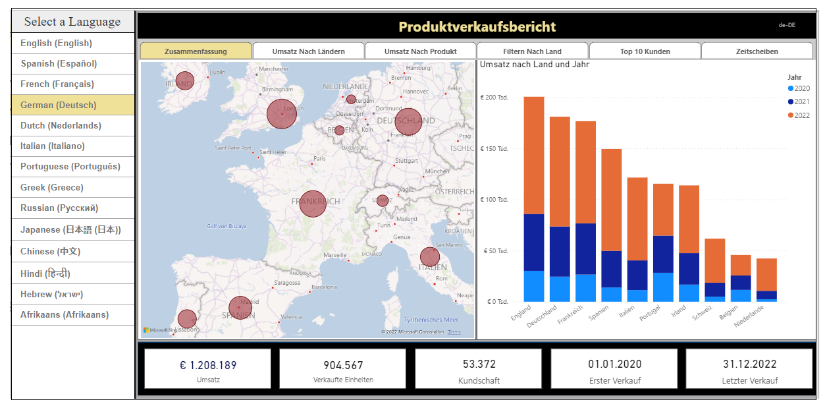

The live demo is based on a custom web application that uses Power BI
embedding. When you click on a link in the left navigation, there is
JavaScript behind this web page that responds by explicitly reloading
the report using the language of German intead of English. You can see
that all the text-based elements for the entire report are now displayed
with their German translations instead of with the default English
translations.

### Power BI Support for Metadata Translations

The primary localization feature in Power BI used to build
multi-language reports is known as **metadata translations**. Power BI
inherited this feature from its predecessor, Analysis Services, which
introduced metadata translations to add localization support to the data
model associated with a tabular database or a multidimensional database.
In Power BI, metadata translations support has been integrated at the
dataset level.

A metadata translation represents the property for a dataset object
that's been translated for a specific language. Consider a simple
example. If your dataset contains a table with an English name of
**Products**, you can add translations for the **Caption** property of
this table object to provide alternative names for when the report is
rendered in a different language. The types of dataset objects that
support metadata translations include **Table**, **Column**,
**Measure**, **Hierarchy** and **Hierarchy** **Level**. In addition to
the **Caption** property which tracks an object's display name, dataset
objects also support adding metadata translations for two other
properties which are **Description** and **DisplayFolder**.

Power BI reports and datasets that support multiple languages can only
run in workspaces which are associated a dedicated capacity created
using Power BI Premium or the Power BI Embedded Service. That means
multi-language reports will not load correctly when launched from a
workspace in the shared capacity. If you are working in a Power BI
workspace that does not display a diamond indicating it’s a Premium
workspace, you will find that multi-language reports don’t work as
expected because there is no support for loading translations from
secondary languages.

Another critical point to understand is that the Power BI support for
metadata translations only applies to datasets. Neither Power BI Desktop
nor the Power BI Service provide any support for storing or loading
translations for text values stored as part of the report layout.

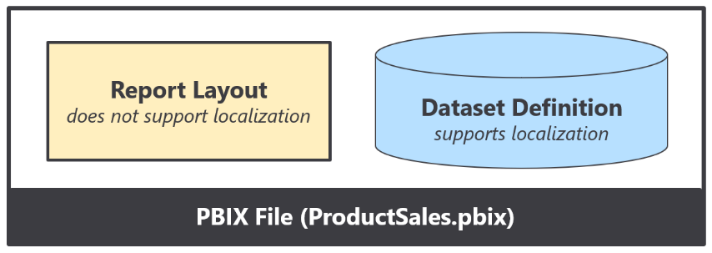

Think about a common scenario where you add a textbox or a button to a
Power BI report and then you type in literal text for a string value
displayed to the user. That text value is stored in the report layout
and cannot be localized. Therefore, you must avoid using textboxes and
buttons that contain literal text values stored in the report layout. As
a second example, page tabs in a Power BI report are also problematic
because their display names cannot be localized. Therefore, you must
design multi-language reports so that page tabs are hidden and never
displayed to the user.

### Implementing Translations Dynamically using Measures and USERCULTURE

A second essential feature to assist with building multi-language
reports in Power BI is the DAX **USERCULTURE** function. The
**USERCULTURE** function returns a string which includes a lower-case
language ID parsed together with an upper-case locale identifier. Here
are a few examples of strings with a language and locale that might be
returned by **USERCULTURE**.

- **en-US** \[language=English, locale identifier=United States\]

- **es-ES** \[language=Spanish, locale identifier=Spain\]

- **fr-FR** \[language=French, locale identifier=French\]

- **de-DE** \[language=German, locale identifier=Germany\]

- **ja-JP** \[language=Japanese, locale identifier=Japan\]

Remember that you can only use the **USERCULTURE** function to implement
dynamic translations in measures. When you use **USERCULTURE** in the
DAX expression for a measure, it’s guaranteed to return the language and
locale identifier for the current user. The same is not true if you use
the **USERCULTURE** function in the DAX expression for a table or a
column which get evaluated at dataset load time. When you use
**USERCULTURE** in the DAX expression for a table or calculated column,
you don’t get the same guaranteed that it uses the language and locale
of the current user.

The live demo displays the return value of **USERCULTURE** in the upper
right corner of the report banner. You will not typically display a
report element like this in a real application, but it’s included with
the live demo so you can see exactly what language and locale identifier
are being used to load the report each time you switch to a new
language.

Let’s look at a simple example of writing a DAX expression for a measure
that implements dynamic translations. You can start by extracting the
language ID for the current user using **USERCULTURE** together with
**LEFT**.

CurrentLanguage = LEFT(USERCULTURE(), 2)

Now, you can take things a step further by adding a **SWITCH** statement
to form a basic pattern for dynamic translations.

Product Sales Report Label = SWITCH(LEFT(USERCULTURE(), 2),

"es", "Informe De Ventas De Productos",

"fr", "Rapport Sur Les Ventes De Produits",

"de", "Produktverkaufsbericht",

"Product Sales Report"

)

OK, it’s nowhere near as impressive as some of those fancy DAX patterns
that come out of Italy. But hey, it’s a start.

### Formatting Dates and Numbers with the Current User’s Locale

Every report that loads in the Power BI Service is initialized with a
specific language and a specific locale. The default behavior of the
Power BI Service it to load each report using the language and regional
locale specified by the user’s browser settings. However, those settings
can be overridden by adding the **language** query string parameter to
the end of the report URL. If you’re developing with Power BI embedding,
you also have complete control to load a report with a specific language
and locale as demonstrated by the live demo.

You’ve already seen that you can implement dynamic translations by
writing a DAX expression in a measure with conditional logic based on
the user’s language. This is a technique that will be used frequently
when building reports that support multiple languages. However, you will
not be required to write conditional DAX logic based on the user’s
locale. Why is that?

The short answer is that Power BI visuals automatically handle
locale-specific formatting behind the scenes. This makes things so much
easier.

The long answer is that a Power BI visual inspects the locale of the
current user before rendering. During the rendering process, the visual
determines what formatting to use for a date or numeric value based on
the user’s locale and the format string of the source column or measure.

Consider a simple scenario in which you’re building a report for an
audience of report consumers that live in both New York \[**en-US**\]
and in London \[**en-GB**\]. All users speak English (**en**), but yet
some live in different regions (**US** vs **GB**) where dates and
numbers are formatted differently. For example, a user from New York
wants to see dates in a **mm/dd/yyyy** format while a user from London
wants to see dates in a **dd/mm/yyyy** format. Everything thing works
out as long as you configure columns and measures using format strings
that support regional formatting.

If you are formatting a date, it is recommended you use a format string
of **Short Date** or **Long Date** because those format strings support
regional formatting. Power BI Desktop offers other formatting options
(those without an asterisk) that should be avoided as they have a
pre-defined display patterns to do not change in response to the user’s
locale.

Here are a few examples of how a date value formatted with **Short
Date** appears when loaded under different locales.

| en-US | 12/31/2022 |
|-------|------------|
| en-GB | 31/12/2022 |
| pt-PT | 31-12-2022 |
| de-DE | 31.12.2022 |
| ja-JP | 2022/12/31 |

The Japanese formatting is hands-down the winner. It’s the only format
that automatically sorts chronologically.

### Understanding the Three Types of Translations

When it comes to localizing Power BI artifacts such as datasets and
reports, there are three different types of translations and you must be
able distinguish between them. These are the three types of translations
you should understand.

- Metadata Translations

- Report Label Translations

- Data Translations

Now, let’s examine all three types in a little more depth.

**Metadata translations** provides localized values for dataset object
properties. The object types which support metadata translation include
tables, columns, measures, hierarchies and hierarchy levels. The
following screenshot shows how metadata translations provide German
names for the measures displayed in card visuals.

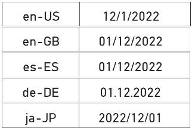

Metadata translations are also used to display column names and measure
names in tables and matrices.

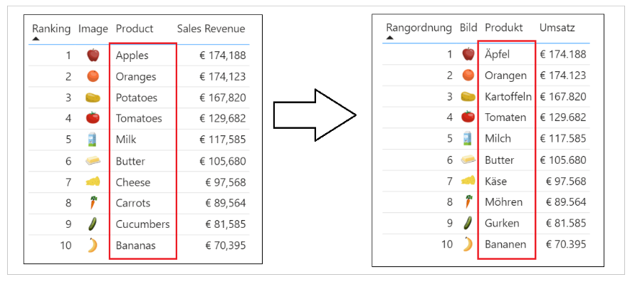

Metadata translations are the easiest to create, manage and integrate
into a Power BI report. By leveraging the features of Translations
Builder to generate machine translations, you can add all the metadata
translations you need to build and test a Power BI report in a matter of
seconds. As you will discover, adding metadata translations to your
dataset is fairly straight-ahead and an essential first step. However,
metadata translations rarely provide a complete solution by themselves.
A complete solution will typically require going further to localize
report labels.

**Report label translations** provide localized values for text elements
on a report that are not directly associated with a dataset object.
Examples of report labels include the report title, section headings and
button captions. Here are a few examples of report label translations in
the live demo with the report title and the captions of navigation
buttons.

Report label translations are harder to create and manage than metadata
translations because Power BI provides no built-in feature to track or
integrate them. Translations Builder solves this problem using the
Localized Table strategy. This strategy is based on creating a hidden
table named **Localized Labels** in the dataset behind a report with
measures which can track and load translations for each report label.
You will learn more about the Localized Labels table strategy later in
this article in the section titled **Understanding the Localized Labels
Table**.

**Data translations** provide translated values for text-based columns
in the underlying data itself. Think about a scenario where a Power BI
report displays product names imported from the rows of the **Products**
table in an underlying database. Data translations are used to display
product names differently for users who speak different languages. For
example, some users see products names in English while other users see
product names in secondary languages.

Data translations also appear in the axes of cartesian visuals and in
legends as shown in the following screenshot.

Data translations are harder to design and implement than the other two
types of translations. The reason it’s harder is that you must typically
redesign the underlying datasource with additional text columns for
secondary language translations. Once the underlying datasource has been
extended with extra text columns for secondary language translations,
you can then use a powerful new feature in Power BI Desktop known as
***Field Parameters*** to design a scheme where you can control the
loading the data translations for a specific language through filtering.

While every multi-language report will typically require both metadata
translations and report label translations, it is not as clear whether
they will also require data translations. Some projects to build a
multilanguage report for Power BI will require data translations while
others will not. This point will be revisited in more depth later in
this article.

### Packaging Dataset and Report in PBIX Project Files

Now that you understand high-level concepts of building multi-language
reports with translations, it's time to discuss the multi-language
report development process. The first step here is to decide how to
package your dataset definitions and report layouts for distribution.
Let's examine two popular approaches used by content creators who work
with Power BI Desktop.

In the first approach, the goal is to keep things simple and convenient
by creating a single PBIX project file which contains both a report
layout and its underlying dataset definition. You can easily deploy a
reporting solution like this by importing the PBIX project file into a
Power BI workspace. If you need to update either the report layout or
the dataset definition after they have been deployed, you can perform an
upgrade operation by importing an updated version of the PBIX project
file.

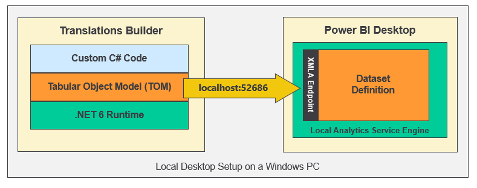

The single PBIX file approach doesn't always provide the flexibility you
need. Imagine a scenario where one team is responsible for creating and
updating dataset definitions while other teams are responsible for
building reports. For a scenario like this, it makes sense to split out
dataset definitions and report layouts into separate PBIX project files.

To use the shared dataset approach, you create one PBIX project file
with a dataset definition and an empty report which remains unused. Once
this dataset has been deployed to the Power BI Service, report builders
can connect to it using Power BI Desktop to create report-only PBIX
files. This makes it possible for the teams building reports to build
PBIX project files with report layouts which can be deployed and updated
independently of the underlying dataset.

From the perspective of adding multi-language support to a Power BI
solution, it really doesn't matter which of these approaches you choose.
The techniques and disciplines used to build multi-language reports
remain the same whether you decide to build your solution using a single
PBIX project file or with a combination of PBIX project files. There are
specific tasks you need to perform at the dataset level and other tasks
you must perform when building report layouts in Power BI Desktop. The
multi-language report development process can be broken down into a few
distinct phases. Each of these phases will be examined in detail in this
article.

While the solution provided by **ProductSalesMultiLanguage.pbix**
demonstrates a single PBIX project file approach where the dataset and
report are packaged together for convenience. However, nothing changes
if you package and distribute datasets and reports using separate PBIX
files. You will use the exact same concepts and techniques to build
multi-language reports in scenarios where your solution contains
multiple PBIX files.

## Understanding How Translations Builder Works

Translations Builder is a tool created for content creators using Power
BI Desktop. Content creators can use this tools to add multi-language
support to PBIX project files. The following screenshot shows what
Translations Builder looks like when working with a simple PBIX project
that supports a small number of secondary languages.

Translations Builder is an external tool developed for Power BI Desktop
using C#, .NET 6, and Windows Forms. Translations Builder uses an API
known as the ***Tabular Object Model (TOM)*** to update datasets that
have been opened and are running in Power BI Desktop. Translations
Builder does most of its work by adding and updating the metadata
translations associated with datasets objects including tables, columns
and measures. However, there are several scenarios in which Translations
Builder will actually create new tables in a dataset to implement
strategies to handle various aspects of building multi-language reports.

When you open a PBIX project in Power BI Desktop, the dataset definition
from inside the PBIX file is loaded into memory in a local session of
the Analysis Services engine. Translations Builder uses TOM to establish
a direct connection to a dataset for the current PBIX project.

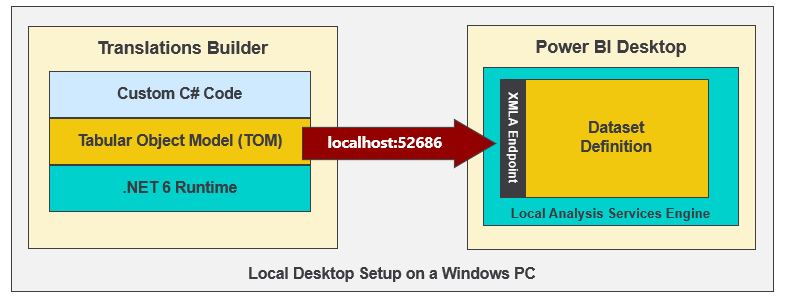

The Translations Builder project has been developed using the
[**external tools integration
support**](https://docs.microsoft.com/en-us/power-bi/transform-model/desktop-external-tools)
for Power BI Desktop. You can install Translations Builder on a Windows
PC where you've already installed Power BI Desktop using instructions in
the [**Translations Builder Installation
Guide**](https://github.com/PowerBiDevCamp/TranslationsBuilder/blob/main/Docs/Installation%20Guide.md).
Once the Translations Builder application has been installed on a
Windows computer, you can launch it directly from Power BI Desktop using
the **External Tools** tab in the ribbon.

When you launch an external tool like Translations Builder, the
application is passed startup parameters including a connection string
which can be used to establish a connection back to a dataset that's
loaded in Power BI Desktop. This allows Translations Builder to display
dataset information and to provide commands to automate adding metadata
translations. You can read [**Translations Builder Developers
Guide**](https://github.com/PowerBiDevCamp/TranslationsBuilder/blob/main/Docs/Developer%20Guide.md)
if you want to learn more about the details of working with Translations
Builder as a developer. The content in this article will focus on
teaching concepts and localization skills to content creators using
Power BI Desktop.

The key value proposition of Translations Builder is that is allows a
content creator to view, add and update metadata translations using a
two-dimensional grid. This ***translations grid*** simplifies the user
experience because it abstracts aways the low-level details or reading
and writing metadata translation associated with a dataset definition.
Users work with the translation grid to view, add and edit metadata
translations in a manner that is similar to working with data inside an
Excel spreadsheet.

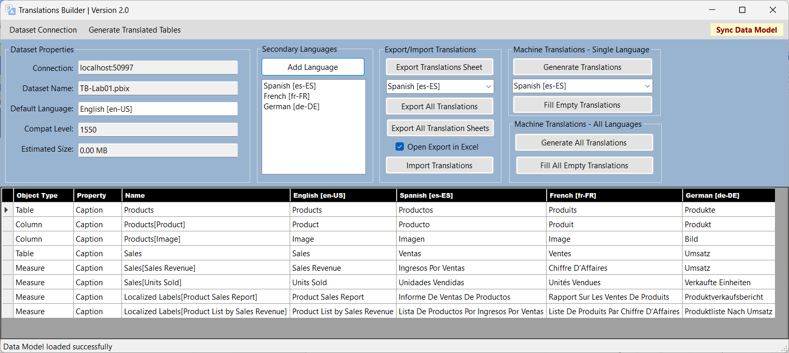

### Adding Secondary Languages and Translations

When you launch Translations Builder with a PBIX project for the first
time, the translation grid will display a row in for each non-hidden
table, measure and column in the project’s underlying data model. The
translation grid does not display rows for dataset objects in the data
model that are hidden from report view. The reason for this is that
hidden objects will not be displayed on a report and, therefore, do not
require translations. The following screenshot shows the starting point
for a simple data model before it’s been modified to support secondary
languages.

If you examine this PBIX project more closely, you can see the first
three columns in the translation grid contain read-only columns used to
identity each metadata translation. Each metadata translation has a
parent which is a dataset object such as a table, column or measure.
Each translation is based on a property such as **Caption**. The fourth
column displays the translation for the dataset’s default language which
in this case is English **\[en-US\]**.

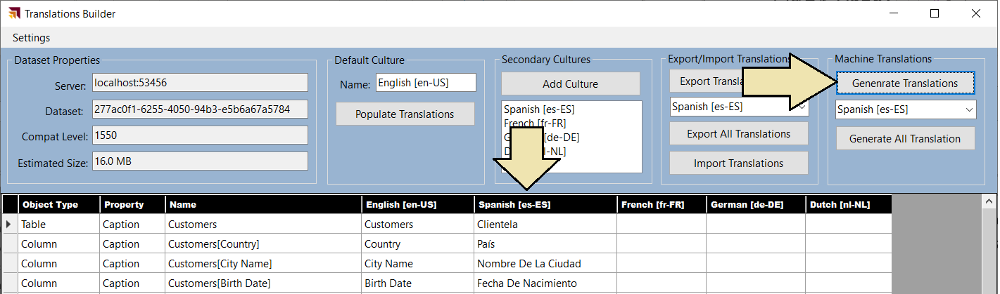

Translations Builder provides an **Add Language** command to add
secondary languages to the project’s data model.

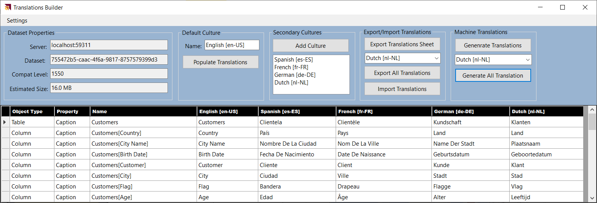

Clicking **Add Language** displays the **Add Language** dialog which
allows the user to add one or more secondary languages.

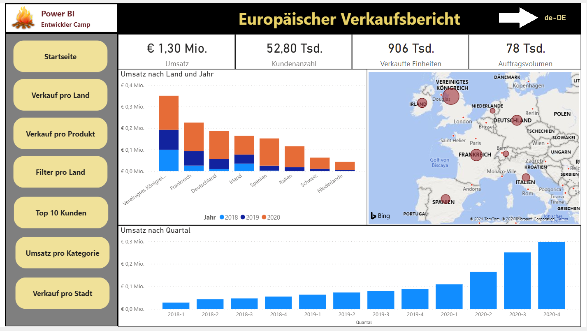

After a new language has been added, the user can see the language in
the **Secondary languages** list.

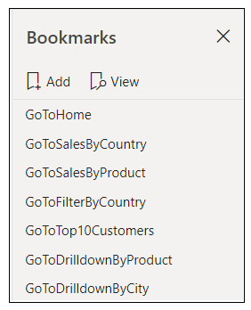

Adding a new language will also add a new column of editable cells to
the translations grid.

In scenarios where content creators know how to speak all the languages
involved, they can add and update translations for secondary languages
directly in the translation grid with an Excel-like editing experience.

Technically speaking, Translations Builder isn’t just adding a language
object to the dataset. Instead, Translations Builder is actually adding
a **Culture** object with includes both a language ID and a locale
identifier. In Power BI datasets, a **Culture** object is identified
using a string-based key which combines a lower-case language ID and an
upper-case locale identifier for the geographical region. Note this is
the same string-based format returned by the **USERCULTURE** function.

Translations Builder abstracts away the differences between a language
and a culture. This has been done to simplify the user experience for
content creators who can just think in terms of languages and not worry
about the differences between a language and a culture. It’s not overly
important to distinguish between a language and a culture until you
begin programming with TOM and you need to add new **Culture** objects
to a Power BI dataset.

Another important aspect of working with Translations Builder has to do
with saving your work. While external tools for Power BI Desktop like
Translations Builder are able to modify the dataset loaded into memory
from a PBIX file, there is no way for an external tool to trigger a
command to save the in-memory changes back to the underlying PBIX file.
Therefore, you must always return back to Power BI Desktop and click the
**Save** command any time you have added languages and any time you have
created or edited translations.

Once the changes have been written back to the PBIX file, that file can
then be published to the Power BI Service for testing. Once you have
tested your work and verified that the translations are working
properly, you can also store the PBIX file in a source control system
such as GitHub or an Azure DevOps repository. This provides the
foundation for an ALM strategy where support for secondary languages and
translations can be evolved across versions of a PBIX file.

### Testing Translations in the Power BI Service

One of the issues that makes working with translations a bit more
complicated is that you cannot test your work in Power BI Desktop.
Instead, you must test your work in the Power BI Service in a workspace
associated with a Premium capacity. After you have added translation
support with Translations Builder and you have save your changes to the
underlying PBIX file, you can then publish the PBIX project from Power
BI Desktop to the Power BI Service for testing.

After publishing your PBIX project to the Power BI Service, you can test
loading the report using secondary language by modifying the report URL
with a query string parameter named **language**. After the report loads
with its default language, you can click the browser address bar and add
the following language parameter to the end of the report URL.

/?language=es-ES

Once you add the **language** parameter to the end of the URL and press
**ENTER**, you should be able to verify that the **language** parameter
has been accepted by the browser as it reloads the report. If you forget
to add the **?** or if you do not format the **language** parameter
correctly, the browser will reject the parameter and remove it from the
URL as it loads the report. If you correctly load a report using a
**language** parameter value of **es-ES**, you should see the UI
experience for the Power BI Service UI switch from English to Spanish.

You will also see that the report displays the Spanish translations for
the names of columns and measure.

Now that you’ve seen how to test your work when working with
translations, it possible to make a high-level observation about working
with Translations Builder. As you begin to work with secondary languages
and translations to localize a PBIX project, you will follow the same
set of steps again and again:

1.  Make changes in Power BI Desktop

2.  Publish the PBIX project to the Power BI Service

3.  Test your work with a browser in the Power BI Service using
    **language** parameter

4.  Repeat steps 1-3 until all the translations work has been completed

You seem to be getting excited about all of this. If you want to jump
right in and get started with Translations Builder, you can work try out
the hands-on lab titled [**Lab 01: Getting Started with Translations
Builder**](https://github.com/PowerBiDevCamp/TranslationsBuilder/blob/main/Labs/Lab%2001%20-%20Getting%20Started%20with%20Translation%20Builder.md).

### Embedding Power BI Reports Using a Specific Language and Locale

If you are developing with Power BI embedding, you can use the Power BI
JavaScript API to load reports with a specific language and locale. This
is accomplished by extending the **config** object passed to
**powerbi.embed** with a **localeSettings** object containing a
**language** property as shown in the following code.

let config = {

type: "report",

id: reportId,

embedUrl: embedUrl,

accessToken: embedToken,

tokenType: models.TokenType.Embed,

localeSettings: { language: "de-DE" }

};

let report = powerbi.embed(reportContainer, config);

### Generating Machine Translations using Azure Translator Service

One of the biggest challenges in building multi-language reports is
managing the language translation process. You must ensure that the
quality of translations is high and that the translated names of tables,
columns, measures and labels do not lose their meaning when translated
to another language. In most cases, acquiring quality translations will
require human translators to create or at least review translations as
part of the multi-language report development process.

While human translators are an essential part of the end-to-end process,
it can take a long time to send out translation files to a translation
team and then to wait for them to come back. With all the recent
industry advances in Artificial Intelligence (AI), you also have the
option to generate machine translations using a Web API that can be
called directly from an external tool such as Translations Builder. If
you initially generate machine translations for each secondary language
you need to support, that will give you something to work with while
waiting for a translation team to return their high-quality human
translations.

While machine translation are not always guaranteed to be high quality,
they do provide value in the multi-language report development process.
First, they can act as translation placeholders so you can begin your
testing by loading reports using secondary languages to see if there are
layout issues or unexpected line breaks. Machine translations can also
provide human translators with a better starting point as they just need
to review and correct translations instead of creating every translation
from scratch. Finally, machine translations can be used to quickly add
support for languages in scenarios where there are legal compliance
issues and organizations are facing fines or litigation for
non-compliance.

Translations Builder generates machine translations by executing API
calls against the [**Azure Translator
service**](https://docs.microsoft.com/en-us/azure/cognitive-services/translator/translator-info-overview)
which is an API endpoint offered through Azure Cognitive Services. This
Web API makes it possible to automate enumerating through dataset
objects to translate dataset object names from the default language to
translations for secondary languages.

If you'd like to test out the support in Translations Builder for
generating machine translations, you will require a Key for an instance
of the Azure Translator Service. If you have an Azure subscription, you
can learn how to obtain this key and its location by reading [Obtaining
a Key for the Azure Translator
Service](https://github.com/PowerBiDevCamp/TranslationsBuilder/blob/main/Docs/Obtaining%20a%20Key%20for%20the%20Azure%20Translator%20Service.md).
Translations Builder provides a Configuration Options dialog which makes
it possible to configure the key and location to access the Azure
Translator Service.

Once a user has configured an Azure Translator Service key, Translations
Builder will begin to display additional command buttons which make it
possible to generate translations for a single language at a time or for
all languages at once. There are also commands to generate machine
translations only for the translations that are currently empty.

## Understanding the Localized Labels Table

Earlier you learned that report label translations provide localized
values for text elements on a report that are not directly associated
with a dataset object. Examples of report labels are the text values for
report titles, section headings and button captions. Given that Power BI
provides no built-in features to track or integrate report labels,
Translations Builder solves this problem using the **Localized Labels**
table strategy. Before introducing this strategy, let’s take a moment to
discuss the problems this strategy has been designed to solve.

If you have experience building datasets and reports with Power BI
Desktop, it's critical that you learn which report design techniques to
avoid when building multi-language reports. Let's begin with the obvious
things which cause problems due to a lack of localization support.

- Using textboxes or buttons with hard-coded text values

- Adding a hard-coded text value for the title of a visual

- Displaying page tabs to the user

The key point here is that any hard-coded text value that gets added to
the report layout cannot be localized. Consider the case where you add a
column chart to your report. By default, a Cartesian visual such as a
column chart is assigned a dynamic value to its **Title** property which
is parsed together using the names of the columns and measures that have
been added into the data roles such of **Axis**, **Legend** and
**Values**.

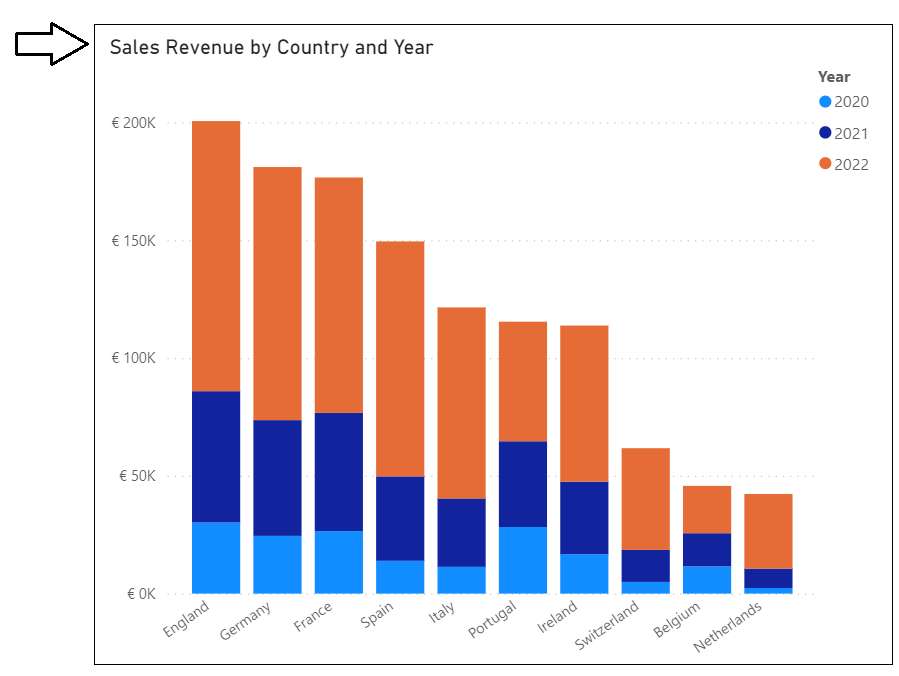

There is good news here. The default **Title** property for a Cartesian
visual is dynamically parsed together in a fashion that supports
localization. As long as you supply metadata translations for the names
of columns and measures in the underlying dataset definition (e.g.
**Sales Revenue**, **Country** and **Year**), the **Title** property of
the visual will use the translations for whatever language has been used
to load the report. The following table shows how the default **Title**
property of this visual is updated for each language supported by the
live demo.

| Language        | Visual Title                         |
|-----------------|--------------------------------------|
| English (en-US) | Sales Revenue by Country and Year    |
| Spanish (es-ES) | Ingresos por ventas por país y año   |
| French (fr-FR)  | Chiffre d’affaires par pays et année |
| German (de-DE)  | Umsatz nach Land und Jahr            |
| Dutch (nl-NL)   | Omzet per land en jaar               |

Even if you dislike the dynamically-generated visual **Title**, you must
resist the temptation to replace it with a hard-coded text value. Any
hard-coded text you type into the **Title** property of the visual will
be added to the report layout and cannot be localized. Therefore, you
should either leave the visual **Title** property with its default value
or you should use the **Localized Labels** table strategy to create
report labels that support localization.

### Introducing the Localized Labels Table Strategy

As discussed earlier in this article, the Power BI localization features
are supported at the dataset level but not at the report layout level.
At first you might ask the question “*how can I localize text-based
values in a Power BI report that are not stored inside the dataset?”*
The answer to this question is that there is no simple way to accomplish
this. A better question to ask is “*how can I add the text-based value
for a report label into the dataset as a dataset object to enable
localization support?”*

The idea behind the **Localized Labels** table isn’t all that
complicated. It builds on the idea that Power BI supports metadata
translations for specific types of dataset objects including measures.
When you add a report label with Translations Builder, the tool
automatically adds a new measure to the **Localized Labels** table
behind the scenes. Once a measure has been created for each report
label, Power BI can store and manage its translations in the exact same
fashion that it does for metadata translations. In fact, the **Localized
Labels** table strategy uses metadata translations to implement report
label translations.

Translations Builder provides commands to create the **Localized
Labels** table and to add a measure each time you need a report label.
The **Localized Labels** table is created as a hidden table behind the
scenes. The idea is that you can do all the work to create and manage
report labels inside the Translation Builder user experience. There is
no need to inspect or modify the **Localized Labels** table using the
Power BI Desktop dataset design experience.

Here's an example of the **Localized Labels** table from the live demo
project. As you can see it provides localized report labels for the
report title, visual titles and captions for navigation buttons used
throughout the report.

Translations Builder 1.0 introduced the **Localized Labels** table, but
it did not take the strategy far enough. Consequently, the user
experience was complicated and limited to surface report labels from the
**Localized Labels** table directly on a report page. Translations
Builder 2.0 introduces an evolved strategy to perform more work behind
the scenes in order to make it easier and more natural for report
designers to surface localized labels on a report page.

You can add the **Localized Labels** table to a PBIX project by
executing the **Create Localized Labels Table** command from the
**Generate Translated Tables** menu.

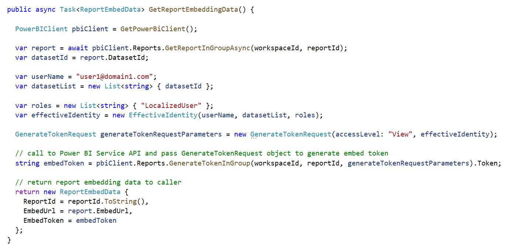

When you execute this command to create the **Localized Labels** table,
you will be prompted by the following dialog asking if you want more
information about the **Localized Labels** table strategy. If you click
**<u>Y</u>es,** interestingly enough, you’ll be redirected back to this
very section of this article

After the **Localized Labels** table has been created, you will see
three sample report labels as shown in the following screenshot. In most
cases you will want to delete these sample report labels and replace
them with the actual report labels required on the current project.

Remember, there is no need to interact with the **Localized Labels**
table in Power BI Desktop. You can add and manage all the report labels
you need using **Translations Builder**. To create your first report
label, you can drop down the **Generate Translated Tables** menu and
select **Add Labels to the Localized Labels Table**. Note you can also
execute the **Add Labels to the Localized Labels Table** command using
the shortcut key of **Ctrl+A**.

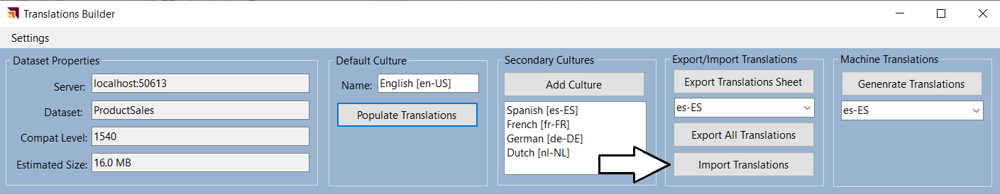

You can add report labels one at a time by typing in the text for the
label and then clicking **Add Label**.

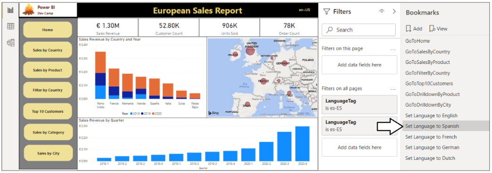

You can alternatively switch the **Add Localized Labels** dialog into
**Advanced Mode** which makes it possible to delete all existing report
labels at once and to enter a large batch of report labels in a single
operation.

Once you’ve added the required report labels to your PBIX project, they
will appear in the translation grid. At that point, you can add and edit
localized label translations just like any other type of translation in
the translation grid.

As you learned earlier, Translations Builder only populates the
translation grid with dataset objects that are not hidden from **Report
View**. The measures in the **Localized Labels** table are hidden from
**Report View** and they provide the one exception to the rule that
excludes hidden objects from being displayed in the translation grid.

One valuable aspect of the **Localized Labels** table strategy is that
report labels can be created, managed and stored in the same PBIX
project file that holds the metadata translations for the names of
tables, columns and measures. The **Localized Labels** table strategy is
able to merge metadata translations and report label translations
together in a unified experience in the translation gird. There is no
need to distinguish between metadata translations and report label
translations when it comes to editing translations or when using
Translations Builder features to generate machine translations.

In the Power BI community, there are other popular localization
techniques that track report label translations in a separate CSV file.
While these techniques work just fine, they are not as streamlined as
the **Localized Labels** table strategy because report label
translations must be stored in a separate CSV file. In other words,
report label translations must be created separately and managed
differently from the metadata translations in a PBIX project. The
**Localized Labels** table strategy allows for report label translations
and metadata translations to be stored together and managed the exact
same way.

### Generating the Translated Localized Labels Table

The **Localized Labels** table contains a measure with translations for
each report label in a PBIX project. However, the measures inside the
**Localized Labels** table are hidden and are not intended to be used
directly by report authors. Instead, the **Localized Labels** table
strategy is based on running code to generate a second table named
**Translated Localized Labels** with measures that are meant to be used
directly on a report page. You can create this table by executing the
**Generate Translated Localized Labels Table** command.

The first time you execute the **Generate Translated Localized Labels
Table** command, Translations Builder executes code to create the
**Translated Localized Labels** table and populate it with measures.
After that, executing the **Generate Translated Localized Labels Table**
command will delete all the measures in the **Translated Localized
Labels** table and recreate them to synchronize the report labels and
translations between the **Localized Labels** table and the **Translated
Localized Labels** table.

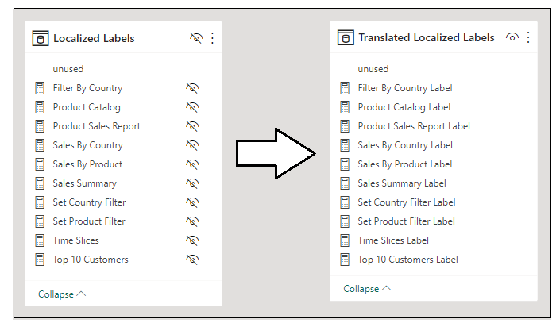

Unlike the **Localized Labels** table, the **Translated Localized
Labels** table is not hidden from **Report View**. In fact, it’s quite
the opposite. The **Translated Localized Labels** table provides
measures that are intended to be used to surface report labels in a
report. Here is how the **Translated Localized Labels** table appears to
a report author in the **Fields** pane when the report is in **Report
View**.

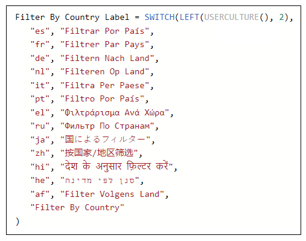

You can see that every measure in the **Translated Localized Labels**
table has a name that ends with the world **Label**. The reason for this
is that two measures inside the same dataset cannot have the same name.
Measure names must be unique on a project-wide basis so it’s not
possible to create measures in the **Translated Localized Labels** table
that have the same name as the measures in the **Localized Labels**
table. Therefore, the **Localized Labels** table strategy appends the
word **Label** to all measure names in the **Translated Localized
Labels** table to ensure their names are unique.

If you examine the machine-generated DAX expressions for measures inside
the **Translated Localized Labels** table, you will see they are based
on the same pattern shown earlier which uses **USERCULTURE** to
determine the language of the current user.

You must remember to execute **Generate Translated Localized Labels
Table** anytime you make changes to the **Localized Labels** table. Keep
this in mind because it is easy to forget. You should also resist any
temptation to edit the DAX expressions for measures in the **Translated
Localized Labels** table. Any edits you make will be lost as all the
measures in this table are deleted and recreated each time you execute
**Generate Translated Localized Labels Table**.

### Surfacing Localized Labels on a Report Page

As you have learned, report labels are implemented as measures in the
**Translated Localized Labels** table. That makes them very easy to
surface in a Power BI report. For example, you can add a **Card** visual
to a report and then configure its **Fields** data role in the
Visualizations pane with a measure from the **Translated Localized
Labels** table.

As Microsoft continues to evolve the report design experience in Power
BI Desktop, there have been several new enhancements which make it
easier for content creators to build multi-language reports. One
essential aspect of these enhancements is a greater ability to use
measures in a report layout to configure dynamic property values for
report elements such as visuals and shapes. The live demo project uses a
**Rectangle** shape to display the localized report label for the report
title. The following screenshot shows how to select a **Rectangle**
shape and then navigate to configure its **Text** property value in
**Shape** \> **Style** \> **Text** section in the **Format** pane.

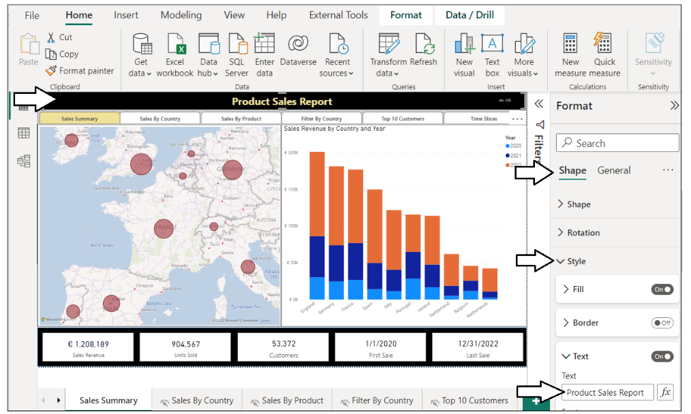

The **Text** property of a **Rectangle** shape can be configured with a
hard-coded string as shown in this screenshot.

However, you already know you must avoid hard-coding text values into
the report layout when creating multi-language reports. If you click on
the ***fx*** button to the right, Power BI Desktop will display a dialog
which allows you to configure the **Text** property of the **Rectangle**
shape using a measure from the **Translated Localized Labels** table .

Once this dialog appears, you can navigate to the **Translated Localized
Labels** table and select any measure inside.

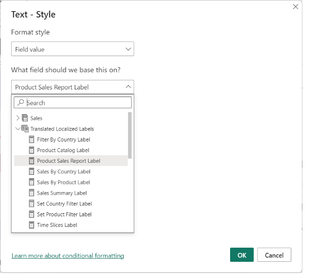

You can use the same technique to localize a visual **Title** using a
measure from the **Translated Localized Labels** table.

### Adding Support for Page Navigation

As you recall, you cannot display page tabs to the user in a
multi-language report because page tabs in a Power BI report do not
support localization. Therefore, you must provide some other means for
users to navigate from page to page. This can be accomplished using a
design technique where you add a navigation menu using buttons. When the
user clicks on a button, the button is configured to apply a bookmark to
navigate to another page. Let's step through the process of building a
navigation menu that supports localization using measures from the
**Localized Labels** table.

The first thing you need to do when building a custom navigation menu is
to hide every page in the report except for the first page which acts as
the report landing page.

Next, create a set of bookmarks. Each bookmark should be created to
navigate to a specific page. The **live demo** sample demonstrates this
technique by adding a bookmark for each page supported by the navigation
menu.

When creating bookmarks for navigation, you should disable **Data** and
**Display** and only enable **Current Page** behavior.

The next step is to configure each button in the navigation menu to
apply a bookmark to navigate to a specific page.

After you’ve configured a button with a bookmark, the final step is to
configure the **Text** property with a localized label.

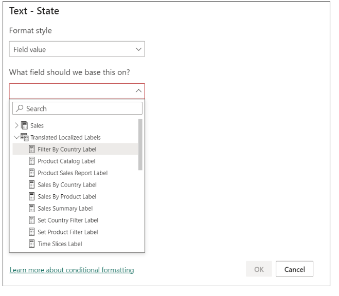

The **Text** property of each button should be configured with a measure
from the **Translated Localized Labels** table.

At this point, you've learned how to create the **Localized Labels**
table and add labels. You also learned how to generate the **Translated
Localized Labels** table and to bind the measures in that table to
report elements such as Card visuals, shapes and buttons. These are the
localization techniques you will continue to use as you create and
maintain reports that are required to support multiple languages. Now
this section will conclude with some general advice for building Power
BI reports that support multiple languages.

### Using Best Practices When Localizing Power BI Reports

When it comes to localizing software, there are some universal
principals to keep in mind. The first is to plan for localization from
the start of any project. It's significantly harder to add localization
support to an existing dataset or report that was initially built
without any regard for Internationalization or localization. This is
especially true with Power BI reports because there are so many popular
design techniques that do not support localization. You might find that
much of the work for adding localization support to existing Power BI
reports involves moving backward and undoing the things that do not
support localization before you can move forward with design techniques
that do support localization.

Another important concept in localization is to plan for growth. A label
that's 400 pixels wide when displayed in English could require a much
greater width when translated into another language. If you optimize the
width of your labels for text in English, you might find that
translations in other languages introduce unexpected line breaks or get
cut off which, in turn, creates a compromised user experience.

Adding a healthy degree of padding to localized labels is the norm when
developing Internationalized software and it's essential that you test
your reports with each language you plan to support. In essence, you
need to ensure your report layouts looks the way you expect with any
language you have chosen to support.

## Enabling Human Workflows for Translation using Export and Import

Up to this point, you have learned to structure a Power BI report and
its underlying dataset to support translations. You also learned how to
complete this work in a quick and efficient manner by using Translations
Builder and by generating machine translations. However. It’s import to
acknowledge that machine-generated translations alone will not be
adequate for most production scenarios. You need to find a way to
integrate other people acting as translators into a human workflow
process.

Now it’s time to examine the Translations Builder features to export and
import translations using a CSV file format. The export features provide
a quick way to generate translations sheets that can be sent to human
translators. As you will see, translators can make their edits to a
translation sheets using Microsoft Excel. Once you’ve received an
updated translation sheet back from a translator, Translations Builder
provides an import operation to integrate those updated translations
back into the dataset for the current project.

The **Translations Builder** introduces the concept of a translation
sheet. A translation sheet is a CSV file that you generate with an
export operation to send out to a translator. The translator performs
the work to update the translation sheet and then returns it back to
you. You can then execute an import operation the integrate the changes
to translations by a translator back into the current PBIX project’s
dataset.

When you click the **Export Translation Sheet** button, the
**TranslationsBuilder** application generates a CSV file for the
selected language using a naming format (e.g.
**ProductSales-Translations-German.csv**) which includes the dataset
name and the language for translation. After generating the file and
saving it to the location of **TranslationsOutboxFolderPath** the
**TranslationsBuilder** application will then open the translation sheet
in Microsoft Excel.

Once these translation files have been generated, they can be sent out
to the translation team. Once these translations files have been edited
and returned with the high-quality human translations, you can then use
the **Import Translations** command to important these human
translations which will then effectively overwrite the machine
translations.

### Configuring Target Folders for Import and Export Operations

Create two new folders inside the lab folder named **Outbox** and
**Inbox**.

Next, you need to configure settings in Translations Builder so that
these folders are used as targets for export and import operations.

1.  Translations Builder and drop down the **Dataset Connection** menu.

2.  Click **Configure Settings…** to display the **Configuration
    Options** dialog.

3.  By default, folder paths for the **Outbox** and **Inbox** are
    configured to target the current user’s **Documents** folder.

Why does **Outbox** come before **Inbox**? That’s because you generally
work with the **Outbox** first when you export translation sheets that
you will send to translators. Once you get updated translations sheets
back from translators, you add them to the **Inbox** for import.

4.  Click the **set** button to update the setting for **Translations
    Outbox Folder Path**.

5.  Select the **Outbox** folder you created earlier in this exercise.

6.  Click the **set** button for **Translations Inbox Folder Path** and
    select the **Inbox** folder you created earlier

7.  Click **Save Changes**.

Now that you have configured the folder paths for the Outbox and Inbox,
it’s time to begin exporting translation sheets.

8.  Examine what’s inside the Export/Import Translations section.

### Exporting a Translation Sheet for a Secondary Language

Let’s start by creating a translation sheet for a single language.

Drop down the selection menu under the **Export Translations Sheet**
button and select **German \[de-DE\]**.

After selecting **German \[de-DE\]**, click the **Export Translations
Sheet** button.

Translations Builder should create a translation sheet named
**TB-Lab01-Translations-German.csv** and open this CSV file in Excel

Examine the contents of **TB-Lab01-Translations-German.csv**.

Over the next two steps you will use a trick in Excel to widen the
columns so ou can see all their contents.

Click on the top left corner where the row headers and the column
headers meet. This should select all columns and rows.

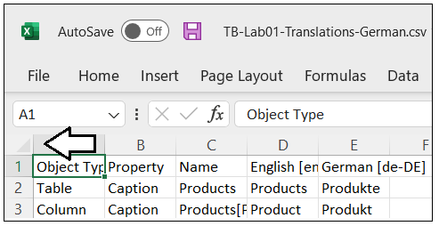

Double-click on the column heading divider between the column headers
showing **A** and **B**.

You should now be able to see all the text from each column.

### Exporting the Master Style Sheet

This translation sheet is what you will send to translators. They can
then use Excel to review the machine translations and make changes
wherever they are required. Click the **Export All Translations** button
to export a master translation sheet with the translations for all
languages.

Translations Builder creates a translation sheet named
**TB-Lab01-Translations-Master.csv** and opens this CSV file in Excel.
When **TB-Lab01-Translations-Master.csv** open in Microsoft Excel, you
cannot see the contents of all columns at first.

Use the Excel trick you learned earlier to expand all columns so you can
see the entire contents of all cells.

### Exporting Translation Sheets for All Secondary Languages

Now that you have learned to export translations sheets, it’s time to
examine how to manage translation sheet files.

In Windows Explorer, navigate to the **Outbox** folder. You should see
the two files you generated using export operations.

Return to Translations Builder and uncheck the checkbox with the caption
**Open Export in Excel**.

All three export commands use this checkbox to decide whether to open a
translation sheet in Excel after it’s generated. In some cases, it’s
handy to have the translation sheet open in Excel. In other scenarios
like the one ahead, it’s unnecessary and distracting.

Click the **Export All Translation Sheets** button.

The **Export All Translation Sheets** command generates the complete set
of translation sheets to be sent to translators.

Return to the **Outbox** folder in Windows Explorer.

You should see that a sperate translation sheet has been generated for
each secondary language.

Now that you have experienced how to export translation sheets, you will
now learn how to import translation sheets.

### Importing Translation Sheets

In the **Outbox** folder in Windows Explorer, select
**TB-Lab01-Translations-Master.csv** and
**TB-Lab01-Translations-Spanish.csv**.

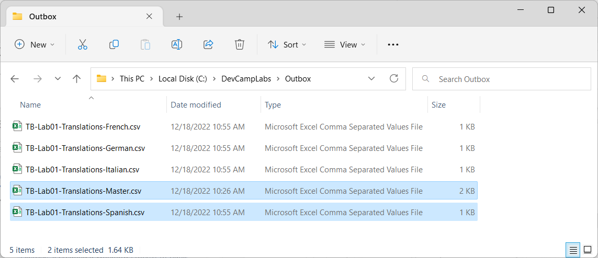

Copy the two selected translation sheet files to the Windows clipboard.

Navigate from the **Outbox** folder to the **Inbox** folder.

Paste the two translation sheet files from the Windows clipboard into
the **Inbox** folder.

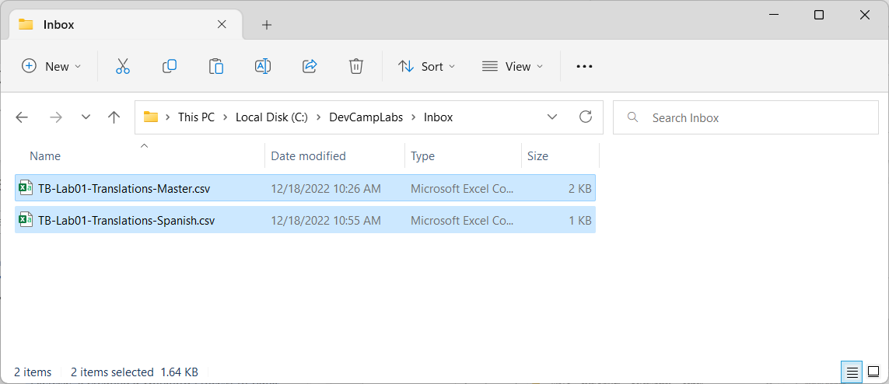

Open the translation sheet named
**Inbox\TB-Lab01-Translations-Spanish.csv** in Microsoft Excel.

The job of the translator is to review all translations in the fifth
column and to make updates where appropriate. From the perspective of
the translator, the top row with column headers and the first four
columns should be treated as read-only values.

Enter new values for each of the Spanish translations in the fifth
column.

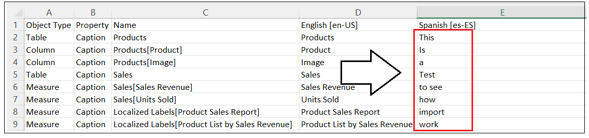

Don’t worry whether the values you are valid translations. You just need
to add any text so you can test the import process.

Save your changes to **TB-Lab01-Translations-Spanish.csv** and then
close the file in Microsoft Excel.

Return to Translations Builder and click the **Import Translations**
button.

Remember to close translation sheet files in Microsoft Excel before
importing them with Translations Builder to prevent errors.

In the **Open** file dialog, select
**TB-Lab01-Translations-Spanish.csv** and click **Open**.

You should see that your updates to the Spanish translation sheet now
appear in the translation grid.

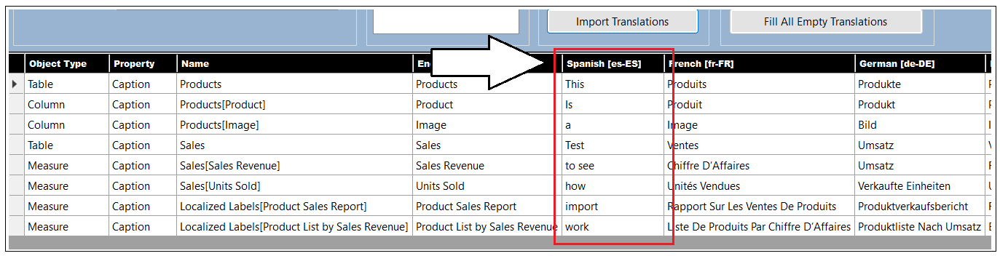

Now that you have seen how to how to import translations from an updated
translations sheet with a single language, it’s time to move ahead and
import translations from all languages at once by importing the master
translation sheet.

click the **Import Translations** button.

In the **Open** file dialog, select **TB-Lab01-Translations-Master.csv**
and click **Open**.

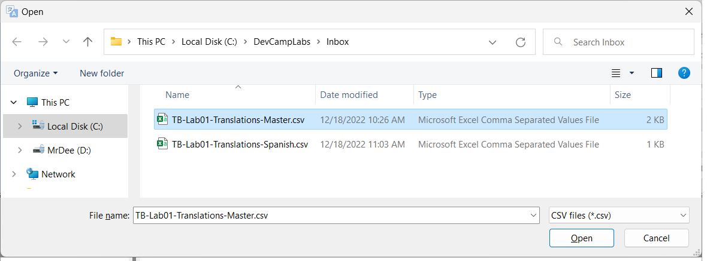

You should see that the original, machine-generated Spanish translations
now appear in the translation grid.

You can see that the master translation sheet can also serve as a great
way to backup and restore your translations work. To make this point,
you are now going to delete the column for French. Deleting a column
like this will delete all translations for that language. As you will
see, Translations Builder will automatically add the column back if it
finds the column when importing a translation sheet.

Right-click on the **French \[fr-FR\]** column header and click **Delete
Secondary Language**.

When prompted by the **Confirm Delete Secondary Language Operation**
dialog, click **OK** to continue.

You should see that the column for French has been removed from the
translations grid.

click the **Import Translations** button.

In the **Open** file dialog, select **TB-Lab01-Translations-Master.csv**
and click **Open**.

After the import operation competes, the **French \[fr-FR\]** column
should reappear as the last column on the right.

This concludes the coverage of developing an external tool with custom
code and TOM to automate the development tasks associated with creating
and maintaining metadata translations in a multi-language reporting
solution. Now it’s time to move ahead to the final section which
addresses the ***why***, ***when*** and ***how*** of implementing data
translations.

The **live demo** demonstrates how to implement localized labels in the
report title and the top navigation menu buttons. The following
screenshot shows the how button captions are translated when loaded with
five different languages.

The live demo also demonstrates how to implement data translations. With
metadata translations, you can see the names of columns and measures
change as you switch between languages. Data translations go further to
localize the product names in rows of the **Products** table. The
following screenshot shows how the **ProductSales.pbix** developer
sample provides data translations for product names as well.

## Implementing a Data Translations Strategy

While all multi-language reports will require metadata translations and
report label translations, you cannot assume the same for data
translations. Some projects will require data translations and others
will not. In order the determine whether your project will require data
translations, you'll need to think through the use cases you plan to
support with your reporting solution. You will find that adding support
for data translations can involve a good deal of planning and effort.
You might decide to only support data translations if they are a hard
requirement for your project.

Implementing data translations is quite different from implementing
metadata translations or report label translations. They are different
because Power BI doesn't offer any localization features to assist you
with data translations. Instead, you must implement a data translation
strategy which typically involves extending the underlying database with
extrat columns to track translations for text in rows of data such as
the names of products, categories and countries.

### Determine Whether Your Solution Really Requires Data Translations

To determine whether you need to implement data translations, start by
thinking about how your reporting solution will be deployed and think
about the use case for its intended audience. That leads to a key
question. **Will you have people who speak different languages looking
at the same database instance?**

Imagine a scenario where you are developing a report template for a SaaS
application with a well-known database schema. Now let's say some
customer maintain their database instance in English while others
maintain their database instances in other languages such as Spanish or
German. There is no need to implement data translations in this use case
as the data from any database instance only needs to be viewed by users
in a single language.

The important observation is that each customer deployment uses a single
language for its database and all its users. Metadata translations must
be implemented is this use case so you can deploy a single version of
the PBIX file across all customer deployments. However, there is no need
to implement data translations when no database instance ever needs to
be viewed in multiple languages.

Now let's examine a different use case which introduces the requirement
of data translations. This is the use case for the **ProductSales.pbix**
developers sample which involves a single database instance containing
sales performance data across several European countries. This reporting
solution has the requirement to display its report in different
languages while the data being analyzed is coming from a single database
instance.

Once again, the key question to ask is whether you will have people who
speak different languages looking at the same database instance. If the
answer to that question is ***NO***, then you will not be required to
implement data translations. If the answer to that question is
***YES***, then you should ask additional questions because there are
other consideration you should think through before deciding whether it
make sense to implement data translations.

When you're considering whether to implement data translations, you
should examine the text-based columns which are candidates for
translation to determine how hard will it be to translate those text
value to secondary languages. Columns with short text values for things
like product names, product categories and country names are a good
candidates for data translations because the values are short and easy
to translate. What if you have a column for product descriptions where
each row has two to three sentences of text. While you can provide
translations for product descriptions, they will require more effort to
generate high quality translations. In general, columns with longer text
values are less ideal as candidates for data translations.

You should also consider the number of distinct column values that will
require translation. You can easily translate product names in a
database that holds 100 products. You can probably translate product
names when the number gets up to 1000. However, what happens if the
number of translated values reaches 10,000 or 100,000. If you cannot
rely on machine-generate translations. your translation team might have
trouble scaling up to handle that volume of human translations.

You also have to consider that your commitment to implement data
translations often requires on-going maintenance. Every time someone
adds a new record to the underlying database, you might be required to
add new data translations for it. This is very different from
implementing metadata translations or report label translations where
you create a finite number of translations for database objects and,
after that point, your work is done. Metadata translations and report
label translations don't require on-going maintenance as long as the
underlying dataset schema and the report layout remain the same.

In summary, there are many factors that go into deciding whether you
should implement data translations. You must decide whether you can
afford to spend the time and effort it takes to implement data
translations properly. You might decide that implementing metadata
translations goes far enough. If your primary goal is to make your
reporting solution compliant with laws or regulations, you might that
find implementing metadata translations is all you need.

### Modify the Dataset Design to Support Data Translations

The recommended way

The following diagram shows the use case for the **ProductSales.pbix**
developer sample. Note that this approach eliminates the need to
redesign the underlying database to support data translations. Instead,
all the ETL logic used to implemented data translations can be packaged
and maintained inside a PBIX template file.

Now it's time to examine a few queries in the **ProductSales.pbix**
developer solution so you can see how Power Query can be used to
generate the extra rows required in the row replication pattern. Let's
begin by examining the query named **Languages** which generates a table
based on the following M code.

let

OutputSchema = type table \[ LanguageTag=text, DisplayName=text,
NativeName=text, SortOrder=number \],

Languages = \#table(OutputSchema, {

{ "en-US", "English", "English", 1 },

{ "es-ES", "Spanish", "español", 2 },

{ "fr-FR", "French", "français", 3 },

{ "de-DE", "German", "Deutsch", 4 },

{ "nl-NL", "Dutch", "Nederlands", 5 }

})

in

Languages

The **Languages** query generates a table with a row for each language
which will be used in the row expansion process.

### Load Reports using Bookmarks to Filter Data Translations

Once you have created the Field Parameters to load \tables which use the
row replication strategy, you must then figure out how to filter table
rows so a user only sees the rows for one language at a time. In the
**ProductSales.pbix** developer sample, the two tables that require
filtering are **Products** and **Countries**. The following screenshot
shows how you can use the **Filter** pane in Power BI Desktop to set
report-level filtering on the **LanguageTag** column on both the
**Products** table and the **Countries** table so only rows with
**German** translations are displayed to the user.

The best way to control filtering in a Power BI report is to create a
set of bookmarks. The **ProductSales.pbix** developer sample includes a
set of bookmarks that can be used to apply the filtering required for
each of the supported languages. Now you can simply apply a bookmark to
set the data translations filtering as shown in the following
screenshot.

Earlier in this article, you learned that it is possible to open a
report in the Power BI Service using the **language** query string
parameter to force a report to load the metadata translations for a
specific language. Now that the report implements data translations in
addition to metadata translations, it is now necessary to pass a second
query string parameter to apply a bookmark. This query string parameter
is named **bookmarkGuid** and it makes it possible to apply a bookmark
as the report is loading before anything is displayed to the user.

## Summary

This article has examined how to use Power BI localization features to
design and implement multi-language reports. Along the way you learned
that Power BI datasets provide support for localization while the Power
BI report designer does not. This partial support for localization in
Power BI can lead to confusion as many common Power BI Desktop report
design techniques do not support localization and must be avoided.

Becoming successful at building multi-language reports requires a deep
understanding of Power BI architecture and a thorough knowledge of which
report design techniques support localization. You 've learned how to
prepare datasets and reports for localization and how to create the
**Localized Labels** table so you can localize report labels such as
titles, headings and button captions. You also learned several different
approaches you can use to add metadata translations to a dataset
definition. After reading this article, you should now possess a deeper
understanding and the fundamental skills you need to build
multi-language reports in a reliable and testable fashion.

This article also discussed when and how to implement data translations.
You have learned that some projects will require data translations while
other will not. You must decide whether to implement data translations
on a project-by-project basis. Fortunately, you now know the right
questions to ask in order to make that decision.

The **ProductSales.pbix** developer sample demonstrates how to implement
data translations using the row replication pattern. While this design
approach will work well for some scenarios, it might have trouble
scaling in larger scenarios as the number of rows in the tables with
translated content increases due to the use of many-to-many
relationship. In the fullness of time, Power BI developers will continue
to come up with creative and innovative designs to implement an
efficient data translation strategy for these types of scenarios.
