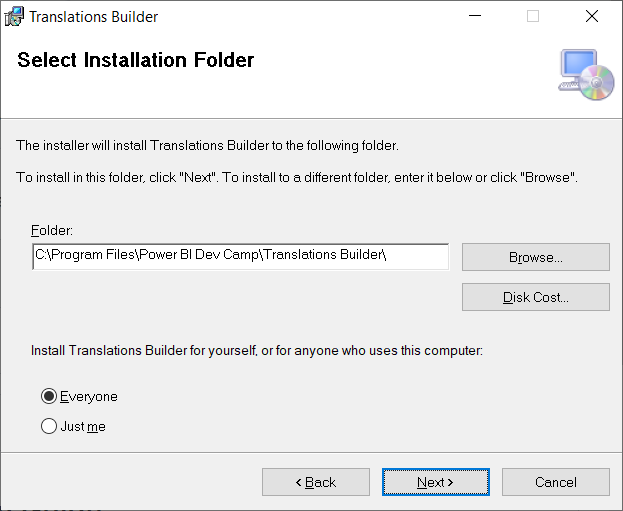
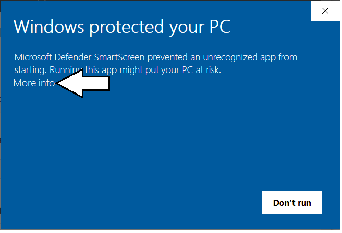
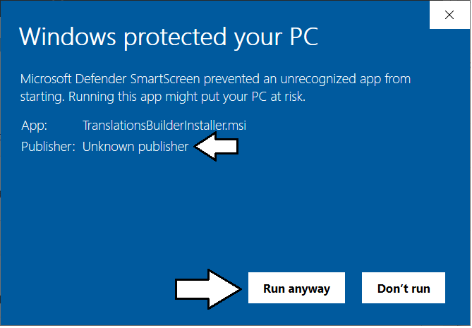
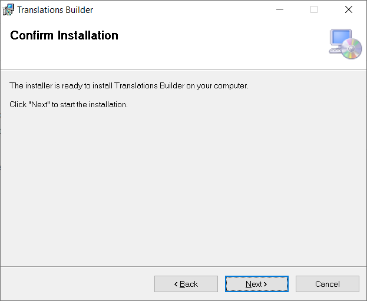
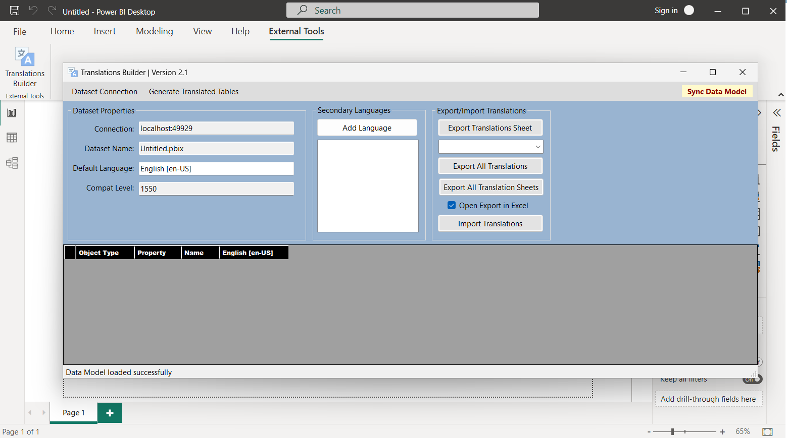
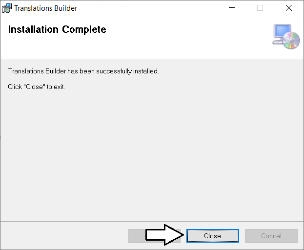
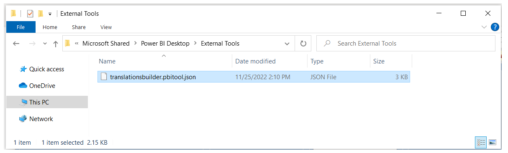
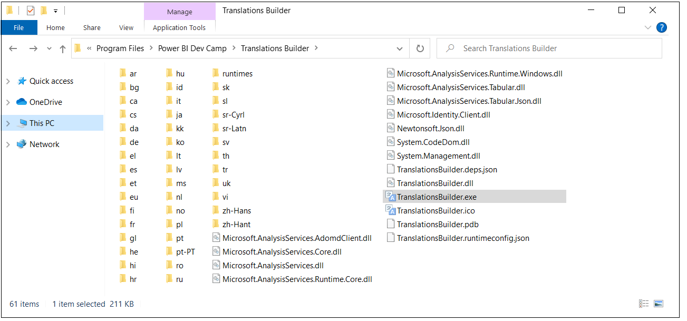
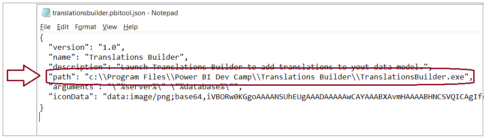

## **Translations Builder Installation Guide**

Before installing **Translations Builder**, ensure your computer meets
the following requirements.

1.  64-bit Version of Windows 10 or Windows 11

2.  64-bit version of Power BI Desktop (November 2022 or later)

3.  .NET 6 Runtime for Desktop Applications ([download install
    files](https://dotnet.microsoft.com/en-us/download/dotnet/thank-you/runtime-desktop-6.0.8-windows-x64-installer)).

To install **Translations Builder**, begin by downloading
[**TranslationsBuilderInstall.msi**](https://github.com/PowerBiDevCamp/TranslationsBuilder/raw/main/SetupFiles/TranslationsBuilderInstaller.msi).

When you click the download link, the browser should download the MSI
file named **TranslationsBuilderInstall.msi** and place this file in the
local **Downloads** folder. The browser should eventually show that
**TranslationsBuilderInstall.msi** has been downloaded and it should
provide a context menu of actions. The following screenshot shows what
this experience looks like when using Google Chrome. Other browsers will
provide a different experience.

Note that the installation file named **TranslationsBuilderInstall.msi**
has not been signed using Authenticate to verify the authenticity of the
code manufacturer. We are in the process of obtaining a code-signing
certificate for Power BI Dev Camp which will make the installation
process smoother. But for now, there are some extra steps to go through
during installation because the Window operating system cannot verify
who the publisher is.

Open to context menu for **TranslationsBuilderInstall.msi** and select
**Open** to run the installation program.

Because TranslationsBuilderInstall.msi is not signed with a code-signing
certificate, you will be present with the following dialog with the
title **Windows protected your PC dialog**. Click the **More info** link
to continue.

The next screen display the name of the App as
**TranslationsBuilderInstall,msi** and indicate that the publisher is
unknown. Click the **Run anyway** button to begin the installation
process.

When you see the **Welcome** screen of the **Translations Builder Setup
Wizard**, click **Next** to continue,

On the **Select Installation Folder** page, accept the default Folder
value and click **Next**.

. 

Do not change default **Folder** path value of **C:\Program Files\Power
BI Dev Camp\Translations Builder\\**. That’s because the installation
program copies a file named into the special folder for external tools.
adds

Xxx

Xxxx

Xxxx

X

Open Power BI Desktop, Navigate to the **External Tools** tab.

You should see

Xxxxx

Your done.

Troubleshooting

Installation should create this

C:\Program Files\Power BI Dev Camp\Translations Builder

Here is what it looks like.

C:\Program Files\Power BI Dev Camp\Translations Builder

The installation program copies a special file named
translationsbuilder.pbitool.json into a folder at the path of

C:\Program Files (x86)\Common Files\Microsoft Shared\Power BI
Desktop\External Tools to register Translations Builder as an external
tool which can be integrated with Power BI Desktop.

There is also a file named l

Upgrade

You can install a newer version just like you did the original install.
