## **Getting Started with Translation Builder**

**Setup Time**: 60 minutes

**Lab Folder**: C:\Student\Modules\05_PBIVIZ\Lab

**Overview**: In this lab, you will begin be installing the Power BI
Custom Visual Tool (PBIVIZ). After that, you will use Node.js, the
PBIVIZ utility and Visual Studio Code to create and debug custom visual
projects within the context of a Power BI workspace.

**Prerequisites**: This lab assumes you’ve already installed Node.JS and
Visual Studio Code as described in setup.docx.

### Exercise 1: Prepare Your PC for Developing Custom Visuals

In this exercise you will install the Power BI Custom Visual Tool
(PBIVIZ) and then install a self-signed SSL certificate which makes it
possible to debug custom visual projects in Node.js using the local
address of <https://localhost>.

1.  Install the Power BI Custom Visual Tool (PBIVIZ).

    1.  Using the Windows Start menu, launch the **Node.js command
        prompt**.

2.  You should now have an open Node.js command prompt.

3.  Type and execute the following command to install the Power BI
    Custom Visual Tool (PBIVIZ).

npm install -g powerbi-visuals-tools@3

The **@3** at the end ensures that you install the version of these
tools with the largest version number that starts with a 3 but not a 2.

4.  By inspecting the console output, you should be able to determine
    which version of the tools are being installed.

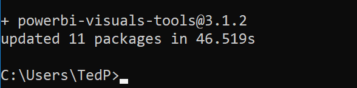

2.  Run the **pbiviz --help** command to discover what commands are
    available.

    1.  From the Node.js command prompt, type and execute the following
        command.

pbiviz --help

2.  You should see output in the console that lists the commands
    supported by the **pbiviz** utility.

3.  Check the version of **pbiviz** by typing and executing the
    following command.

pbiviz --version

4.  You should now see the version number of the **pbiviz** utility as
    output in the console window.

3.  Install a self-signed SSL certificate to test and debug custom
    visuals using the <https://localhost> domain.

    1.  In the Node.js command prompt, type and execute the following
        command.

pbiviz --install-cert

When you execute this command, you will be prompted by the **Certificate
Import Wizard**. This wizard provides an interactive experience in which
you will work to complete the process of installing the self-signed SSL
certificate for **localhost**.

1.  On the **Welcome to the Certificate Import Wizard** page, click
    **Next**.

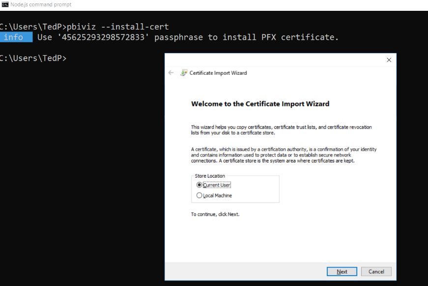

2.  Navigate back to the console and copy the passphrase into the
    Windows clipboard.

3.  On the **Welcome to the Certificate Import Wizard** page, select
    **Current User** and then click **Next**.

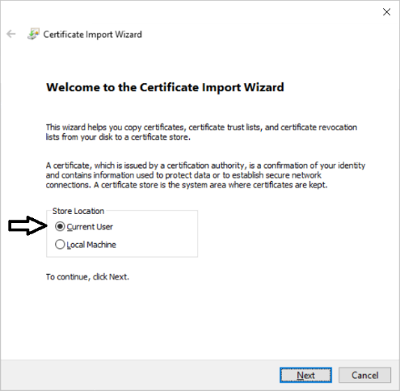

4.  On the **File to Import** page, accept the default **File name**
    value and click **Next** to continue.

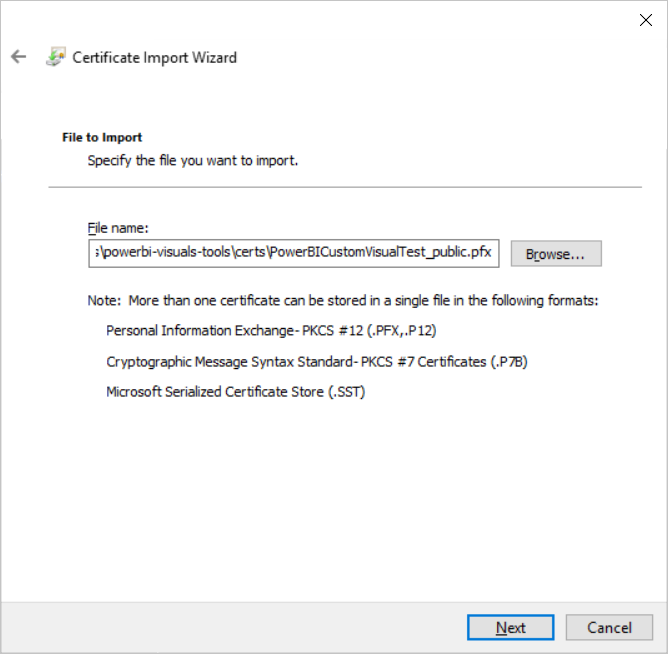

5.  On the **Private key protection** page, paste the passphrase from
    the clipboard into the **Password** textbox and click **Next**.

It can be helpful to check the **Display Password** option so you can
make sure there are no quotes at the start or end of the password.

6.  On the **Certificate Store** page, select **Place all certificates
    in the following store** and then click the **Browse…** button.

7.  In the **Select Certificate Store** dialog, select **Trusted Root
    Certificate Authorities** and click the **OK** button.

8.  On the **Certificate Store** page, click the **Next** button to
    continue.

9.  On the **Completing the Certification Import Wizard** page, click
    **Finish**.

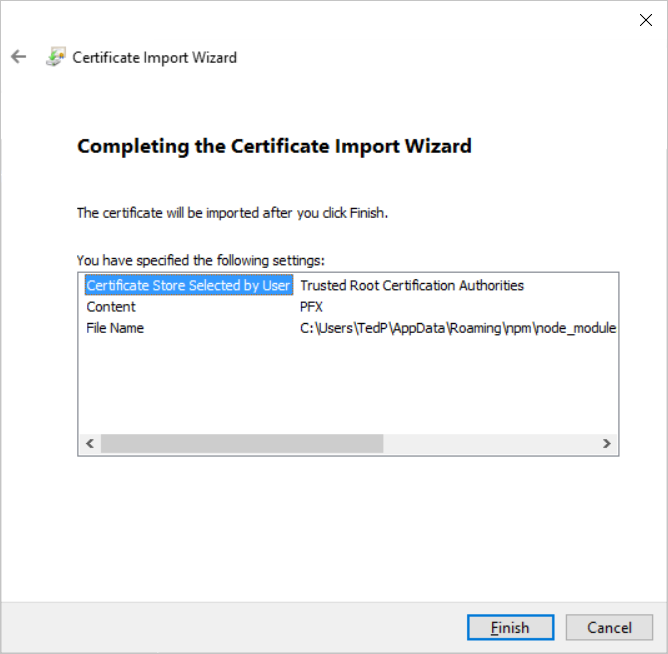

10. If you see the following **Security Warning** dialog, click **Yes**
    to continue with the certificate installation.

11. You should be prompted with a dialog that tells you the certificate
    import was successful.

You have now installed the Power BI Custom Visual Tool (PBIVIZ) and a
self-signed SSL certificate for the local debugging address of
<https://localhost>. You can now begin to create, test and debug custom
visuals.

### Exercise 2: Create and Debug a Simple Custom Visual

In this exercise you will create and test out your first custom visual
project using the PBIVIZ utility.

1.  Create a new project for custom visual name **viz01** using the
    **pbiviz** utility.

    1.  Return to the **Node.js** command prompt.

    2.  Type and execute **cd c:\Student** to switch the current path to
        the **c:\Student** folder.

    3.  Type and execute the command **md CustomVisuals** to create a
        new folder named **c:\Student\CustomVisuals**.

    4.  Type and execute **cd** **CustomVisuals** to switch the current
        path to the **c:\Student\CustomVisuals** folder.

12. Type and execute the following **pbiviz** command to create a new
    custom visual project named **viz01**.

pbiviz new viz01

13. You should see output in the console window that the visual has been
    created successfully.

14. Open project using Visual Studio Code.

15. In the Node.js command prompt, type and execute **cd viz01** to make
    the folder for this project the current directory

16. In the Node.js command prompt, type and execute **code .** to open
    the project with Visual Studio Code.

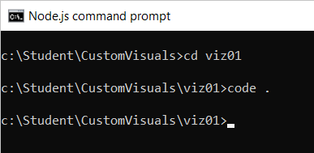

17. Visual Studio Code should start and open the root folder of the
    **viz01** project.

18. Inspect the **package.json** file for your new project.

19. Open the the **package.json** file.

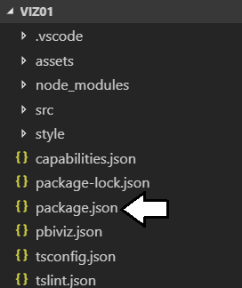

20. Inspect the **dependencies** and **devDependencies** sections to see
    what other packages have been installed.

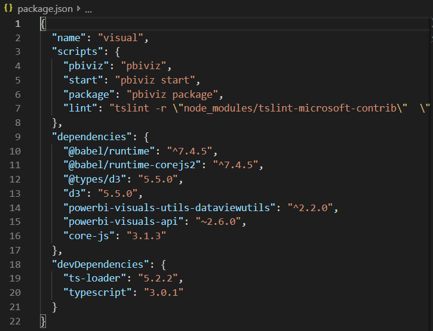

21. After you have inspected **package.json**, close this file without
    saving any changes.

22. Inspect what’s inside **visual.ts** to see the TypeScript code
    automatically added by **pbiviz** when creating a new custom visual.

23. In Visual Studio Code, expand the **src** folder and locate file
    named **visual.ts** and double-click this file to open it.

24. Look inside the source file **visual.ts** and inspect the
    pre-provided code for the class named **Visual**.

25. Delete all the existing code from **visual.ts** and replace it with
    the following code.

import powerbi from "powerbi-visuals-api";

import VisualConstructorOptions =
powerbi.extensibility.visual.VisualConstructorOptions;

import VisualUpdateOptions =
powerbi.extensibility.visual.VisualUpdateOptions;

import IVisual = powerbi.extensibility.visual.IVisual;

export class Visual implements IVisual {

private target: HTMLElement;

private updateCount: number;

constructor(options: VisualConstructorOptions) {

console.log('Visual constructor', options);

this.target = options.element;

this.updateCount = 0;

}

public update(options: VisualUpdateOptions) {

console.log('Visual update', options);

this.target.innerHTML = \`\<p\>Update count:
\<em\>\${(this.updateCount++)}\</em\>\</p\>\`;

}

}

If it’s easier, you can copy and paste this code from
**C:\Student\Modules\05_PBIVIZ\Lab\Snippets\Exercise2-Visual-Starter.ts.txt**.

26. Open the **Integrated Terminal** so you can execute **pbiviz**
    commands from within **Visual Studio Code**.

27. In Visual Studio Code, select the **View \> Integrated Terminal**
    command to display the Integrated Terminal.

You should now see a comand line prompt within Visual Studio Code.

28. Use the **start** command of the **pbiviz** utility to start a
    debugging session for the **viz01** custom visual project.

29. Place your cursor at the command prompt in the Integrated Terminal.

30. Type and execute the following command to start a debugging session
    for the **viz01** project.

pbiviz start

31. If you examine the console output, you can see that the web server
    provided by Node.js for debugging has started and is listening for
    incoming HTTP requests on **https://localhost:8080**.

32. Test visual by loading it into the Power BI environment.

33. Log into our personal workspace at <https://app.powerbi.com>.

34. Once you have logged into your personal workspace, drop down the
    Power BI Setting menu (*it’s the one with the gear icon*) and then
    select the **Settings** menu command as shown in the following
    dialog.

35. Select **Developer** on the left and then select the **Enable
    developer visual for testing** checkbox.

36. Now navigate to any report in your workspace. It doesn’t matter what
    report you use as long as you have a report.

37. Move the report into edit mode by clicking the **Edit report**
    button.

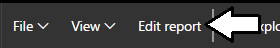

38. Add a new page to the report so you have a blank report page to work
    with.

39. Add an instance of the **Developer Visual** to the page.

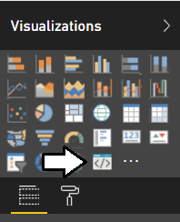

40. Select the developer visual and then add a field into the **Category
    Data** well in the **Fields** pane.

It doesn’t really matter which field you add. However, you must add at
least one field for the visual rendering to occur properly.

41. You should now see the custom visual for **viz01** on the report
    page render inside the developer visual.

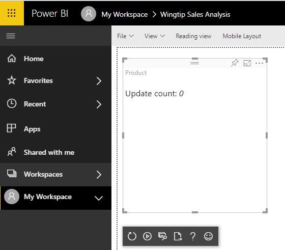

42. Resize the visual by dragging and dropping the lower right corner of
    the visual with the mouse. You should see the **Update count** total
    increase whenever you resize the visual.

43. Modify the code in the **update** function of the custom visual.

44. Return to Visual Studio Code.

45. Open the source file **visual.ts**.

46. Inside **visual.ts**, locate the **update** method which should
    currently match the following code listing.

public update(options: VisualUpdateOptions) {

console.log('Visual update', options);

this.target.innerHTML = \`\<p\>Update count:
\<em\>\${(this.updateCount++)}\</em\>\</p\>\`;

}

47. Replace the code in the **update** method by copying and pasting the
    following code.

public update(options: VisualUpdateOptions) {

console.log('Visual update', options);

this.target.innerHTML =

\`\<table id='myTable'\>

\<tr\>\<td\>Width:\</td\>\<td\>\${options.viewport.width}\</td\>\</tr\>

\<tr\>\<td\>Height:\</td\>\<td\>\${options.viewport.height}\</td\>\</tr\>

\</table\>\`;

}

You can copy and paste this code from
**C:\Student\Modules\05_PBIVIZ\Lab\Snippets\Exercise2-Replace-Update-Function.ts.txt**.

48. After you have updated the **update** method, save your changes to
    the file **visual.ts**.

49. When you save **visual.ts**, you will notice that the Node.js
    command prompt will run to recompile the code for your visual.

50. Return to the browser and the page where you instantiated the custom
    visual for testing.

51. In the visual developer panel, click the **Reload Visual Code**
    button as shown in the following screenshot.

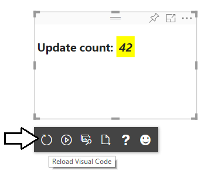

52. You should now see that the visual output as shown in the following
    screenshot which shows the visual width and height.

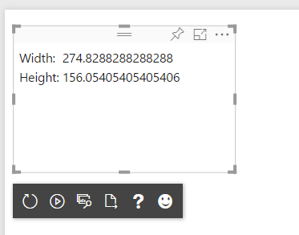

53. Click the **Toggle Auto Reload** button so that visual automatically
    reloads when you make additional updates.

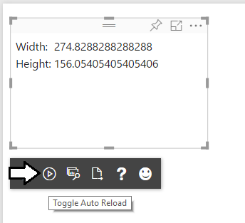

54. Make another change to the code in your custom visual.

55. Return to Visual Studio Code.

56. Move down to the **update** method.

57. Modify the code that retrieve the visual width and height by adding
    the **toFixed(2)** method to configure the output to only show two
    digits of accuracy after the decimal.

public update(options: VisualUpdateOptions) {

console.log('Visual update', options);

this.target.innerHTML =

\`\<table id='myTable'\>

\<tr\>\<td\>Width:\</td\>\<td\>\${options.viewport.width.toFixed(2)}\</td\>\</tr\>

\<tr\>\<td\>Height:\</td\>\<td\>\${options.viewport.height.toFixed(2)}\</td\>\</tr\>

\</table\>\`;

}

You can copy & paste this from
**C:\Student\Modules\05_PBIVIZ\Lab\Snippets\Exercise2-Replace-Update-Function-Part2.ts.txt**.

58. Save your changes to **visual.ts**.

59. Return to the browser and you should see the effect of your changes
    in that the values now show only two points of precision.

60. Experiment by resizing the visual and you should see the width and
    height automatically update.

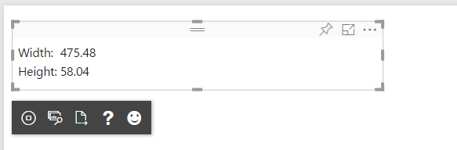

At this point, you are done testing your first custom visual.

61. Stop the visual debugging session.

62. Return to Node.js command prompt.

63. Hold down the **Ctrl** key on the keyboard and then press **C** to
    interrupt the Node.js debugging session.

64. When prompted to terminate the session, type **Y** and press
    **ENTER**.

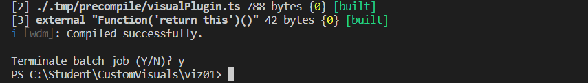

Now you have created and tested a simple custom visual project. Next you
will create another custom visual project that uses jQuery.

65. Add some CSS styles to your visual.

66. Expand the style folder and open the file named **visual.less**.

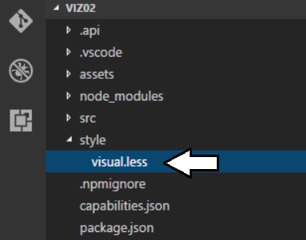

67. Replace the contents of **visual.less** with the following CSS code.

\#myTable{

background-color: black;

td{

background-color: lightyellow;

color:darkblue;

padding: 8px;

}

}

68. Save your changes to **visual.less**.

When you save your changes to **visual.less**, the PBIVIZ utility will
recompile the entire **viz02** project.

69. Return to the browser and refresh your visual. You should see the
    effects of the CSS styles in your visual.

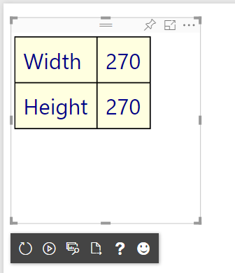

70. Add scaling font behavior to your visual.

71. Return to Visual Studio Code.

72. Navigate to the **visual.ts** file and locate the **update** method.

73. Copy and paste the following code into the **update**.

public update(options: VisualUpdateOptions) {

console.log('Visual update', options);

var scaledFontSizeWidth: number = Math.round(options.viewport.width /
8);

var scaledFontSizeHeight: number = Math.round(options.viewport.height /
5);

var scaledFontSize: number = Math.min(...\[scaledFontSizeWidth,
scaledFontSizeHeight\]);

var scaledFontSizeCss: string = scaledFontSize + "px";

this.target.innerHTML =

\`\<table id='myTable' style='font-size:\${scaledFontSizeCss};'\>

\<tr\>\<td\>Width:\</td\>\<td\>\${options.viewport.width.toFixed(2)}\</td\>\</tr\>

\<tr\>\<td\>Height:\</td\>\<td\>\${options.viewport.height.toFixed(2)}\</td\>\</tr\>

\</table\>\`;

}

You can copy & paste the code for this visual from
**C:\Student\Modules\05_PBIVIZ\Lab\Snippets\Exercise3-Font-Scaling.ts.txt**

74. Save your changes to **visual.ts**.

75. Return to the browser and refresh your visual.

76. As you change the size of the visual, the font size should now
    change along with it.

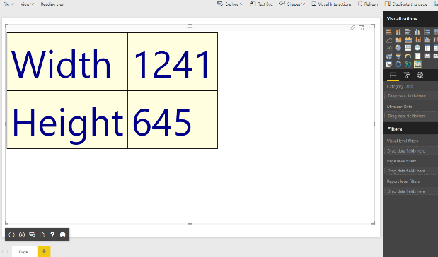

### Exercise 3: Create a Custom Visual using the D3 Library

In this exercise, you will create a new visual named **viz03** which
uses D3 to implement a simple Power BI visual.

1.  Create a new visual project named **viz02**.

    1.  Return to the Node.js command prompt.

    2.  Type and execute the following command to make the current
        directory back to **C:\Student\CustomVisuals**

Cd ..

1.  Type and execute the following three commands to create a new visual
    project and open it in Visual Studio Code.

pbiviz new viz02

cd viz02

code .

2.  You should now have a new project named **viz02** that is open in
    Visual Studio Code.

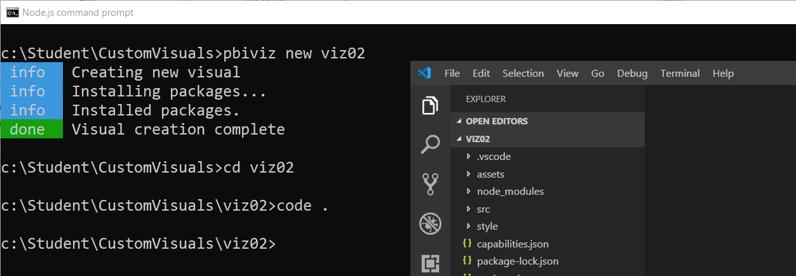

77. Open package.json.

78. Open file

There is no need to add the Node.js package for d3 and @types/d3 because
they have been automatically added by the template used to create a new
custom visual project.

79. Close package.json without saving any changes.

80. Open the Integrated Terminal so you can execute command-line
    instructions from within Visual Studio Code.

81. Inside Visual Studio Code, select the **View \> Integrated
    Terminal** menu command.

82. You should see the **Integrated Terminal** window with a command
    prompt inside Visual Studio Code.

83. 

Now you are now ready to begin programing your TypeScript code using the
D3 library.

84. Modify the **visual.ts** file.

85. Open **visual.ts** if it is not already open.

86. Modify the class definition named **Visual** to match the following
    code.

module powerbi.extensibility.visual {

export class Visual implements IVisual {

constructor(options: VisualConstructorOptions) { }

public update(options: VisualUpdateOptions) { }

}

}

1.  Modify the Visual class as shown in the following code listing.

module powerbi.extensibility.visual {

export class Visual implements IVisual {

private svgRoot: d3.Selection\<SVGElementInstance\>;

private ellipse: d3.Selection\<SVGElementInstance\>;

private text: d3.Selection\<SVGElementInstance\>;

private padding: number = 20;

constructor(options: VisualConstructorOptions) {

this.svgRoot = d3.select(options.element).append("svg");

}

public update(options: VisualUpdateOptions) {}

}

}

2.  Modify the constructor using the following code.

constructor(options: VisualConstructorOptions) {

this.svgRoot = d3.select(options.element).append("svg");

this.ellipse = this.svgRoot.append("ellipse")

.style("fill", "rgba(255, 255, 0, 0.5)")

.style("stroke", "rgba(0, 0, 0, 1.0)")

.style("stroke-width", "4");

this.text = this.svgRoot.append("text")

.text("Hello D3")

.attr("text-anchor", "middle")

.attr("dominant-baseline", "central")

.style("fill", "rgba(255, 0, 0, 1.0)")

.style("stroke", "rgba(0, 0, 0, 1.0)")

.style("stroke-width", "2");

}

3.  Modify the update method by adding code to append the **svgRoot**
    element.

public update(options: VisualUpdateOptions) {

this.svgRoot

.attr("width", options.viewport.width)

.attr("height", options.viewport.height);

}

4.  Add the following code to create a **plot** variable.

this.svgRoot

.attr("width", options.viewport.width)

.attr("height", options.viewport.height);

var plot = {

xOffset: this.padding,

yOffset: this.padding,

width: options.viewport.width - (this.padding \* 2),

height: options.viewport.height - (this.padding \* 2),

};

5.  Add the following code to resize the ellipse.

this.ellipse

.attr("cx", plot.xOffset + (plot.width \* 0.5))

.attr("cy", plot.yOffset + (plot.height \* 0.5))

.attr("rx", (plot.width \* 0.5))

.attr("ry", (plot.height \* 0.5))

87. Add the following code to scale the font size.

var fontSizeForWidth: number = plot.width \* .20;

var fontSizeForHeight: number = plot.height \* .35;

var fontSize: number = d3.min(\[fontSizeForWidth, fontSizeForHeight\]);

88. Add the following code to resize the text element.

this.text

.attr("x", plot.xOffset + (plot.width / 2))

.attr("y", plot.yOffset + (plot.height / 2))

.attr("width", plot.width)

.attr("height", plot.height)

.attr("font-size", fontSize);

1.  Your implementation of **update** should now match the following
    code listing.

public update(options: VisualUpdateOptions) {

this.svgRoot

.attr("width", options.viewport.width)

.attr("height", options.viewport.height);

var plot = {

xOffset: this.padding,

yOffset: this.padding,

width: options.viewport.width - (this.padding \* 2),

height: options.viewport.height - (this.padding \* 2),

};

this.ellipse

.attr("cx", plot.xOffset + (plot.width \* 0.5))

.attr("cy", plot.yOffset + (plot.height \* 0.5))

.attr("rx", (plot.width \* 0.5))

.attr("ry", (plot.height \* 0.5))

var fontSizeForWidth: number = plot.width \* .20;

var fontSizeForHeight: number = plot.height \* .35;

var fontSize: number = d3.min(\[fontSizeForWidth, fontSizeForHeight\]);

this.text

.attr("x", plot.xOffset + (plot.width / 2))

.attr("y", plot.yOffset + (plot.height / 2))

.attr("width", plot.width)

.attr("height", plot.height)

.attr("font-size", fontSize);

}

You can copy & paste all this code from
**C:\Student\Modules\05_PBIVIZ\Lab\Snippets\Exercise4-Visual-Starter.ts.txt**

2.  Test out your new visual on a Power BI report.

    1.  Return to the Node.js command prompt and run the following
        command to start a new debugging session.

pbiviz start

2.  Move back to the browser and return to the Power BI report you used
    in the previous exercise.

3.  Make sure the report is in edit mode.

4.  Add a Developer Visual to the page and then add a field into the
    **Data Category** well inside the **Fields** pane.

5.  You should now see your custom visual render on the page and it
    should match the following screenshot.

89. Experiment by resizing the visual and seeing how to scales to
    various sizes.

Congratulations. You have now completed this lab.
