# **Hands-on Lab: Building Multi-language Reports for Power BI**

> **Overview**: In this lab, you will learn how to work with Power BI
Desktop and [**Translations
Builder**](https://github.com/PowerBiDevCamp/TranslationsBuilder) to
build and test a multi-language report for Power BI. You will start by
downloading a PBIX project file named **Product Sales.pbix** and opening
it in Power BI Desktop. Once you have opened the **Product Sales**
project, you will launch Translations Builder and move through the steps
to add metadata translations and report label translations. In later
exercises you will also learn how to implement data translations. At
various milestones in this lab, you will be required to publish the
**Product Sales** project from Power BI Desktop to the Power BI Service
so you can test out the translations you’ve added to the PBIX project to
ensure they display correctly when loaded using different languages and
locales.

### Prerequisites

- **Prerequisite 1**: This lab assumes you're experienced with Power BI
Desktop and you know how to build queries, datasets and reports.

- **Prerequisite 2**: This lab assumes you’ve already installed
Translations Builder. If you haven’t installed Translations Builder yet,
you must follow steps in the [Translations Builder Installation
Guide](https://github.com/PowerBiDevCamp/TranslationsBuilder/blob/main/Docs/Installation%20Guide.md)
before continuing with these lab exercises.

- **Prerequisite 3**: To complete this lab, you will need a Power BI
workspace where you have appropriate permissions to publish PBIX project
files from Power BI Desktop to test your work. This workspace must also
be associated with a Premium capacity as indicated by the diamond image
 displayed after the workspace name (*see below*). A workspace in a
premium capacity is required because Power BI translations do not load
properly for reports in the shared capacity.

&nbsp;&nbsp;&nbsp;&nbsp;&nbsp; 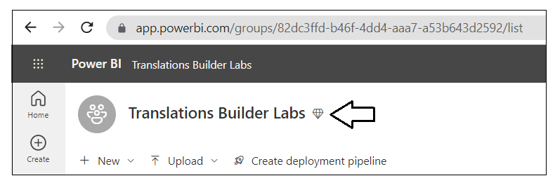

### Student Files
These hands-on lab instructions are accompanied by a set of files in a ZIP
archive named **StudentFiles.zip** that you can download from
[**HERE**](https://github.com/PowerBiDevCamp/TranslationsBuilder/raw/main/Labs/StudentFiles.zip).
The **StudentFiles** folder inside the ZIP archive contains a **Solution** folder with a completed solution for each of the six lab exercises in the form of a PBIX project file. There is also a
**Snippets** folder with text files containing DAX code and M code that
you will need to copy and paste in Power BI Desktop in later exercises. While you can copy
and paste DAX and M code from this lab manual, some students will find it
easier to copy the code from these text files in the **Snippets** folder instead.

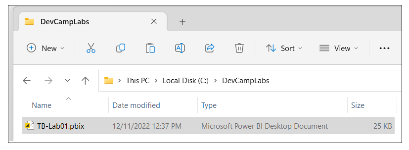

### Lab Exercise Table of Contents
- [Exercise 1: Creating and Testing Metadata Translations](#exercise-1-creating-and-testing-metadata-translations)
- [Exercise 2: Generating Machine Translations](#exercise-2-generating-machine-translations)
- [Exercise 3: Creating and Testing Report Label Translations](#exercise-3-creating-and-testing-report-label-translations)
- [Exercise 4: Creating a Workflow Process To Gather & Integrate Human Translations](#exercise-4-creating-a-workflow-process-to-gather-integrate-human-translations)
- [Exercise 5: Implementing Data Translations using Field Parameters](#exercise-5-implementing-data-translations-using-field-parameters)
- [Exercise 6: Implementing Data Translations for a Calendar Table](#exercise-6-implementing-data-translations-for-a-calendar-table)

## Exercise 1: Creating and Testing Metadata Translations
> In this exercise, you will begin by downloading a PBIX file with a
simple data model and a report with three pages. You will publish the
project to the Power BI Service to set up a workflow process to test
your work with translations in the browser. After that, you will use
Translations Builder to add metadata translations for the column names
and measure names in the dataset.

1.  Download the PBIX starter file named **Product Sales.pbix** from **[this link](https://github.com/PowerBiDevCamp/TranslationsBuilder/raw/main/Labs/StarterFiles/Product%20Sales.pbix)** or from  the **StarterFiles** folder in the **StudentFiles** folder. 


2.  Create a new folder on your local hard drive for these lab exercises in a location such as **C:\DevCampLabs**.

&nbsp;&nbsp;&nbsp;&nbsp;&nbsp;&nbsp;&nbsp;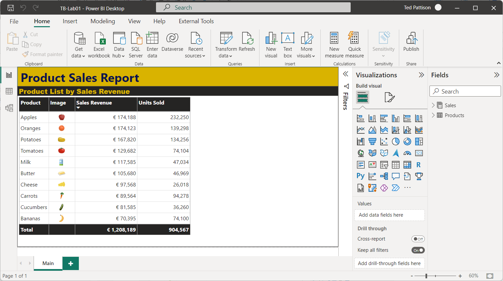

3.  Copy **Product Sales.pbix** into the lab folder and then open it in
    Power BI Desktop to examine the report inside.

&nbsp;&nbsp;&nbsp;&nbsp;&nbsp;&nbsp;&nbsp;

4.  While in **Report** view, examine the **Fields** list to see the tables, columns and measure that are not hidden.

&nbsp;&nbsp;&nbsp;&nbsp;&nbsp;&nbsp;&nbsp;

5.  Navigate to the second page named **Sales By Category** and examine
    its contents and layout.

&nbsp;&nbsp;&nbsp;&nbsp;&nbsp;&nbsp;&nbsp;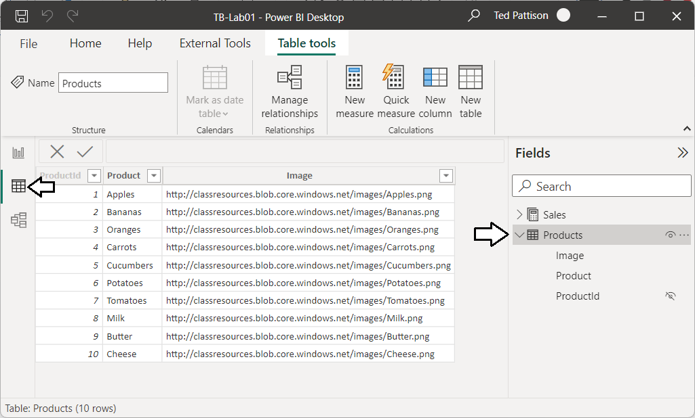

> Data translations for product names and category names will be addressed in **Exercise 5**.

6.  Navigate to the third page named **Sales Over Time** and examine its contents and layout.

&nbsp;&nbsp;&nbsp;&nbsp;&nbsp;&nbsp;&nbsp; 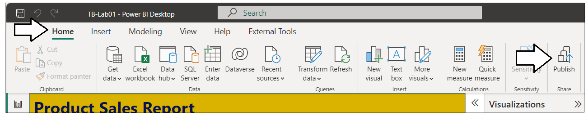

> Data Translations for month names and day names will be addressed in **Exercise 6**.

7.  Now, navigate to **Model** view so you can see the entire data model including the columns hidden from **Report** view.

&nbsp;&nbsp;&nbsp;&nbsp;&nbsp;&nbsp;&nbsp; 

8.  Navigate to **Data view** and examine the rows of the **Products** table.

&nbsp;&nbsp;&nbsp;&nbsp;&nbsp;&nbsp;&nbsp; 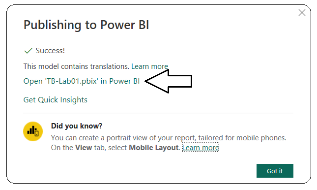

> Next, you are going to publish the **Product Sales** project to a Premium workspace in the Power BI Service.

9.  Navigate to the **Home** tab and then click the **Publish** button.

&nbsp;&nbsp;&nbsp;&nbsp;&nbsp;&nbsp;&nbsp; 

10. When prompted by the **Publish to Power BI** dialog, choose your test workspace and then click **Select**.

&nbsp;&nbsp;&nbsp;&nbsp;&nbsp;&nbsp;&nbsp; 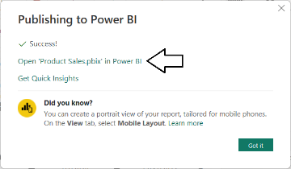

11. Once you see **Success!**, click **Open ‘Product Sales.pbx’ in Power BI** to view the report in the Power BI Service.

&nbsp;&nbsp;&nbsp;&nbsp;&nbsp;&nbsp;&nbsp; 

12. The report named **Product Sales** should appear like the report shown in the screenshot below.

&nbsp;&nbsp;&nbsp;&nbsp;&nbsp;&nbsp;&nbsp; 

13. Navigate to the two other pages using the navigation buttons in the toolbar under the report title.

&nbsp;&nbsp;&nbsp;&nbsp;&nbsp;&nbsp;&nbsp; 

> Now it’s time to begin adding translations. As you begin to add
translations to a PBIX project, you will often follow this set of
steps:  
**(1)** make changes in Power BI Desktop, **(2)** publish the project,
**(3)** check your work in the Power BI Service, **(4)** repeat

14. Return to Power BI Desktop.

15. Navigate to the **External Tools** tab and launch **Translations Builder**.

&nbsp;&nbsp;&nbsp;&nbsp;&nbsp;&nbsp;&nbsp; 

16. Translations Builder should start and load the data model for the **Product Sales** project.

&nbsp;&nbsp;&nbsp;&nbsp;&nbsp;&nbsp;&nbsp; 

17. The **Dataset properties** section on the left provides details about the dataset connection and the PBIX project file.

&nbsp;&nbsp;&nbsp;&nbsp;&nbsp;&nbsp;&nbsp; 

> Every PBIX project file has a default language and a default locale. The
**Product Sales** project has a default language of **English (en)** and
a default locale of the **United States (US)**.

18. Examine the translation grid down below which displays a row for each non-hidden dataset object in the data model.

&nbsp;&nbsp;&nbsp;&nbsp;&nbsp;&nbsp;&nbsp; 

> Tables, columns and measures that are hidden from report view in the
data model are not displayed. You don’t need to translate them.

19. Click the **Add Language** button to add your first secondary language.

&nbsp;&nbsp;&nbsp;&nbsp;&nbsp;&nbsp;&nbsp; 

20. Select **Spanish \[es-ES\]** and click **Add Language**.

&nbsp;&nbsp;&nbsp;&nbsp;&nbsp;&nbsp;&nbsp; 

21. You should now see that **Spanish \[es-ES\]** appears as the first language in the **Secondary Languages** list.

&nbsp;&nbsp;&nbsp;&nbsp;&nbsp;&nbsp;&nbsp; 

22. You should also notice that a new column has been added to the translation grid for Spanish translations.

&nbsp;&nbsp;&nbsp;&nbsp;&nbsp;&nbsp;&nbsp; 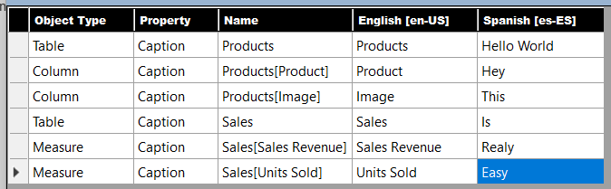

23. In the row with the **Products** table, click on the cell for the **Spanish** column. It should turn blue when selected.

&nbsp;&nbsp;&nbsp;&nbsp;&nbsp;&nbsp;&nbsp; 

24. Type **Hello World**. You should see that you can just start typing in the selected cell to add or edit a translation.

&nbsp;&nbsp;&nbsp;&nbsp;&nbsp;&nbsp;&nbsp; 

25. Press the **ENTER** key to save your changes. Note that pressing **ENTER** will move the selection to the cell below.

&nbsp;&nbsp;&nbsp;&nbsp;&nbsp;&nbsp;&nbsp; 

26. Now, type some more text and press **ENTER** repeatedly to quickly add text to each cell in the Spanish column.

&nbsp;&nbsp;&nbsp;&nbsp;&nbsp;&nbsp;&nbsp; 

> The point of the last few steps has been for you to become comfortable
with the translation editing experience. You can see the grid provides
an editing experience similar to working with Excel. You can even use
the **{F2}** key to move a cell with content into edit mode.

27. \[OPTIONAL STEP\] Add Spanish translations using the following table or translate them yourself if you know Spanish.

| **English**    | **Spanish**         |
|----------------|---------------------|
| Products       | Productos           |
| Image          | Imagen              |
| Category       | Categoría           |
| Product        | Producto            |
| Sales          | Ventas              |
| Sales Revenue  | Ingresos Por Ventas |
| Units Sold     | Unidades Vendidas   |
| Customer Count | Número De Clientes  |
| First Sale     | Primera Venta       |
| Last Sale      | Última Venta        |
| Calendar       | Calendario          |
| Date           | Fecha               |
| Year           | Año                 |
| Month          | Mes                 |
| Day            | Día                 |

> It's OK if you don't want to type in all the Spanish translations from
the table. Just add whatever text you'd like for these translation so each one contains some text.

28. When you are done with your edits, the Spanish translations should match the following screenshot (or not).

&nbsp;&nbsp;&nbsp;&nbsp;&nbsp;&nbsp;&nbsp; 

29. Return to the **Product Sales** project in Power BI Desktop and save your work by clicking the **Save** button.

&nbsp;&nbsp;&nbsp;&nbsp;&nbsp;&nbsp;&nbsp; 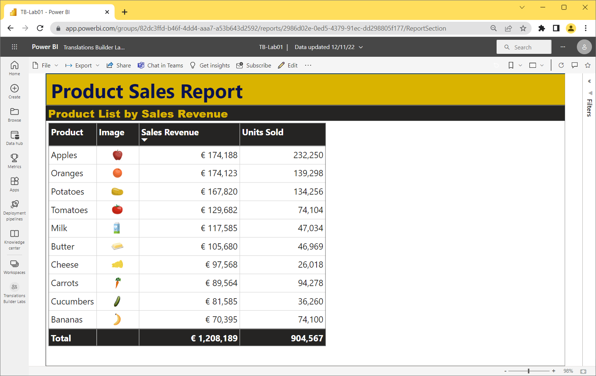

> It’s easy to forget to save your changes in Power BI Desktop. Be aware
that any changes made by Translations Builder are just made to the data
model loaded in memory. None of your changes are saved back to the PBIX
project file until you save in Power BI Desktop.

30. Publish the **Product Sales project** to push the changes to the project’s translations to the Power BI Service.

&nbsp;&nbsp;&nbsp;&nbsp;&nbsp;&nbsp;&nbsp; 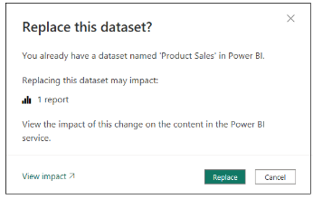

31. When prompted by the **Replace this dataset?** Dialog, click the **Replace** button to continue.

32. Once you see **Success!**, click **Open ‘Product Sales.pbx’ in Power BI** to view the report in the Power BI Service.

&nbsp;&nbsp;&nbsp;&nbsp;&nbsp;&nbsp;&nbsp; 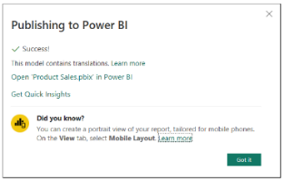

33. The report should load with its default behavior showing all text in English at first.

&nbsp;&nbsp;&nbsp;&nbsp;&nbsp;&nbsp;&nbsp; 

> Now, it’s time to test your translations. You will accomplish this by using the **language** query string parameter to load the report.

34. Click the browser address bar and add the following **language** parameter to the end of the report URL and press **ENTER.**

```
/?language=es-ES
```

35. When you press **ENTER**, you should see the **language** parameter accepted by the browser as it reloads the report.

&nbsp;&nbsp;&nbsp;&nbsp;&nbsp;&nbsp;&nbsp; 

> When the report reloads, you should see the UI experience for the entire Power BI Service UI switch from English to Spanish.

36. Inspect the Card visuals at the bottom of the **Sales Summary**
    page. Verify the column and measure names are displayed with the
    Spanish translations you added earlier in this exercise.

&nbsp;&nbsp;&nbsp;&nbsp;&nbsp;&nbsp;&nbsp; 

37. Inspect the column headers in the Table visual. Verify the column
    and measure names are also displayed with the Spanish translations
    you added.

&nbsp;&nbsp;&nbsp;&nbsp;&nbsp;&nbsp;&nbsp; 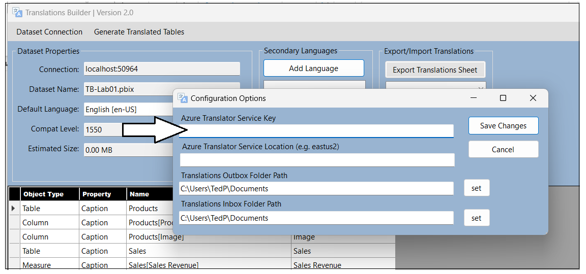

38. Inspect the Column Chart visual. Verify the title and legend title are displayed with the Spanish translations.

&nbsp;&nbsp;&nbsp;&nbsp;&nbsp;&nbsp;&nbsp; 

39. Navigate to the **Sales By Category** page.

40. You should see the title of the Bar Chart visual is not translated because the text for the title is hard-coded in the report.

&nbsp;&nbsp;&nbsp;&nbsp;&nbsp;&nbsp;&nbsp; 

>You have now successfully added the metadata translations to display
this report in both English and Spanish. Leave Power BI Desktop and
Translations Builder open as you will continue using them in your next
exercise.

## Exercise 2: Generating Machine Translations
> In this lab you will configure Translations Builder to support
generating machine translations using the Azure Translator Service.
While machine translations might not provide the level of quality
required for some production scenarios, they do provide a great step
forward in generating the first round translations which can be used for
testing and for getting *\*something\** into production sooner.

To complete this lab you will require a **Key** and **Location** which
provide access to the **Azure Translator Service**. If you have an Azure
subscription, you can learn how to obtain this key and its location by
reading [**Obtaining a Key for the Azure Translator
Service**](https://github.com/PowerBiDevCamp/TranslationsBuilder/blob/main/Docs/Obtaining%20a%20Key%20for%20the%20Azure%20Translator%20Service.md).
If you do not have a Azure subscription or you cannot obtain a key of
your own, you can use the following **Key** and **Location** value when
working on these lab exercises up through February 28, 2023.

Key: **7bf614164d924cd9a9ba3d9cf351d15f**

Location: **eastus2**

1.  Return to Translations Builder and drop down the **Dataset
    Connection** menu.


41. Select the **Configure Settings…** menu command to display the
    **Configuration Options** dialog.


42. In the **Configuration Options** dialog, enter the **Key** and
    **Location** for the Azure Translator Service.


43. Once you have added the **Key** and **Location**, click **Save
    Changes**.

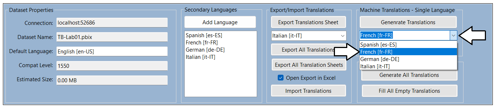

44. After you have configured the **Key** and **Location** for the Azure
    Translator Service, new command will appear on the main window.

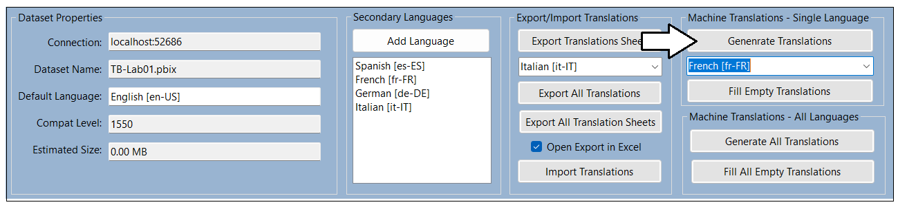

Now that you have added support for generating machine translations,
it’s time to put that automatic translation support to work!

45. Click the **Add Language** button to add your second secondary
    language.

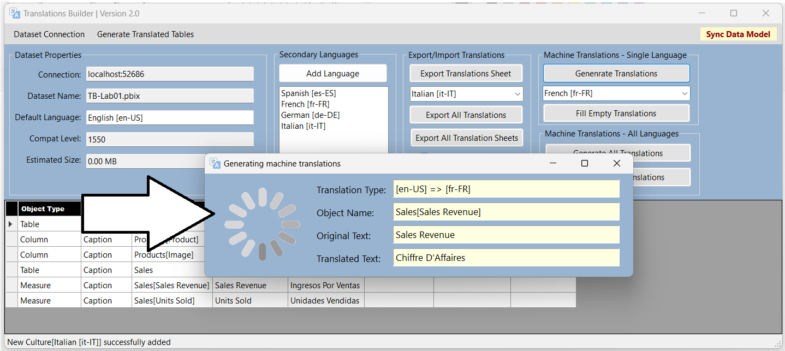

You can hold down the **CTRL** key in the **Add Language** dialog while
selecting languages to enable multiple selection

46. Hold down the **CTRL**, and select **French** and **German**. And
    then click **Add Language**.

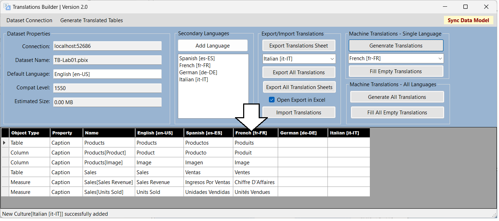

47. You should now see the two new languages appear in the **Secondary
    Languages** list.

48. You will also notice that new columns have been added to the
    translation grid for each new language.


49. In the **Machine Translations – Single Language** section, select
    **French \[fr-FR\]** from the drop down menu.

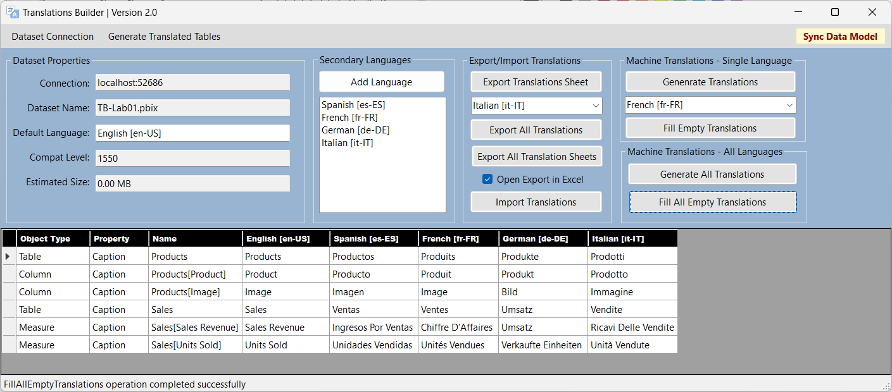

50. Once you have selected **French \[fr-FR\]**, click **Generate
    Translations** to create French translations for all rows in the
    grid.

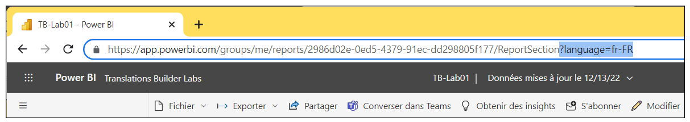

51. As the code runs to interact with the Azure Translator Service, the
    **Generating machine translation** dialog shows the progress.


52. Once this dialog closes, you should see all cells the French column
    has been filled with machine-generated translations.


If your Spanish translations are less than perfect, you can use the same
technique to replace what you have with machine translations.

53. Click the **Fill All Empty Translation** button in the **Machine
    Translations - All Languages** section.

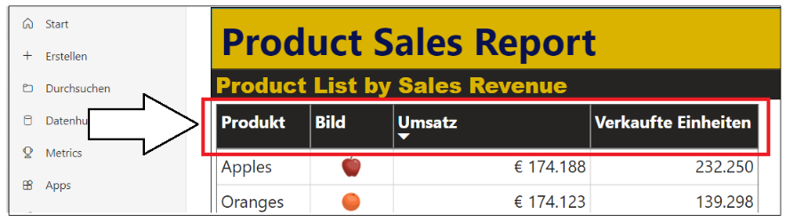

In this scenario, you want to use the **Fill All Empty Translation**
command generate machine translations just for translations that are
empty. Use the **Generate All Translations** command to replace all
existing translations with newly-generated machine translations.

54. You should now see that the empty cells for all secondary languages
    have been populated with machine-generated translations.


Now, it’s time once again to test your work in the Power BI Service,

55. Return to the **Product Sales** project in Power BI Desktop and save
    your work by clicking the **Save** button.

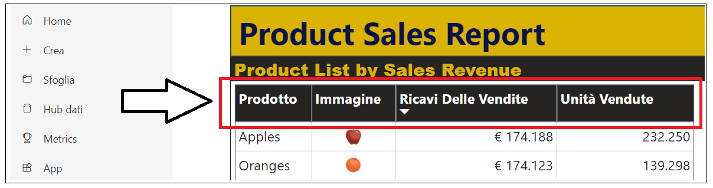

Don’t forget to save your work! Did we mention it’s easy to forget which
can inadvertently lead to you losing your work.

56. Publish the **Product Sales project** to push the changes to the
    project’s translations to the Power BI Service.


57. When prompted by the **Replace this dataset?** Dialog, click the
    **Replace** button to continue.

58. Once you see **Success!**, click **Open ‘Product Sales.pbx’ in Power
    BI** to view the report in the Power BI Service.

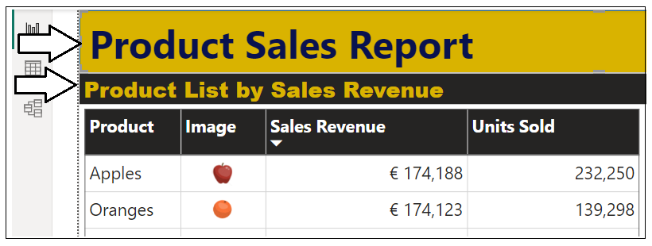

59. The report should load as normal showing all text in English at
    first.


Now, it’s time to test your French and German translations using the
**language** query string parameter to load the report.

60. Click the browser address bar and add the **language** parameter
    value of **fr-FR** for French to the end of the report URL.

/?language=fr-FR

61. When the report reloads, you should see the UI experience for the
    Power BI Service UI switch from English to French.


62. Verify the column and measure names used in all three visuals are
    displayed with French translations.


Now that you have tested the French translations, it’s time to test
German.

63. Click the browser address bar and add the **language** parameter
    value of **de-DE** for German to the end of the report URL.

/?language=de-DE

64. When the report reloads, you should see the UI experience for the
    Power BI Service UI switch to German.


65. Verify the column and measure names in columns headings are
    displayed with the German translations.


Take a moment to appreciate how the date and numeric formatting
automatically changes across all four regional locales.


66. As a final step in this exercise, add a browser bookmark for each
    language with a **language** parameter at the end.

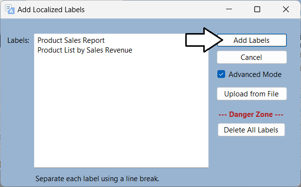

Creating a browser bookmark for each language might take a minute or two
to set up at first. However, it will save lots of time in the long run
as you continue to test the translations you create for this report in
the lab work that remains ahead.

In the previous step you created bookmark in the browser to easily test
the report using different languages. Later in Exercise 5, you will
create bookmarks inside the context of the report in the **Product
Sales** project. To avoid any potential confusions, these lab exercises
will use the term ***browser bookmark*** when referring to the type of
bookmark you have just created in the browser. These lab exercises will
use the term ***report bookmark*** when referring to the type of
bookmark that is created in a Power BI report.

Let's summarize where you are at. You have now successfully created and
tested metadata translations to display the names of columns and
measures in four different languages. In the next exercise, you will
move ahead to implement report label translations.

### Exercise 3: Creating and Testing Report Label Translations

In this exercise, you will work through the process of adding report
label translations. You will add translations for the report title,
navigation button captions and the title of a visual. This will give you
experience working with the localized labels table strategy that
Translations Builder uses to quickly and easily implement report label
translations.

1.  Return to the **Product Sales** project in Power BI Desktop and move
    to **Report view**.

2.  Make sure the current page is **Sales Summary**.

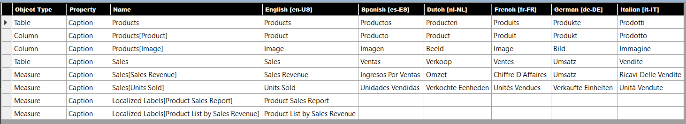

67. Examine the **Product Sales Report** label which is displayed using
    a Rectangle shape object.

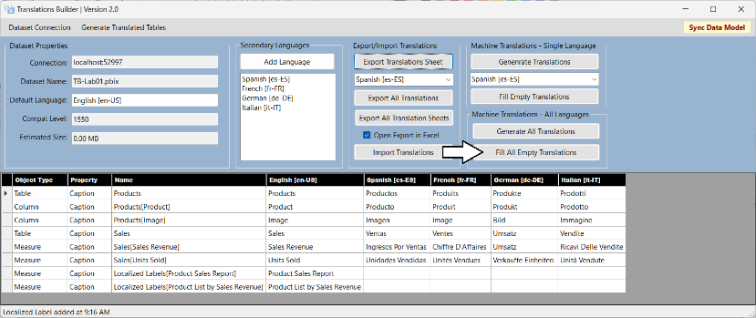

68. Examine the three buttons which provide the navigation menu allowing
    users to switch between pages.

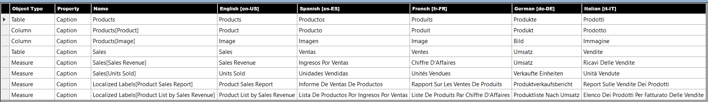

69. Move back to Translations Builder and drop down the **Generate
    Translated Tables** menu.

70. Select the **Create Localized Labels Table** to create the
    **Localized Labels Table**.


71. When you create the **Localized Labels** table, you will be prompted
    with the following dialog. Click **<u>N</u>o** to continue.

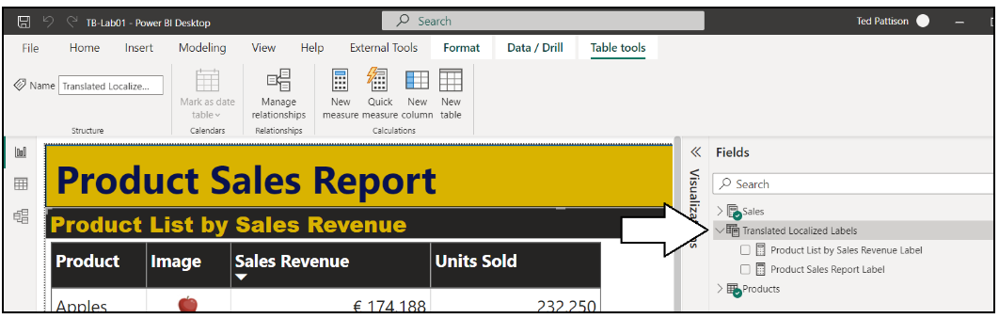

If you click **<u>Y</u>es**, you will be redirected to [this web
page](https://github.com/PowerBiDevCamp/TranslationsBuilder/blob/main/Docs/Building%20Multi-language%20Reports%20in%20Power%20BI.md#understanding-the-localized-labels-table)
which provides a detailed explanation of the Localized Labels table
strategy.

72. Once Translations Builder has created the **Localized Labels**
    table, it will also add three sample report labels.

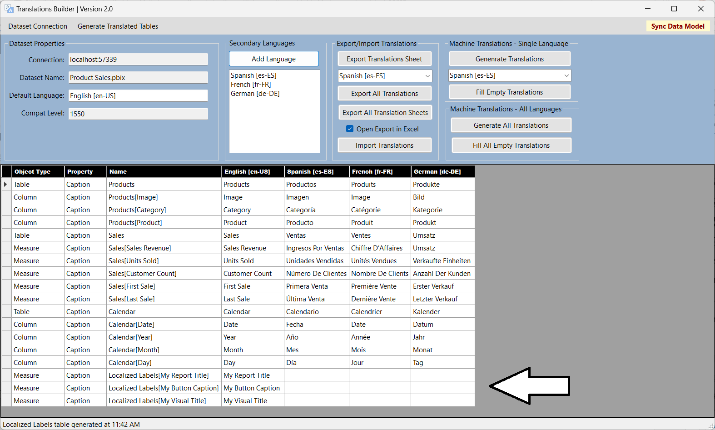

Over the next few steps, you will delete these three sample report
labels and replace them by adding five report labels of your own.

73. Drop down the **Generate Translated Tables** menu and select click
    **Add Labels to the Localized Labels Table**.

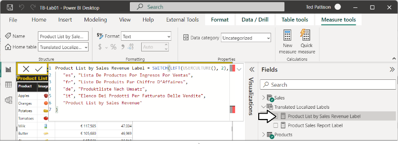

Note you can also execute the **Add Labels to the Localized Labels
Table** command using the shortcut key of **Ctrl+A**.

74. In the **Add Localized Labels** dialog, click the **Advanced Mode**
    checkbox.


75. Once the dialog is in **Advanced Mode**, click the **Delete All
    Labels** button to remove the sample report labels.


76. In the **Labels** textbox, type the following labels separated by
    line breaks.

    - **Product Sales Report**

    - **Sales Summary**

    - **Sales By Category**

    - **Sales Over Time**

    - **Top Selling Products**

77. Click the **Add Labels** button to add the five new report labels to
    your project.


78. You should now see five new rows have been added to the translations
    grid for the new report labels.


79. Click the **Fill All Empty Translations** button to generate
    translations for all the new report labels.


80. At this point, the translations grid should be completely filled
    with machine-generated translations.


There is one critical step you must complete after modifying report
labels in the **Localized Labels** table. More specifically, you must
execute **Generate Translated Localized Labels Table** to create the
measures that will be used to surface report labels on a report.

81. Drop down the **Generate Translated Tables** menu and select click
    **Generate Translated Localized Labels Table**.

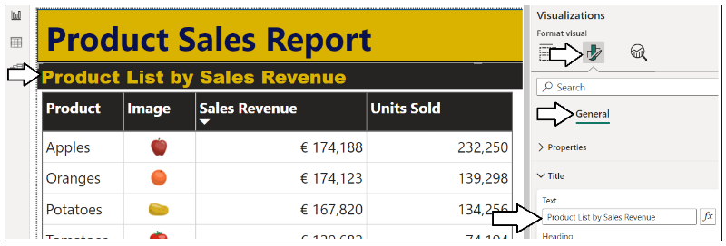

Note you can also execute the **Generate Translated Localized Labels
Table** command using the shortcut key of **Ctrl+L**.

82. Return to the **Product Sales** project in Power BI Desktop and
    navigate to **Report** view.

83. Locate the **Translated Localized Labels** table in the **Fields**
    list.

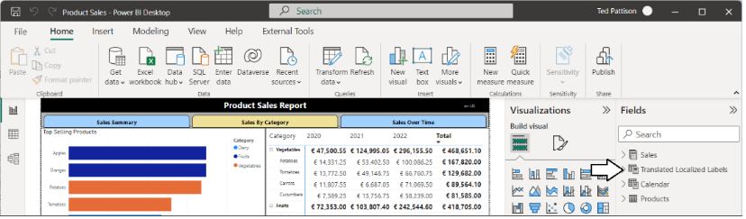

The measures in the **Translated Localized Labels** table are used to
display report labels on a Power BI report.

84. Select the measure named **Product Sales Report Label** and examine
    the DAX expression behind this measure.

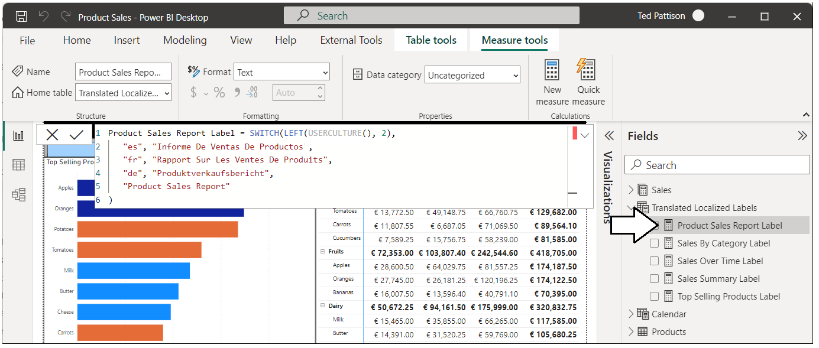

You should not edit the DAX expressions of any measures in the
**Translated Localized Labels** table. Any changes you make will be lost
as all the measures in this table are deleted and recreated each time
you execute **Generate Translated Localized Labels Table**.

85. Take time to examine the DAX expression behind each of the measures
    in the **Translated Localized Labels** table.

Now that you have created measures for report labels in the **Translated
Localized Labels** table, it’s time to use them in the report.

86. Ensure that **Sales Summary** is still the active page in **Report**
    view.


87. In the report layout, select the large black Rectangle shape that
    displays the report title **Product Sales Report**.

88. With the Rectangle shape selected, move to the **Format** pane and
    locate the **Text** section inside the **Style** selection.

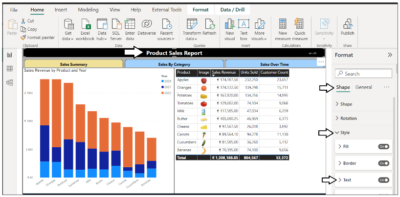

89. Expand the **Text** section to see the **Text** property is
    configured with the literal string value of **Product Sales
    Report**.


Literal string values in a report layout cannot be localized. You will
replace this string using a measure with dynamic translations.

90. Click on the ***fx*** button to the right of the textbox to replace
    the literal string value.


91. In the **Text – Style** dialog, select **Field value** as the
    **Format style**.

92. Drop down the select control with the caption of **What field should
    we base this on?**


93. Select the **Product Sales Report Label** measure from the
    **Translated Localized Labels** table and click **OK**.

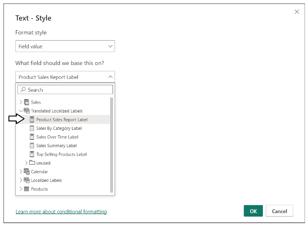

Now that you've updated the Rectangle shape with the report title, it's
time to make similar updates to the navigation buttons.

94. Select the first button in the navigation menu with the caption of
    **Sales Summary**.

95. With the **Sales Summary** button selected, move to the **Format**
    pane and click the **Button** tab.

96. Locate the **Text** section and the **Text** property inside with
    the literal text value of **Sales Summary**.

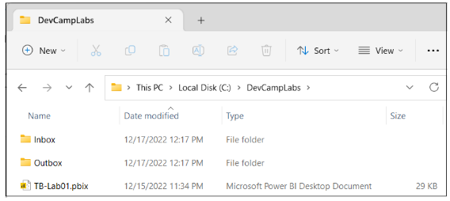

97. Click on the ***fx*** button to display the **Text - State** dialog.

98. Select the **Sales Summary Label** measure from the **Translated
    Localized Labels** table.

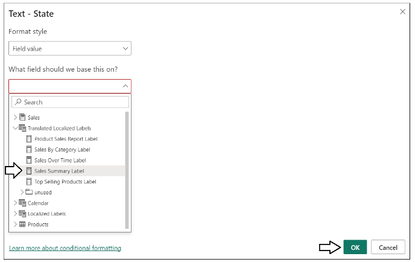

99. Select the second button in the navigation menu with the caption of
    **Sales By Category**.


100. With the **Sales By Category** button selected, move to the
     **Format** pane and click the **Button** tab.

101. Locate the **Text** section and the **Text** property inside with
     the literal text value of **Sales By Category**.

102. Click on the ***fx*** button to display the **Text - State**
     dialog.

103. Select the **Sales By Category Label** measure from the
     **Translated Localized Labels** table.


104. Select the third button in the navigation menu with the caption of
     **Sales Over Time**.

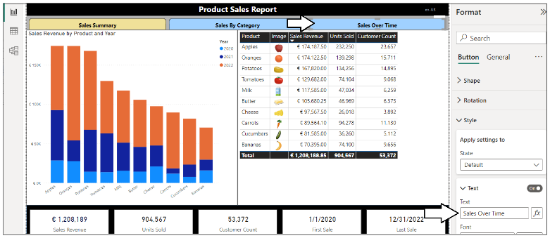

105. With the **Sales Over Time** button selected, move to the
     **Format** pane and click the **Button** tab.

106. Locate the **Text** section and the **Text** property inside with
     the literal text value of **Sales Over Time**.

107. Click on the ***fx*** button to display the **Text - State**
     dialog.

108. Select the **Sales Over Time Label** measure from the **Translated
     Localized Labels** table.


You have just implemented report label translations for the report title
and for navigation button captions on the **Sales Summary** page.
However, there is a separate Rectangle shape with the report title and a
separate set of navigation buttons for each page in the report. Over the
net few steps, you must repeat the work you did in the **Sales Summary**
page on the other two pages.

109. Navigate to the second page named **Sales By Category**.


110. Repeat the same set of steps to display the report title and button
     captions using measures from **Translated Localized Labels**.


Remember the **Sales By Category** page has the visual with the
hard-coded title. Now you will configure this visual to use a measure.

111. Select the Bar Chart visual with the title **Top Selling
     Products**.

112. With the Table visual selected, move to the **Format** pane and
     click the **General** tab.

113. Locate the **Title** section and the **Text** property inside with
     the literal text value of **Top Selling Products**.


114. Select the **Top Selling Products Label** measure from the
     **Translated Localized Labels** table.


115. Navigate to the third page named **Sales Over Time**.


116. Repeat the same steps to display the report title and button
     captions using measures from **Translated Localized Labels**.


You've now completed the work of updating visuals to use report label
translations. Now you need to prepare the report for deployment

117. Navigate back to the **Sales Summary** page before saving to ensure
     this page is the startup page.


118. Save your work by clicking the **Save** button.


Now, it’s once again time to test your work in the Power BI Service,

119. Publish the **Product Sales** project to push your changes to the
     project’s translations to the Power BI Service.


120. When prompted by the **Replace this dataset?** dialog, click the
     **Replace** button to continue.

121. Once you see **Success!**, click **Open ‘Product Sales’ in Power
     BI** to view the report in the Power BI Service.

122. The report should load as normal showing all text in English at
     first.

123. Use the browser bookmark created earlier to load the report in
     Spanish.

124. Verify the report title and navigation button captions are
     displayed using Spanish translations.


125. Navigate to the second page and verify the title for the **Top
     Selling Products** visual is displayed using Spanish translations.


126. Use the browser bookmark created earlier to load the report in
     French.

127. Verify the report title and navigation button captions are
     displayed using French translations.


128. Navigate to the second page and verify the title for the **Top
     Selling Products** visual is displayed using French translations.


129. Use the browser bookmark created earlier to load the report in
     German.

130. Verify the report title and navigation button captions are
     displayed using German translations.


131. Navigate to the second page and verify the title for the **Top
     Selling Products** visual is displayed using German translations.


You have now implemented report label translations using the
Translations Builder Localized Label table strategy. You should be able
to see that this will add a significant level of productivity to your
future efforts to build Power BI reports that support multiple
languages.

### Exercise 4: Creating a Workflow Process To Gather & Integrate Human Translations

Up to this point, you have done the work required to get the report and
its underlying dataset into a structure to support translations for
secondary languages. You were able to complete this work in a quick and
efficient manner using Translations Builder together with
machine-generated translations. However. It’s import to acknowledge that
machine-generated translations alone will not be adequate for many
production scenarios. You will need a way to integrate other people
acting as translators into a human workflow process.

In this lab exercise, you will work with the Translations Builder
features to export and import translations using a CSV file format. This
will provide a quick way to generate translations sheets that can be
sent to human translators. As you will see, translators can make their
edits to a translation sheets using Microsoft Excel. Once you’ve
received an updated translation sheet back from a translator,
Translations Builder provides an import operation to integrate those
updated translations back into the dataset of the current project.

**Prerequisite**: To complete this exercise, you will need Microsoft
Excel installed on the same PC that's running Translations Builder.

1.  Launch Windows Explorer and navigate to the folder where you copied
    the project file **Product Sales.pbix**.


132. Create two new folders inside the lab folder named **Outbox** and
     **Inbox**.


Next, you need to configure settings in Translations Builder so that
these folders are used as targets for export and import operations.

133. Return to Translations Builder and drop down the **Dataset
     Connection** menu.

134. Click **Configure Settings…** to display the **Configuration
     Options** dialog.


135. By default, folder paths for the **Outbox** and **Inbox** are
     configured to target the current user’s **Documents** folder.


Why does **Outbox** come before **Inbox**? That’s because you generally
work with the **Outbox** first when you export translation sheets that
you will send to translators. Once you get updated translations sheets
back from translators, you add them to the **Inbox** for import.

136. Click the **set** button to update the setting for **Translations
     Outbox Folder Path**.


137. Select the **Outbox** folder you created earlier in this exercise.


138. Click the **set** button for **Translations Inbox Folder Path** and
     select the **Inbox** folder you created earlier


139. Click **Save Changes**.


Now that you have configured the folder paths for the **Outbox** and
**Inbox**, it’s time to begin exporting translation sheets.

140. Examine what’s inside the **Export/Import Translations** section.


Let’s start by creating a translation sheet for a single language.

141. Drop down the selection menu under the **Export Translations
     Sheet** button and select **German \[de-DE\]**.


142. After selecting **German \[de-DE\]**, click the **Export
     Translations Sheet** button.


Translations Builder should create a translation sheet named **Product
Sales-Translations-German.csv** and open it in Excel

143. Examine the contents of **Product Sales-Translations-German.csv**.

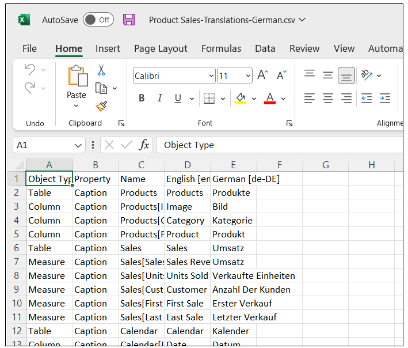

Over the next two steps you will use a trick in Excel to widen the
columns so ou can see all their contents.

144. Click on the top left corner where the row headers and the column
     headers meet. This should select all columns and rows.


145. Double-click on the column heading divider between the column
     headers showing **A** and **B**.


146. You should now be able to see all the text from each column.


This translation sheet is what you will send to translators. They can
then use Excel to review the machine translations and make changes
wherever they are required.

147. Close **Product Sales-Translations-German.csv** and return to
     Translations Builder.

148. Click the **Export All Translations** button to export a master
     translation sheet with the translations for all languages.

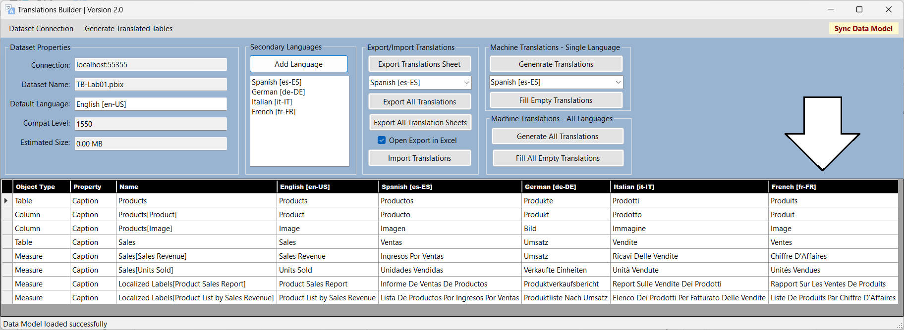

Translations Builder creates a translation sheet named **Product
Sales-Translations-Master.csv** and opens this CSV file in Excel

149. When **Product Sales-Translations-Master.csv** open in Microsoft
     Excel, you cannot see the contents of all columns at first.


150. Use the Excel trick you learned earlier to expand all columns so
     you can see the entire contents of all cells.


Now that you have learned to export translations sheets, it’s time to
examine how to manage translation sheet files.

151. In Windows Explorer, navigate to the **Outbox** folder. You should
     see the two files you generated using export operations.


152. Return to Translations Builder and uncheck the checkbox with the
     caption **Open Export in Excel**.


All three export commands use this checkbox to decide whether to open a
translation sheet in Excel after it’s generated. In some cases, it’s
handy to have the translation sheet open in Excel. In other scenarios
like the one ahead, it’s unnecessary and distracting.

153. Click the **Export All Translation Sheets** button.


The **Export All Translation Sheets** command generates the complete set
of translation sheets to be sent to translators.

154. Return to the **Outbox** folder in Windows Explorer.

155. You should see that a sperate translation sheet has been generated
     for each secondary language.


Now that you have experienced how to export translation sheets, you will
now learn how to import translation sheets.

156. In the **Outbox** folder, select **Product
     Sales-Translations-Master.csv** and **Product
     Sales-Translations-Spanish.csv**.


157. Copy the two selected translation sheet files to the Windows
     clipboard.

158. Navigate from the **Outbox** folder to the **Inbox** folder.

159. Paste the two translation sheet files from the Windows clipboard
     into the **Inbox** folder.


160. Open the translation sheet named **Inbox\Product
     Sales-Translations-Spanish.csv** in Microsoft Excel.


The job of the translator is to review all translations in the fifth
column and to make updates where appropriate. From the perspective of
the translator, the top row with column headers and the first four
columns should be treated as read-only values.

161. Enter new values for a few Spanish translations in the fifth column
     as shown in the following screenshot.


Don’t worry whether the text values you add are valid translations. You
just need to add text that is different for testing purposes.

162. Save your changes to **Product Sales-Translations-Spanish.csv** and
     then close the file in Microsoft Excel.

163. Return to Translations Builder and click the **Import
     Translations** button.


Remember to close translation sheet files in Microsoft Excel before
importing them with Translations Builder to prevent errors.

164. In the **Open** file dialog, select **Product
     Sales-Translations-Spanish.csv** and click **Open**.

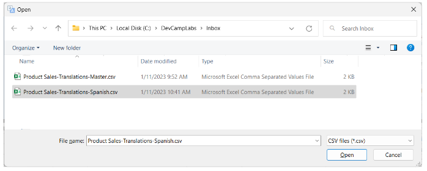

165. You should see that your updates to the Spanish translation sheet
     now appear in the translation grid.


Now that you have seen how to import translations for a single language
using an updated translations sheet, it’s time to move ahead and learn
how to import translations for all languages at once by importing a
master translation sheet.

166. click the **Import Translations** button.


167. In the **Open** file dialog, select **Product
     Sales-Translations-Master.csv** and click **Open**.


168. You should see that the original, machine-generated Spanish
     translations are now back in the translation grid.


You can see that the master translation sheet can provide a great way to
backup and restore your translations work. To make this point, you are
now going to delete the French column from the translations grid which
will remove all the French translations from the current project. As you
will see, Translations Builder will automatically add this column and
all its translations back into the project when importing a translation
sheet that contains translations for a secondary language that do not
exist in the current project.

169. Right-click on the **French \[fr-FR\]** column header and click
     **Delete Secondary Language**.


170. When prompted by the **Confirm Delete Secondary Language
     Operation** dialog, click **OK** to continue.


The **Delete Secondary Language** command is useful when you'd like to
remove a secondary language and all its translations from the current
PBIX project.

171. You should see that the column for French has been removed from the
     translations grid.


Now that you have removed all French translations, you will restore them
by importing the master translation sheet.

172. Click the **Import Translations** button.

173. In the **Open** file dialog, select **Product
     Sales-Translations-Master.csv** and click **Open**.

174. After the import operation competes, the **French \[fr-FR\]**
     column should reappear as the last column on the right.


The key takeaway with this last step is that master translation sheets
make it possible to backup and restore all localization work.

### Exercise 5: Implementing Data Translations using Field Parameters

In this exercise you will implement data translations for product names
and category names. You will begin by extending the **Products** table
by adding new columns that contain translations for product and category
names. After that, you will implement data translations by adding Field
Parameters and a new table named **Languages**. This will provide a
design which makes it possible to filter to select the language for data
translations.

1.  Return to the **Product Sales** project in Power BI Desktop and move
    to **Report** view.

<!-- -->

3.  Make sure the current page is **Sales Summary**.


4.  From the **Home** tab on the ribbon, click **Transform Data** to
    display the Power Query window with queries for the current project.


175. In the left navigation of the Power Query window, select the
     **Products** query and examine the columns in its output table.

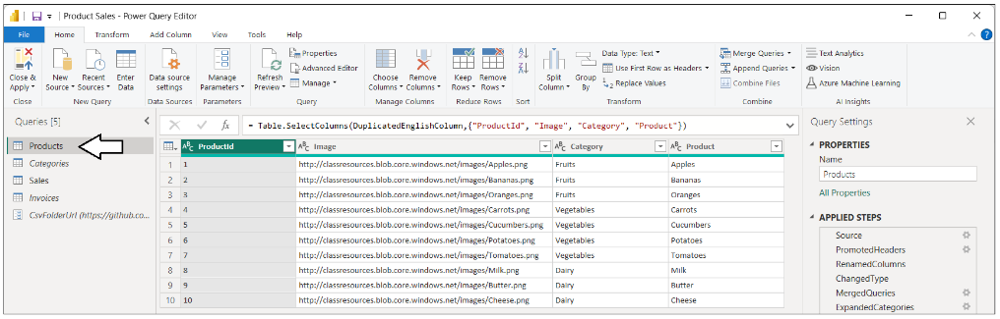

176. Examine the query steps in the **APPLIED STEPS** list on the right
     and locate the step named **RemoveTranslatedColumns**.


177. Right-click the **RemoveTranslatedColumns** step and select the
     **Delete** menu command to delete this step from the query.


178. You should see the query's output table now contains four columns
     with translations for product names.

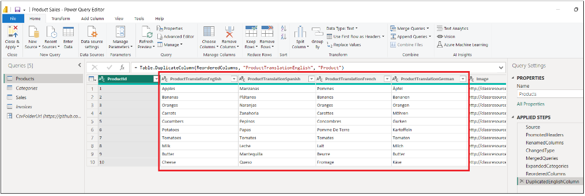

179. If you scroll to the right, you will see there is also four columns
     with translations for category names as well.

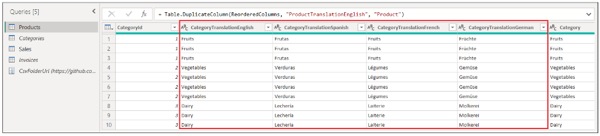

180. Click **Close and Apply** to close the Power Query windows and to
     execute the **Products** query with the update you made.


181. Switch to **Model** view to see the changes that have been made to
     the **Products** table.


Now that the dataset has been extended with extra translation columns,
it's time to create a new Field Parameter.

182. Switch to **Report** view and create a new page in the report.
     Rename the new page **Test Page**.


This test page will be used temporarily to test out the Field Parameter.
You will delete this page later in this exercise.

183. Navigate to the **Modeling** tab and select **New parameter \>
     Fields** to create a Field Parameter.


184. Enter the **Name** for a new Field Parameter as **Translated
     Product Names**.


185. Populate the fields collection with the four columns from the
     **Products** table with product name translations.

186. Leave the **Add slicer to this page** checkbox enabled.


187. Make sure the translation columns are ordered starting with English
     and then Spanish, French and German,


188. Click the **Create** button in the **Parameters** dialog to create
     the new Field Parameter.

After you have created a new Field Parameter, it appears in the
**Fields** list on the right as a new table.

189. Examine the new Field Parameter named **Translated Product Names**
     in the **Fields** list.


190. If you expand the node for **Translated Product Names**, you will
     see a single child field with the same name as the parent table.


191. Select the top node for **Translated Product Names** in the
     **Fields** list to view the DAX expression that defines the fields
     collection.


Now you will conduct a quick experiment so you can better understand how
Field Parameters work.

192. Add a **Table** visual to the report page to the right of the
     slicer.

193. Add the child field from inside the Field Parameter into the
     **Columns** data role of the Table visual.


As long as nothing is selected in the slicer, the Table visual displays
all four source columns.

194. Select a specific field in the slicer. When you select a single
     slicer value such as the **ProductTranslationSpanish** field, the
     slicer applies filtering that reduces the number of columns
     displayed in the Table visual from four columns to a single column.


In the previous screenshot, you can see that the column values for
product names have been translated into Spanish. However, there is still
an issue with the column header. The column header still displays the
column name from the underlying datasource which is
**ProductTranslationSpanish**. The reason for this is that those column
header values were hard-coded into the DAX expression when Power BI
Desktop created the new Field Parameter.

195. Switch to **Data** view.

196. Select the top node for **Translated Product Names** to see the DAX
     expression that defines the Field Parameter's fields collection.

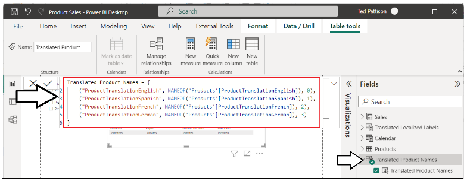

197. Currently, the DAX expression has hard-coded column names like
     **ProductTranslationEnglish** and **ProductTranslationSpanish**.

Translated Product Names = {

("ProductTranslationEnglish",
NAMEOF('Products'\[ProductTranslationEnglish\]), 0),

("ProductTranslationSpanish",
NAMEOF('Products'\[ProductTranslationSpanish\]), 1),

("ProductTranslationFrench",
NAMEOF('Products'\[ProductTranslationFrench\]), 2),

("ProductTranslationGerman",
NAMEOF('Products'\[ProductTranslationGerman\]), 3)

}

The way to resolve this issue is to update the DAX expression to replace
the column names with localized translations.

198. Replace the existing DAX expression with the follow DAX expression.

Translated Product Names = {

("Product", NAMEOF('Products'\[ProductTranslationEnglish\]), 0),

("Producto", NAMEOF('Products'\[ProductTranslationSpanish\]), 1),

("Produit", NAMEOF('Products'\[ProductTranslationFrench\]), 2),

("Produkt", NAMEOF('Products'\[ProductTranslationGerman\]), 3)

}

199. After you have replaced the DAX expression, verify that the column
     header is now translated properly along with product names.


Up to this point we have only examined the Field Parameter in **Report**
view. Now it's time to switch over to **Data** view where you will be
able to see two addition fields inside the Field Parameter that are
hidden from **Report** view.

200. Switch to **Data** view and select the top-level node for
     **Translated Product Names**.


201. Expand the top-level node for **Translated Product Names** and
     examine the fields inside.


The names of the fields inside a Field Parameter are automatically
generated based on the name you gave to the top-level Field Parameter.
The fields inside a Field Parameter can (and should) be renamed to
simplify the data model and to improve readability.

202. In the **Fields** list, double-click on the field named
     **Translated Product Names** and rename it to **Product**.


203. Using the same technique, rename the two other hidden fields with
     the shorter names **Fields** and **SortOrder**.


Currently, **Translated Product Names** contains three columns named
**Product**, **Fields** and **SortOrder**. In the following steps, you
will configure support data translations by adding a fourth column named
**LanguageId** to enable filtering to switch between languages.

204. Replace the DAX expression for **Translated Product Names** with
     the following DAX code which adds a fourth string parameter to the
     row for each language with the lower-case, two character language
     identifier.

Translated Product Names = {

("Product", NAMEOF('Products'\[ProductTranslationEnglish\]), 0, "en" ),

("Producto", NAMEOF('Products'\[ProductTranslationSpanish\]), 1, "es" ),

("Produit", NAMEOF('Products'\[ProductTranslationFrench\]), 2, "fr" ),

("Produkt", NAMEOF('Products'\[ProductTranslationGerman\]), 3, "de" )

}

205. Once you've updated the DAX expression with a language identifier
     for each language, a new column will appear named **Value4**.


206. Rename the **Value4** column to **LanguageId**.


207. Finally, don't forget to configure the sort column for the new
     column named **LanguageId**.


You do not have to worry about configuring the sort column for the two
pre-existing fields named **Fields** and **Product**. That is done
automatically by Power BI Desktop when you create a new Field Parameter.
However, you need to explicitly configure the sort column when you add
additional columns such as **LanguageId**.

208. Switch to **Model** view to inspect the Field Parameter named
     **Translated Product Names**.

209. Hide the **LanguageId** column from **Report** view. Report authors
     will never need to see or use this column in a report.


At this point, you no longer need the slicer that was automatically
added by Power BI Desktop when creating the Field Parameter. While the
slicer added by Power BI Desktop is great for simple demos, it can only
control a single Field Parameter at a time. You need a more scalable,
report-wide strategy to enable switching between languages that works
across multiple Field Parameters.

210. Delete the page you created earlier in this exercise named **Test
     Page**.


Let's summarize where you are at. You have created a Field Parameter
named **Translated Product Names** and extended it with an extra column
named **LanguageId**. The **LanguageId** column will be used to filter
and effectively select which language is used for data translations.
Over the next few steps, you will continue building out the data
translations strategy by adding the **Languages** table.

211. Create a new query by dropping down the **Get data** menu and
     selecting **Blank query**.


212. You should see the Power Query window open with a new query named
     **Query1**.


213. Rename the new query from **Query1** to **Languages**.


214. From the **Home** tab, click the **Advanced Editor** button to
     display the Advanced Editor window for the **Languages** query.


215. The Advanced Editor window will initially contain a minimal amount
     of M code.


216. Copy and paste the following M code into the Advanced Editor window

let

LanguagesTable = \#table(type table \[

Language = text,

LanguageId = text,

DefaultCulture = text,

SortOrder = number

\], {

{"English", "en", "en-US", 1 },

{"Spanish", "es", "es-ES", 2 },

{"French", "fr", "fr-FR", 3 },

{"German", "de", "de-DE", 4 }

}),

SortedRows = Table.Sort(LanguagesTable,{{"SortOrder",
Order.Ascending}}),

QueryOutput = Table.TransformColumnTypes(SortedRows,{{"SortOrder",
Int64.Type}})

in

QueryOutput

217. Once you have copied the M code from above into the **Advanced
     Editor** window, click **Done** to save your changes.

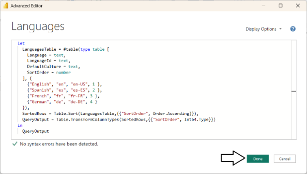

218. When the **Advanced Editor** window closes, the **Languages** query
     should run and generate an output table with four rows.


219. Click **Close & Apply** to close the Power Query window and to add
     the **Languages** table to the project's data model.


220. In the main Power BI Desktop window, switch to **Data** view and
     select the **Languages** table in the **Data** pane.


221. Configure the columns named **Language**, **LanguageId** and
     **DefaultCulture** to use **SortOrder** as their sort column.


222. Switch to **Model** view and reposition **Translated Product
     Names** and the **Languages** table so they are next to each other.

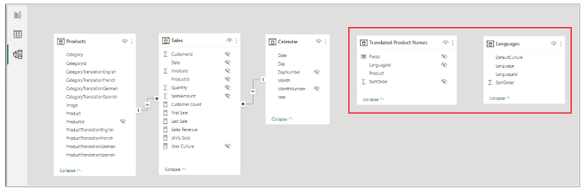

223. Create a one-to-one relationship between **Translated Product
     Names** and **Languages** based on the **LanguageId** column.


224. Hide the columns **DefaultCulture**, **Language** and **SortOrder**
     so that **Language** is the only non-hidden column.


225. Switch to **Report** view and expand the nodes for **Translated
     Product Names** and **Languages** in **Fields** pane. Each of these
     tables should now only display a single child field when in
     **Report** view.


226. Open the **Filters** pane and create a report-level filter based on
     the **Language** column from the **Languages** table.


227. Enable the **Require single selection** filter option and set the
     filter to **Spanish**.


228. Make sure the current page is **Sales Summary**.


229. Select the Column chart on the left and verify it's using the
     **Product** column from the **Products** table for the **X-axis**
     data role.

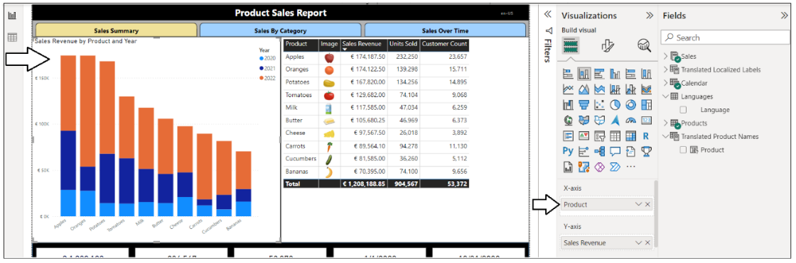

230. Remove the **Product** column from the **Products** table and
     replace it with the **Product** field from **Translated Product
     Names**.


231. You should now see the data translations in the Column chart
     display in Spanish.


232. Select the Table visual on the right. You can see that it is also
     using the **Product** column from the **Products** table.

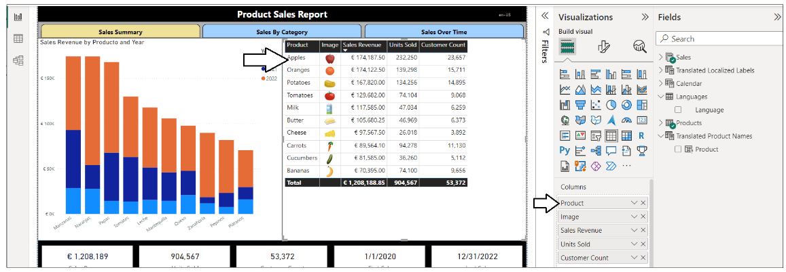

233. Remove the **Product** column from the **Products** table and
     replace it with the **Product** field from **Translated Product
     Names**. The table should now update and display product names in
     Spanish.

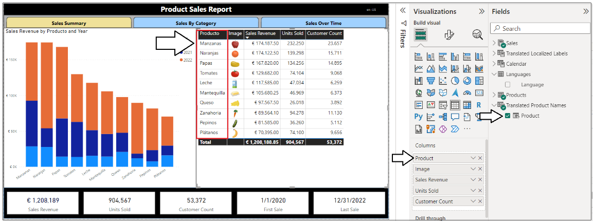

234. Now you can test your data translations by changing the filter on
     the **Languages** table to quickly switch between languages.

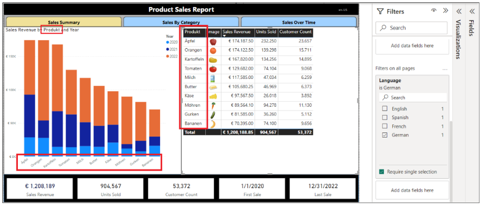

Now you have just implemented data translations for product names. Now,
you will continue by adding the same type of data translation support
for category names as well.

235. Navigate to the **Modeling** tab and select **New parameter \>
     Fields** to create a Field Parameter.


236. Create a new Field Parameter named **Translated Category Names**.
     Populate the fields collection with the four columns from the
     **Products** table with category name translations and be sure to
     disable the **Add slicer to this page** option.


237. Make sure the fields collection is sorted like the fields shown in
     the following screenshot and then click the **Create** button.


238. Move to **Data** view and select the Field Parameter named
     **Translated Category Names** in the **Data** pane on the right.


239. Expand the node **Translated Category Names** and inspect the three
     child fields inside.


240. Update the child field names to **Category**, **Fields** and
     **SortOrder** as shown in the following screenshot.


241. Update the DAX expression for **Translated Category Names** using
     the following DAX code.

Translated Category Names = {

("Category", NAMEOF('Products'\[CategoryTranslationEnglish\]), 0, "en"),

("Categoría", NAMEOF('Products'\[CategoryTranslationSpanish\]), 1,
"es"),

("Catégorie", NAMEOF('Products'\[CategoryTranslationFrench\]), 2, "fr"),

("Kategorie", NAMEOF('Products'\[CategoryTranslationGerman\]), 3, "de")

}

242. You should see that a new column has been added named **Value4**.

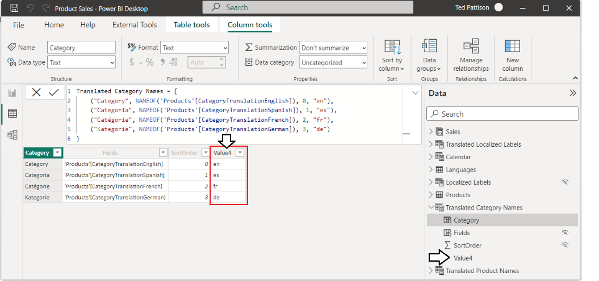

243. Rename the **Value4** field to **LanguageId**.

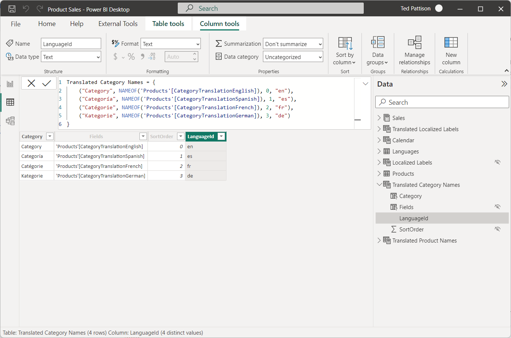

244. Configure the **LanguageId** column to use **SortOrder** as its
     sort column.


245. Switch to **Model** view.

246. Reposition **Translated Category Names** so its underneath
     **Translated Product Names**. as shown in the following screenshot.

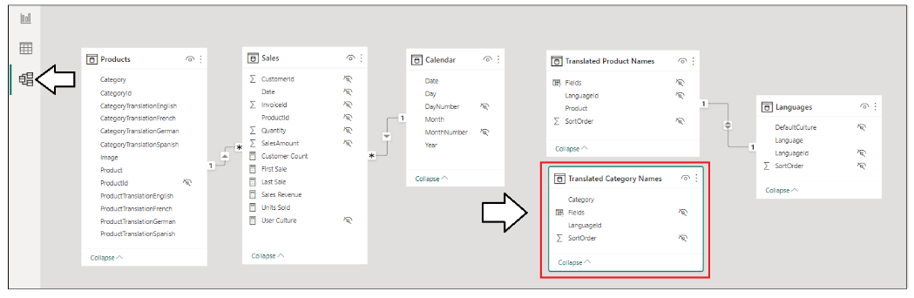

247. Create a one-to-one relationship between **Translated Category
     Names** and **Languages** based on the **LanguageId** column.


248. Hide the column **LanguageId** in **Translated Category Names** so
     it does not show up in **Report** view.


249. Switch to **Report** view and then navigate to the **Sales By
     Category** page.


250. When inspecting **Translated Category Names** in **Report** view,
     it should only contain a single field named **Category**.


251. Set the report-level filter on the **Languages** table to
     **German** for testing purposes.


252. Select the Bar chart on the left and verify it uses the **Product**
     column and the **Category** column from the **Products** table.


253. Update the Bar chart visual to use **Product** from **Translated
     Product Names**.

254. Update the Bar chart visual to use **Category** from **Translated
     Category Names**.


255. You should now see data translations for German in the Y-axis and
     in the legend.

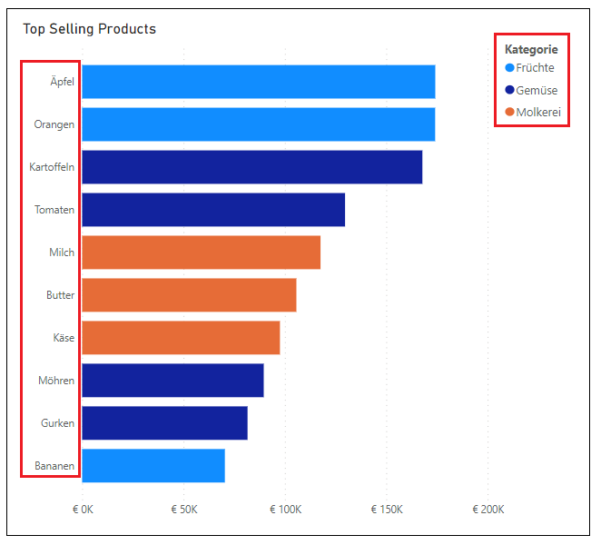

256. Select the Matrix visual and verify it uses the **Product** column
     and the **Category** column from the **Products** table.


257. Update the **Rows** data role of the Matrix visual to use
     **Product** from **Translated Product Names** and **Category** from
     **Translated Category Names**. You should now see data translations
     for German for category names.

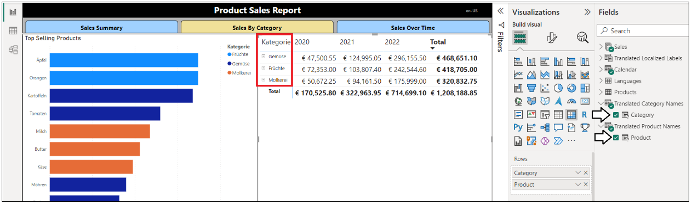

258. Click the **Expand** button with the pitchfork icon to drill down
     and display product names.


259. You should now see an expanded matrix that displays both category
     names and product names in German


You will need to click the **Expand** button again any time you switch
between languages and want to drill into product names.

260. Select the Slicer visual at the bottom of the page and verify it
     uses the **Category** column from the **Products** table

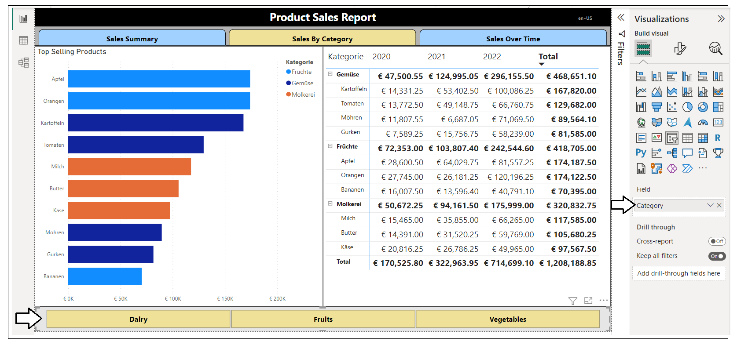

261. Update the **Fields** data role of the Slicer visual to use
     **Category** from **Translated Category Names**.

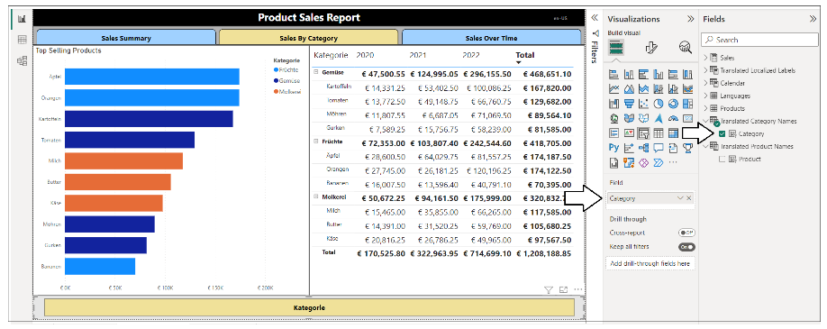

Slicer visuals work differently when configured with a field from a
Field Parameter. The default behavior is to provide a field picker for
the fields collection of the Field Parameter instead of showing the
values. You will correct the slicer's behavior in the next step

262. Use the dropdown menu for the **Category** field inside the
     **Field** data role and select the option to **Show values of
     select field**.


263. The slicer visual should now display the three category names using
     data translations in German.


264. Now experiment by switching the report-level filter on the
     **Languages** table to view the page in each of the supported
     languages.

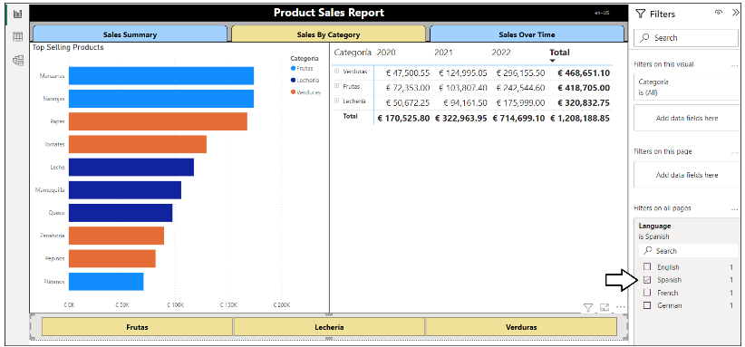

You have now implemented data translations for product names and
category names. The next step is to create a set of report bookmarks
which will make it possible to set the filter for data translations at
report load time.

265. From the **View** tab, click the **Bookmarks** button to display
     the **Bookmarks** pane.


266. Set the report-level filter on the **Languages** table to
     **English** and then click the **Add** button in the **Bookmarks**
     pane.


267. You should see a new report bookmark has been created named
     **Bookmark4**.


268. Rename the new report bookmark to **SetLanguageEnglish**.


269. Drop down the context menu for the report bookmark named
     **SetLanguageEnglish**.


270. By default, the behaviors of **Data**, **Display** and **Current
     page** are enabled. Disable the behaviors for **Display** and
     **Current page**.


271. Ensure that the only behavior that remains enabled is **Data** as
     shown in the following screenshot.


You have now created the first report bookmark. Now you will create
three more for the other languages using the same set of steps.

272. Update the report-level filter on the **Languages** table to
     **Spanish**.


273. Click the **Add** button in the **Bookmarks** pane.


274. Rename the report bookmark to **SetLanguageSpanish** and ensure
     that the only behavior that remains enable is **Data**.


275. Update the report-level filter on the **Languages** table to
     **French** and then click **Add** in the **Bookmarks** pane.


276. Rename the report bookmark to **SetLanguageFrench** and ensure that
     the only behavior that remains enable is **Data**.


277. Update the report-level filter on the **Languages** table to
     **German** and then click **Add** in the **Bookmarks** pane.

     

278. Rename the report bookmark to **SetLanguageGerman** and ensure that
     the only behavior that remains enable is **Data**.


279. Now you should be able to apply these report bookmarks to change
     the language for data translations.


Before testing the report in the Power BI Service, you should explicitly
set the default language filter and the start page.

280. Set the report-level filter on the **Languages** table to
     **English**. Also hide the **Languages** filter so it is not seen
     by report consumers.


Don't give users the option of changing this filter as it only change
data translations but not the other two types of translations.

281. Navigate back to the **Sales Summary** page and make it active
     before saving to ensure this page is the startup page.


282. Save your work by clicking the **Save** button.


Now, it’s time once again to test your work in the Power BI Service.

283. Publish the **Product Sales** project to push your changes to the
     project’s translations to the Power BI Service.


284. When prompted by the **Replace this dataset?** dialog, click the
     **Replace** button to continue.

285. Once you see **Success!**, click **Open ‘Product Sales’ in Power
     BI** to view the report in the Power BI Service.

286. The report should load as normal showing all text in English at
     first.


287. Drop down the **Bookmarks** menu on the toolbar and select **Show
     more bookmarks** to display the **Bookmarks** pane.


288. Experiment by applying each of the report bookmarks which set the
     language used for data translations.

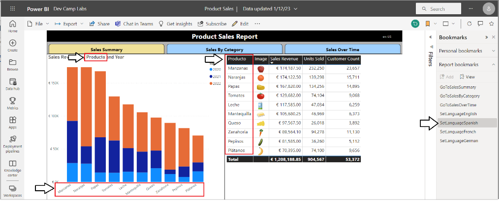

289. After applying a report bookmark, examine the report URL in the
     address bar and locate the **bookmarkGuid** parameter value

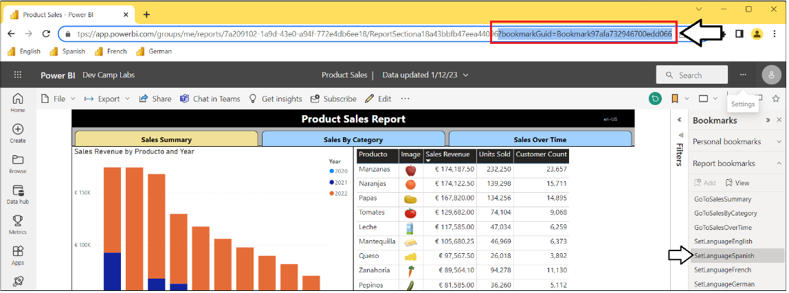

Yes, we agree. The parameter name of **bookmarkGuid** isn't the best
name. But you can think of the **bookmarkGuid** value as the identifier
for a report bookmark which is generated in the format of
**Bookmarkdfa67c1b956e45694481**.

290. Open a text editor such as Notepad and copy and paste the following
     text.

English

?language=en-US&bookmarkGuid={bookmarkGuid for SetLanguageEnglish}

Spanish

?language=es-ES&bookmarkGuid={bookmarkGuid for SetLanguageSpanish}

French

?language=fr-FR&bookmarkGuid={bookmarkGuid for SetLanguageFrench}

German

?language=de-DE&bookmarkGuid={bookmarkGuid for SetLanguageGerman}

291. Discover the **bookmarkGuid** values by applying report bookmarks
     and copying the parameter value from the address bar.

292. Add the **bookmarkGuid** values into the text editor to record the
     URL parameters you need to load each of the four languages.

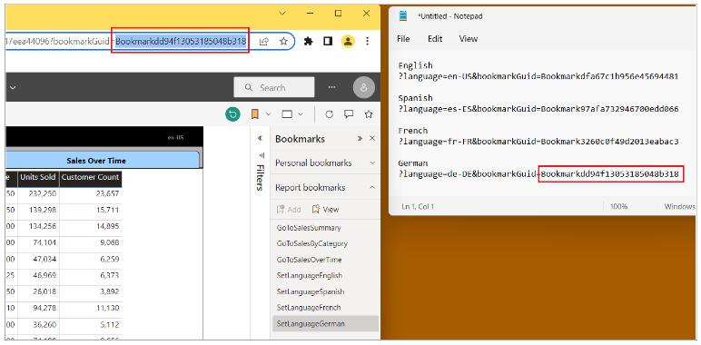

293. Edit each of the four browser bookmarks you created earlier by
     adding the **bookmarkGuid** parameter to load data translations.


294. For each browser bookmark, add the **bookmarkGuid** parameter in
     addition to **language** to apply the correct report bookmark..

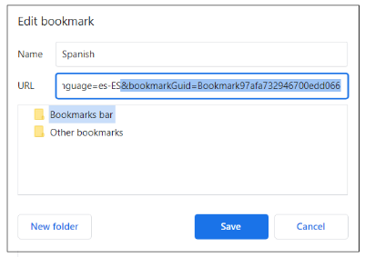

Now all four browser bookmarks should pass the appropriate
**bookmarkGuid** parameter value to load data translations correctly.

295. Click the browser bookmark for **Spanish**. The **Sales Summary**
     page should now be fully translated into Spanish.

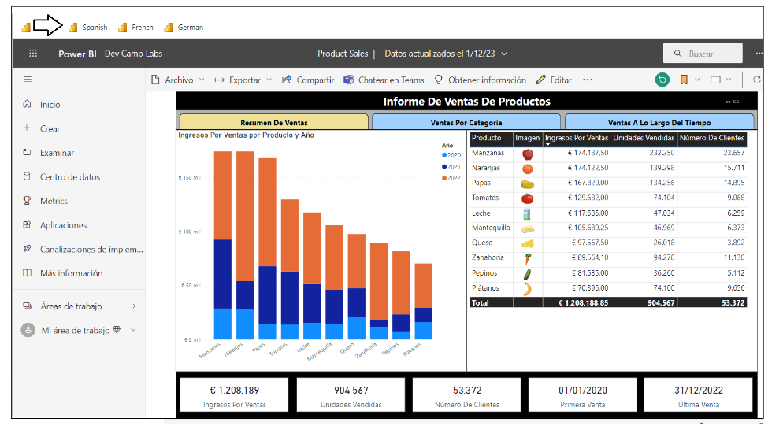

296. Navigate to the **Sales By Category** page. This page should also
     be fully translated into Spanish.


297. Click the browser bookmark for **French**. The **Sales Summary**
     page should now be fully translated into French.

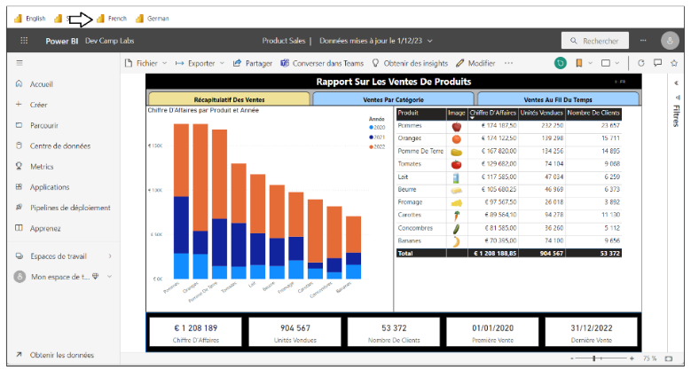

298. Navigate to the **Sales By Category** page. This page should also
     be fully translated into French.

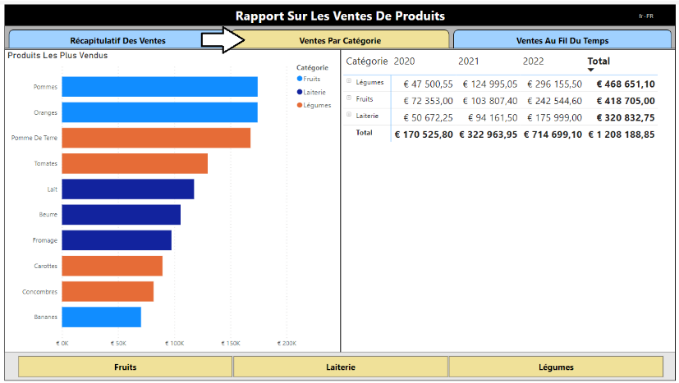

299. Click the browser bookmark for **German**. The **Sales Summary**
     page should now be fully translated into German.

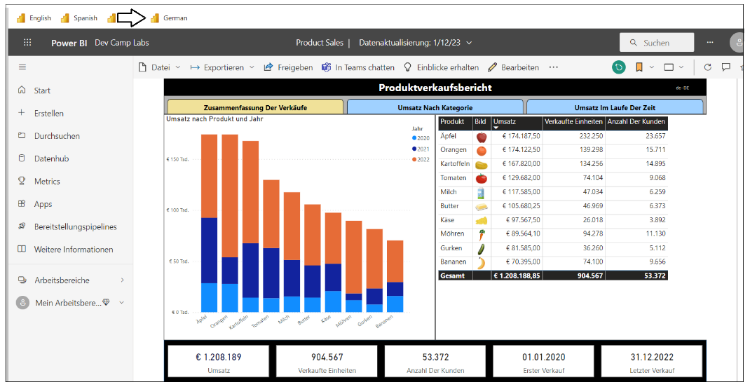

300. Navigate to the **Sales By Category** page. This page should also
     be fully translated into German.

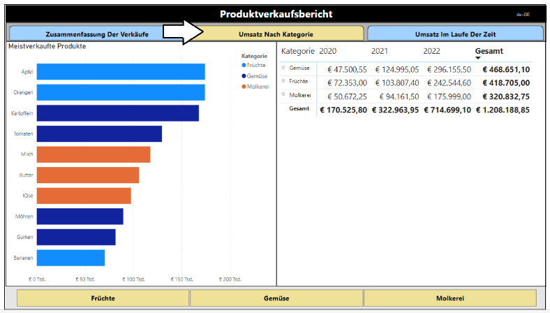

You have now successfully implemented and tested the data translations
for product names and category names. However, your work is not yet
done. The **Sales Over Time** page still contains text-based values for
calendar names that require your attention.

301. Navigate the **Sales Over Time** page. You can see that the names
     of months and days are still in English.


You will now move on to the final exercise where you will implement data
translations for the names of months and days of the week..

### Exercise 6: Implementing Data Translations for a Calendar Table

In this exercise you will implement data translations for the names of
months and days in a **Calendar** table. To properly implement data
translations for columns in a calendar table, you need a strategy to
translate month names and day-of-week names into the secondary languages
you plan to support.

The strategy presented in this lab exercise for implementing calendar
table column translations is based on Power Query and the power of the M
query language. Power Query provides several built-in functions such as
**Date.MonthName** which accept a **Date** parameter and return a
text-based calendar name. The following Power Query function call will
evaluate to a text-based value of January in French.

**Date.MonthName( \#date(2022, 12, 1), "fr-FR")**

Power Query is built on a functional query language named M which makes
it possible to enumerate through the rows of the **Languages** table to
discover what languages and what default cultures are supported in the
current project. This makes it possible to write a query which uses the
**Languages** table as its source to generate translation tables with
the names of months or weekdays.

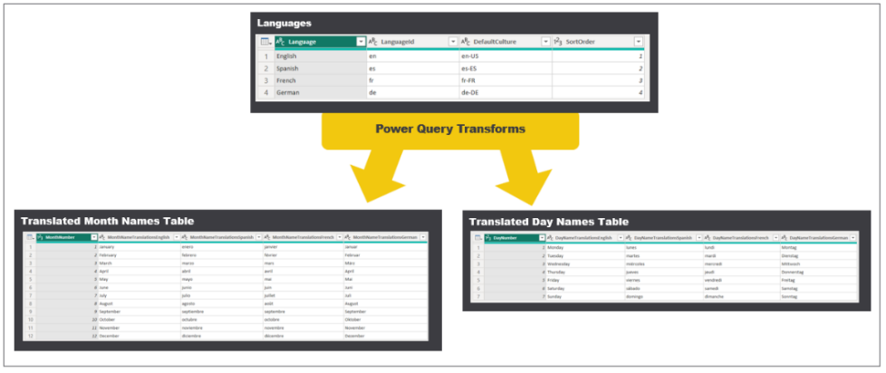

1.  From the **Home** tab on the ribbon, click **Transform Data** to
    display the Power Query window with queries for the current project.


302. In the left navigation of the Power Query window, select the
     **Languages** query and examine the columns in its output table.

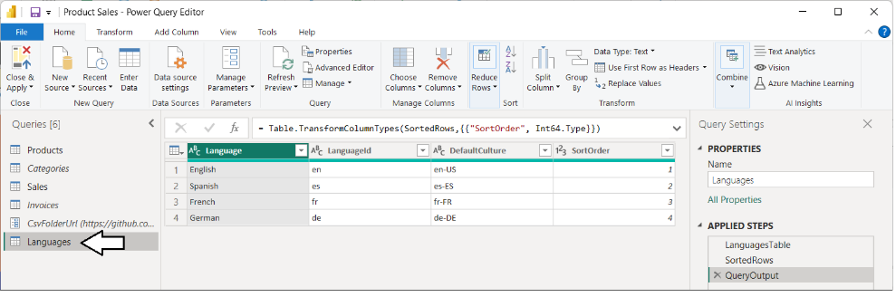

303. Create a new query by dropping down the **New Source** menu and
     selecting **Blank Query**.


304. Rename the new query to **Translated Month Names Table**.

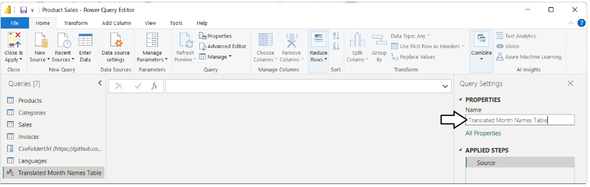

305. Click on the **Advanced Editor** button in the ribbon to open the
     Advanced Editor widow.

306. Copy the following M code listing and paste it into the Advanced
     Editor window.

let

Source = \#table( type table \[ MonthNumber = Int64.Type \],
List.Split({1..12},1)),

Translations = Table.AddColumn( Source, "Translations",

each

\[ MonthDate = \#date( 2022, \[ MonthNumber \], 1 ),

Translations = List.Transform(Languages\[DefaultCulture\], each
Date.MonthName( MonthDate, \_ ) ),

TranslationTable = Table.FromList( Translations, null ),

TranslationsTranspose = Table.Transpose(TranslationTable),

TranslationsColumns = Table.RenameColumns(

TranslationsTranspose,

List.Zip({ Table.ColumnNames( TranslationsTranspose ),

List.Transform(Languages\[Language\],

each "MonthNameTranslations" & \_ ) })

)

\]

),

ExpandedTranslations = Table.ExpandRecordColumn(Translations,

"Translations",

{ "TranslationsColumns" },

{ "TranslationsColumns" }),

ColumnsCollection = List.Transform(Languages\[Language\], each
"MonthNameTranslations" & \_ ),

ExpandedTranslationsColumns =
Table.ExpandTableColumn(ExpandedTranslations,

"TranslationsColumns",

ColumnsCollection,

ColumnsCollection ),

TypedColumnsCollection = List.Transform(ColumnsCollection, each {\_,
type text}),

QueryOutput = Table.TransformColumnTypes(ExpandedTranslationsColumns,
TypedColumnsCollection)

in

QueryOutput

If you have trouble copying the M code from this page, it might be
easier to copy it from
[here](https://raw.githubusercontent.com/PowerBiDevCamp/TranslationsBuilder/main/Labs/Snippets/Translated%20Month%20Names%20Table.m.txt)
or from the Student Files folder.

307. Once you have copied the M code into the Advanced Editor, click
     **Done** to save your changes and execute the new query.

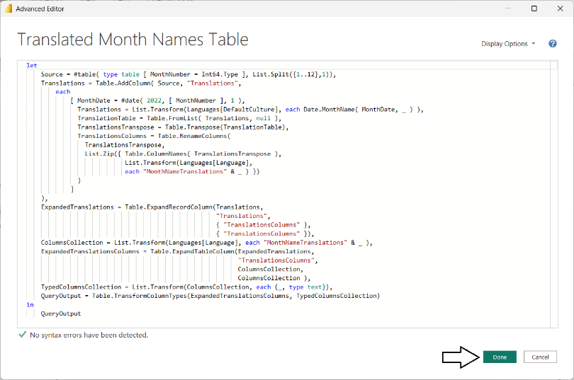

308. You should now see the output table of the **Translated Month Names
     Table** query as shown in the following screenshot.

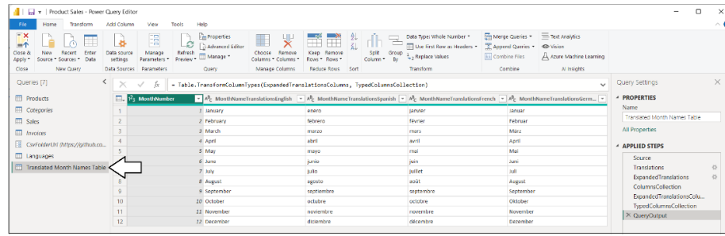

You have now created the translation table for month names. Next you
will create a second table for day names.

309. Create a new query by dropping down the **New Source** menu and
     selecting **Blank Query**.

310. Rename the new query to **Translated Day Names Table**.

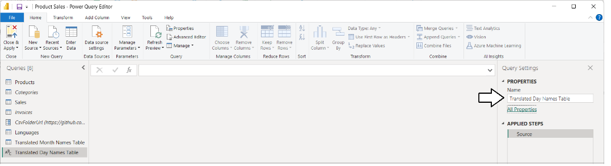

311. Click on the **Advanced Editor** button in the ribbon to open the
     Advanced Editor widow.

312. Copy the following M code listing and paste it into the Advanced
     Editor window.

let

Source = \#table( type table \[ DayNumber = Int64.Type \],
List.Split({1..7}, 1) ),

NextSunday = Date.AddDays( Date.From(DateTime.LocalNow()),

Value.Subtract(6,

Date.DayOfWeek( Date.From(DateTime.LocalNow()),

Day.Monday)) ),

Translations = Table.AddColumn( Source, "Translations",

each

\[ DayOfWeek = Date.AddDays(NextSunday, \[DayNumber\] ),

Translations = List.Transform(Languages\[DefaultCulture\],

each Date.DayOfWeekName(DayOfWeek, \_ ) ),

TranslationTable = Table.FromList( Translations, null ),

TranslationsTranspose = Table.Transpose(TranslationTable),

TranslationsColumns = Table.RenameColumns(

TranslationsTranspose,

List.Zip({ Table.ColumnNames( TranslationsTranspose ),

List.Transform(Languages\[Language\],

each "DayNameTranslations" & \_ ) })

)

\]

),

ExpandedTranslations = Table.ExpandRecordColumn(Translations,

"Translations",

{ "TranslationsColumns" },

{ "TranslationsColumns" }),

ColumnsCollection = List.Transform(Languages\[Language\], each
"DayNameTranslations" & \_ ),

ExpandedTranslationsColumns =
Table.ExpandTableColumn(ExpandedTranslations,

"TranslationsColumns",

ColumnsCollection,

ColumnsCollection ),

TypedColumnsCollection = List.Transform(ColumnsCollection, each {\_,
type text}),

QueryOutput = Table.TransformColumnTypes(ExpandedTranslationsColumns,
TypedColumnsCollection)

in

QueryOutput

If you have trouble copying this M code from this page, it might be
easier to copy it from
[here](https://raw.githubusercontent.com/PowerBiDevCamp/TranslationsBuilder/main/Labs/Snippets/Translated%20Day%20Names%20Table.m.txt)
or from the Student Files folder

313. Once you have copied the M code into the Advanced Editor, click
     **Done** to save your changes and execute the new query.

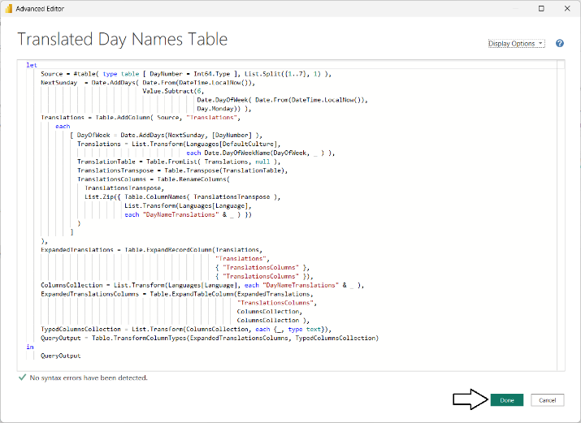

314. You should now see the output of the **Translated Day Names Table**
     query as shown in the following screenshot.


315. Click **Close & Apply** to close the Power Query window and to add
     two new tables to the project's data model.


316. Switch to **Data** view and locate **Translated Month Names Table**
     and **Translated Day Names Table** in the **Data** pane.


317. Select **Translated Month Names Table** and configure all four
     translation columns to use **MonthNumber** as their sort column.


318. Select **Translated Day Names Table** and configure all four
     translation columns to use **DayNumber** as their sort column.

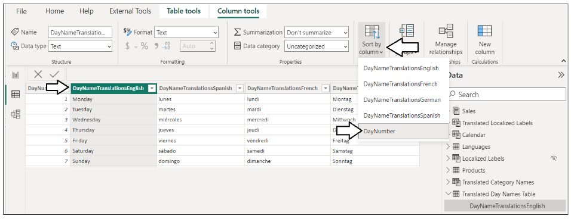

319. Switch to **Model** view.

320. Reposition **Translated Day Names Table** and **Translated Month
     Names Table** just to the right of the **Calendar** table.


321. Create a one-to-many relationship between **Translated Day Names
     Table** and **Calendar** based on the **DayNumber** column.


322. Create a one-to-many relationship between **Translated Month Names
     Table** and **Calendar** based on the **MonthNumber** column.


323. Hide **Translated Day Names Table** and **Translated Month Names
     Table** so they do not appear in **Report** view.


324. Switch to **Report** view and navigate to the **Sales Over Time**
     page.


Now you need to create two new Field Parameters to implement data
translations for month names and day names. However, you have created
and configured two Field Parameters in the previous exercise so the
steps should already be familiar.

325. Navigate to the **Modeling** tab and select **New parameter \>
     Fields** to create a Field Parameter.


326. Name the Field Parameter **Translated Month Names** and add the
     translation columns from **Translated Month Names Table**.

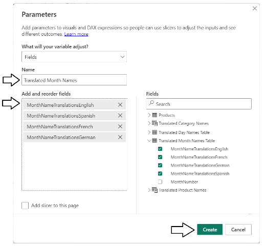

327. Switch to **Data** view and select **Translated Month Names** in
     the **Data** pane so you can view its DAX expression.

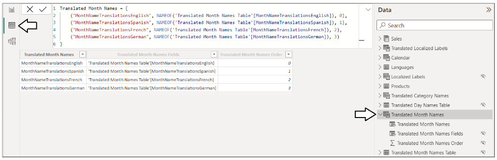

328. Update the DAX expression for **Translated Month Names** with the
     following DAX code.

Translated Month Names = {

("Month", NAMEOF('Translated Month Names
Table'\[MonthNameTranslationsEnglish\]), 0, "en"),

("Mes", NAMEOF('Translated Month Names
Table'\[MonthNameTranslationsSpanish\]), 1, "es"),

("Mois", NAMEOF('Translated Month Names
Table'\[MonthNameTranslationsFrench\]), 2, "fr"),

("Monat", NAMEOF('Translated Month Names
Table'\[MonthNameTranslationsGerman\]), 3, "de")

}

329. After you have updated the DAX expression for **Translated Month
     Names**, you should see a new column named **Value4**.


330. Update the field names inside **Translated Month Names** to
     **Month**. **Fields**, **SortOrder** and **LanguageId**.

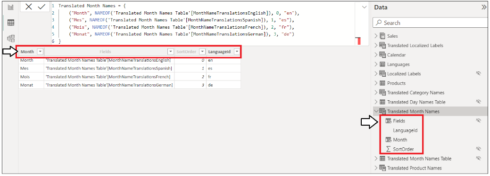

331. Configure the **LanguageId** column to use **SortOrder** as its
     sort column.


Now there is one more Field Parameter you need to create for day names.

332. Switch to **Report** view.

333. Navigate to the **Modeling** tab and select **New parameter \>
     Fields** to create a Field Parameter.


334. Name the Field Parameter **Translated Day Names** and add the
     translation columns from **Translated Day Names Table**.

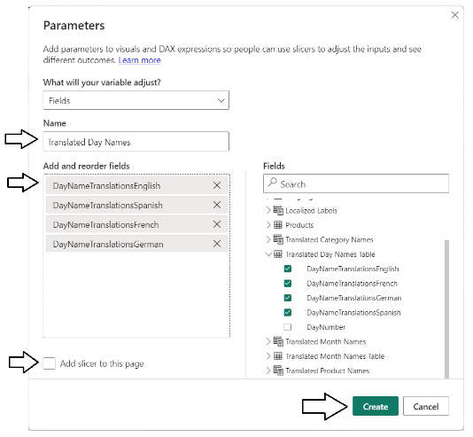

335. Switch to **Data** view and select **Translated Day Names** in the
     **Data** pane so you can view its DAX expression.


336. Update the DAX expression for **Translated Day Names** with the
     following DAX code.

Translated Day Names = {

("Day", NAMEOF('Translated Day Names
Table'\[DayNameTranslationsEnglish\]), 0, "en"),

("Día", NAMEOF('Translated Day Names
Table'\[DayNameTranslationsSpanish\]), 1, "es"),

("Jour", NAMEOF('Translated Day Names
Table'\[DayNameTranslationsFrench\]), 2, "fr"),

("Tag", NAMEOF('Translated Day Names
Table'\[DayNameTranslationsGerman\]), 3, "de")

}

337. After you have updated the DAX expression for **Translated Day
     Names**, you should see a new column named **Value4**.

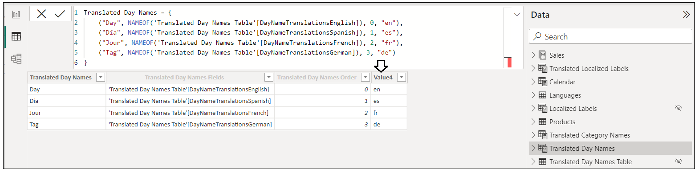

338. Update the field names inside **Translated Day Names** to **Day**.
     **Fields**, **SortOrder** and **LanguageId**.

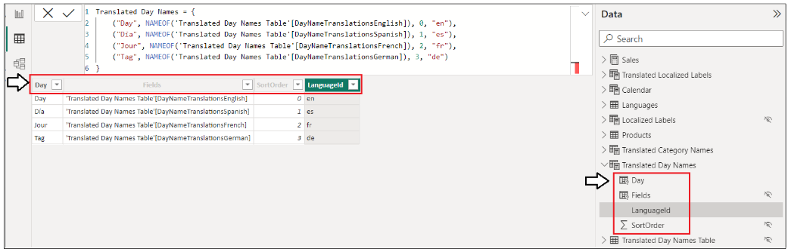

339. Configure the **LanguageId** column to use **SortOrder** as its
     sort column.


340. Switch to **Model** view.

341. Reposition **Translated Month Names** and **Translated Day Names**
     so they appear just to the right of the **Languages** table.


342. Create a one-to-one relationship between **Languages** and
     **Translated Month Names** based on the **LanguageId** column.

343. Create a one-to-one relationship between **Languages** and
     **Translated Day Names** based on the **LanguageId** column.


344. Hide the **LanguageId** field from **Report** view in both
     **Translated Month Names** and **Translated Day Names**.


345. Switch to **Report** view, navigate to the **Sales Over Time** page
     and inspect the two new Field Parameters in the **Fields** pane.


346. Display the **Filter** pane if it's not already showing and set the
     filter on the **Languages** table to **Spanish**.


347. Select the Column chart on the left which displays **Sales Revenue
     by Month and** **Year**.

348. In the **X-axis** data role, replace **Month** from the
     **Calendar** table with **Month** from **Translated Month Names**.

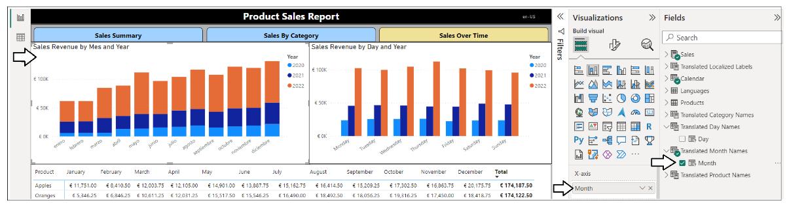

349. Select the Column chart on the right which displays **Sales Revenue
     by Day** **and** **Year**.

350. In the **X-axis** data role, replace **Day** from the **Calendar**
     table with **Day** from **Translated Day Names**.

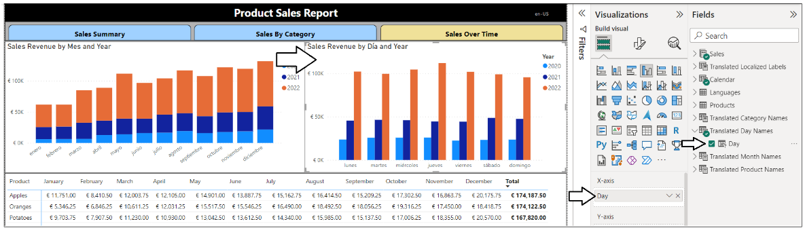

351. Select the Matrix visual at the bottom of the page which displays
     sales revenue by product and month.

352. In the **Rows** data role, replace **Product** from the
     **Products** table with **Product** from **Translated Product
     Names**.

353. In the **Columns** data role, replace **Month** from the
     **Calendar** table with **Month** from **Translated Month Names**.

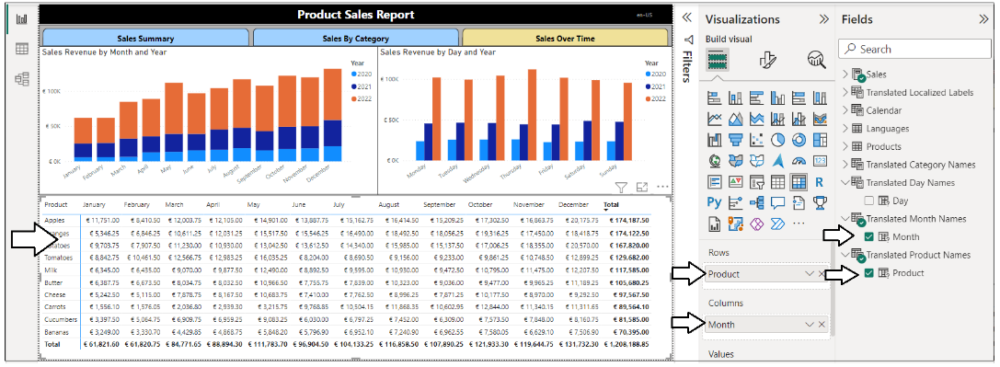

354. Now you can test the data translations for each language by
     switching the filter on the **Languages** table.


Now that you have completed the work to implement data translations, you
will clean up the data model by hiding several columns that should not
be shown to reporter authors in **Report** view.

355. Switch to **Model** view.

356. Hide every column in the **Products** table except for the
     **Image** column.

357. Hide the **Day** column and the **Month** column in the
     **Calendars** table so only the **Date** and **Year** columns are
     seen in **Report** view.


Now you need to prepare the report for deployment to the Power BI
Service.

358. Set the report-level filter on the languages table to **English**.

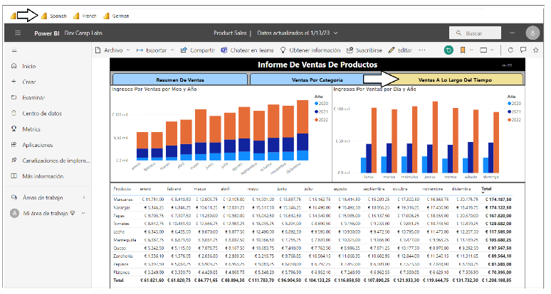

359. Navigate back to the **Sales Summary** page and make it active
     before saving to ensure this page is the startup page.


360. Save your work by clicking the **Save** button.


Now, it’s time once again to test your work in the Power BI Service.

361. Publish the **Product Sales** project to push your changes to the
     project’s translations to the Power BI Service.


362. When prompted by the **Replace this dataset?** dialog, click the
     **Replace** button to continue.

363. Once you see **Success!**, click **Open ‘Product Sales’ in Power
     BI** to view the report in the Power BI Service.

364. The report should load as normal showing all text in English at
     first.

365. Click on the browser book for **Spanish**. Once the report has
     loaded, navigate to the **Sales Over Time** page.

366. Verify that the data translations are loading Spanish names for the
     names of months and days in all three visuals.

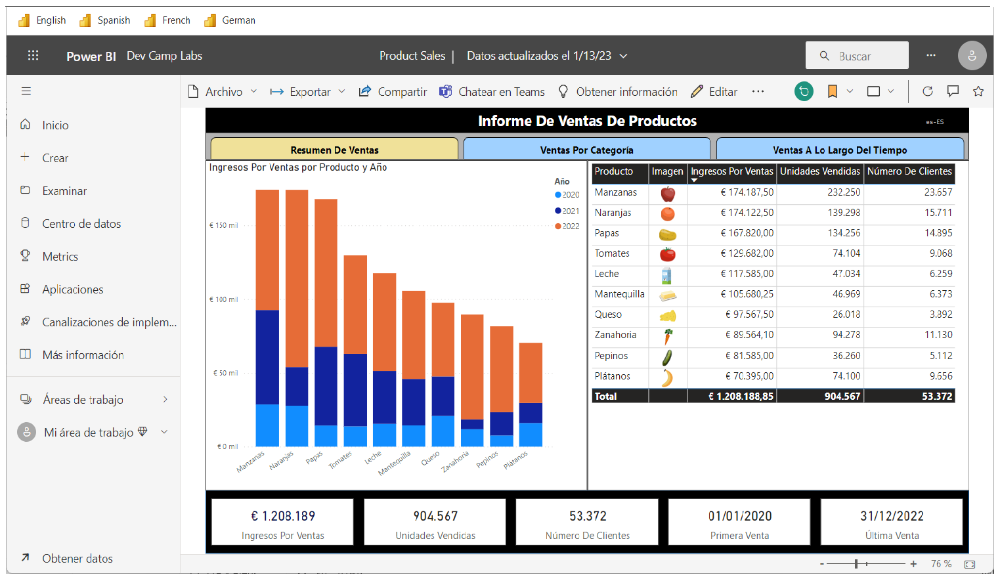

367. Click on the browser book for **French**. Once the report has
     loaded, navigate to the **Sales Over Time** page.

368. Verify that the data translations are loading French names for the
     names of months and days in all three visuals.


369. Click on the browser book for **German**. Once the report has
     loaded, navigate to the **Sales Over Time** page.

370. Verify that the data translations are loading German names for the
     names of months and days in all three visuals.

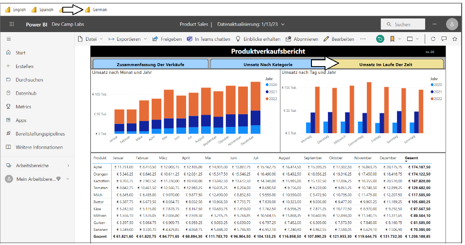

Congratulations. You have now completed this hands-on lab and you can
now begin using your newfound localization skills in working with
translations and building multi-language reports on your own PBIX
projects.
