## **Lab 01: Getting Started with Translations Builder**

> **Overview**: In this lab, you will learn how to work with Power BI
Desktop and Translations Builder to build reports for
Power BI that support multiple languages. You will start by downloading a PBIX project file named
**TB-Lab01.pbix** and opening it in Power BI Desktop. Once you have
opened **TB-Lab01.pbix,** you will launch Translations Builder and move
through the steps to add metadata translations and report label
translations. At various milestones in this lab, you will be required to
publish the **TB-Lab01.pbix** project from Power BI Desktop to the Power
BI Service so you can test how the translations you’ve added to the PBIX
project to ensure they are displayed to users when loaded using
different languages and different cultures.

> **Prerequisite 1**: To complete this lab, you will need a Power BI
workspace where you have appropriate permissions to publish PBIX project
files from Power BI Desktop to test your work. This workspace must also
be associated with a Premium capacity as indicated by the diamond image
(*see below*) displayed after the workspace name. A workspace in a
premium capacity is required because Power BI translations do not load
properly for reports in the shared capacity.

&nbsp;&nbsp;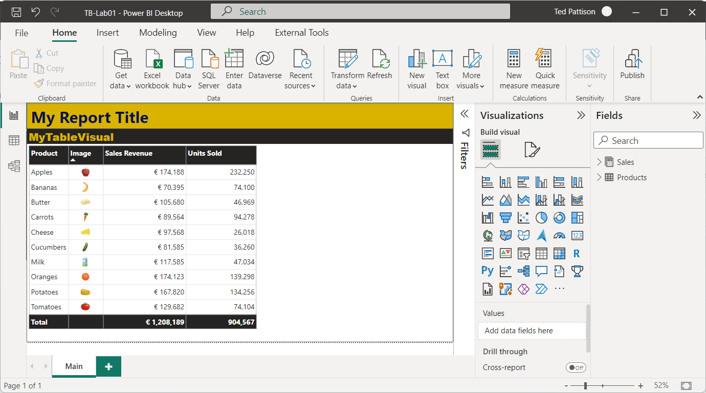

> **Prerequisite 2**: This lab assumes you’ve already installed
Translations Builder. If you haven’t installed Translations Builder yet,
you must follow steps in the [Translations Builder Installation
Guide](Docs/Installation%20Guide.md)
before continuing with these lab exercises.

---

This document is also available for download in [DOCX format](Lab%2001%20-%20Getting%20Started%20with%20Translation%20Builder.docx) and [PDF format](Lab%2001%20-%20Getting%20Started%20with%20Translation%20Builder.pdf).

#### Exercises in this lab...
- [Exercise 1: Creating and Testing Metadata Translations](#exercise-1-creating-and-testing-metadata-translations)
- [Exercise 2: Generating Machine Translations](#exercise-2-generating-machine-translations)
- [Exercise 3: Creating and Testing Report Label Translations](#exercise-3-creating-and-testing-report-label-translations)
- [Exercise 4: Creating a Workflow Process To Gather \& Integrate Human Translations](#exercise-4-creating-a-workflow-process-to-gather--integrate-human-translations)

---

### Exercise 1: Creating and Testing Metadata Translations
> In this exercise, you will begin by downloading a PBIX file with a
simple data model and a single page report. You will publish the project
to the Power BI Service to set up a workflow process to test how
translations appear to report consumers. At the end of this exercise,
you will use Translations Builder to add metadata translations for the
column names and measure names in the dataset.

1. Download the PBIX starter file named **TB-Lab01.pbix** from the following link.

&nbsp;&nbsp;&nbsp;&nbsp;&nbsp;&nbsp;&nbsp;&nbsp;[https://github.com/PowerBiDevCamp/TranslationsBuilder/raw/main/Labs/StarterFiles/TB-Lab01.pbix](StarterFiles/TB-Lab01.pbix)

1.  Create a new folder on your local hard drive for these lab exercises
    in a location such as **C:\DevCampLabs\\**.

&nbsp;&nbsp;&nbsp;&nbsp;&nbsp;&nbsp;&nbsp;

3.  Copy **TB-Lab01.pbix** into the lab folder and then open it in Power
    BI Desktop to examine the report inside.

&nbsp;&nbsp;&nbsp;&nbsp;&nbsp;&nbsp;&nbsp;

4.  While in **Report view**, examine the **Fields** list to see the
    non-hidtables, columns and measure that are not hidden.

&nbsp;&nbsp;&nbsp;&nbsp;&nbsp;&nbsp;&nbsp;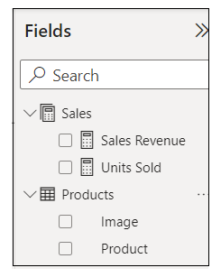

5.  Now, navigate to **Model view** so you can see the entire data model
    including the columns hidden from **Report view**.

&nbsp;&nbsp;&nbsp;&nbsp;&nbsp;&nbsp;&nbsp;

6.  Navigate to **Data view** and examine the rows of the **Products**
    table.

&nbsp;&nbsp;&nbsp;&nbsp;&nbsp;&nbsp;&nbsp;

> Now you are going to publish the **TB-Lab01.pbix** project to a workspace in the Power BI Service.

7.  Navigate to the **Home** tab and then click the **Publish** button.

&nbsp;&nbsp;&nbsp;&nbsp;&nbsp;&nbsp;&nbsp;

8.  When prompted by the **Publish to Power BI** dialog, choose your
    test workspace and then click **Select**.

&nbsp;&nbsp;&nbsp;&nbsp;&nbsp;&nbsp;&nbsp;

9.  Once you see **Success!**, click **Open ‘TB-Lab01.pbx’ in Power BI**
    to view the report in the Power BI Service.

&nbsp;&nbsp;&nbsp;&nbsp;&nbsp;&nbsp;&nbsp;

10. The report named **TB-Lab01** should appear like the report shown in
    the screenshot below.

&nbsp;&nbsp;&nbsp;&nbsp;&nbsp;&nbsp;&nbsp;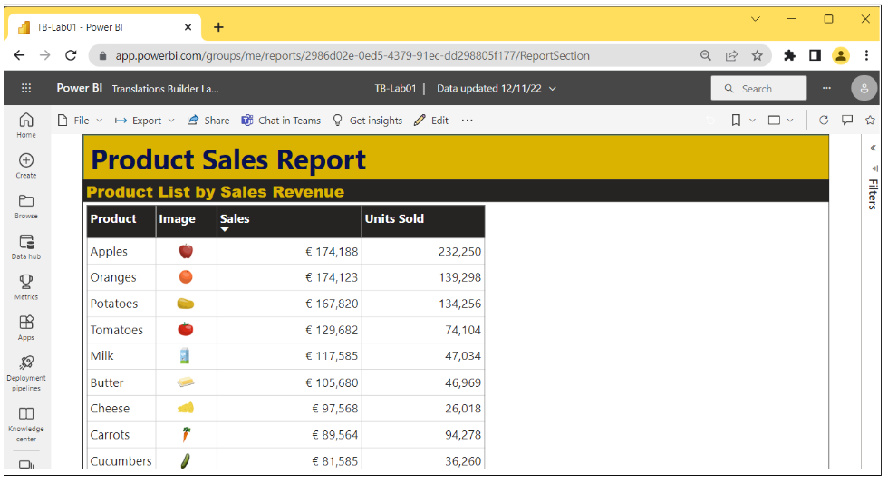

> Now it’s time to begin adding translations. As you begin to add
translations to a PBIX project, you will often follow this set of
steps:  
**(1)** make changes in Power BI Desktop, **(2)** publish the project,
**(3)** check your work in the Power BI Service, **(4)** repeat until
happy

11. Return to Power BI Desktop, navigate to the **External Tools** tab
    and launch **Translations Builder**.

&nbsp;&nbsp;&nbsp;&nbsp;&nbsp;&nbsp;&nbsp;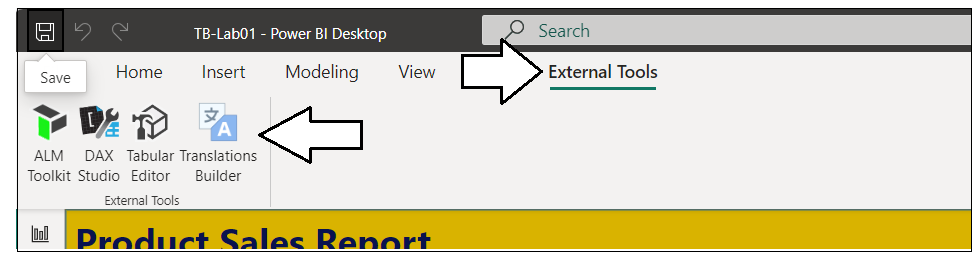

12. Translations Builder should start and load the data model for
    **TB-Lab01.pbix** as shown in the following screenshot.

&nbsp;&nbsp;&nbsp;&nbsp;&nbsp;&nbsp;&nbsp;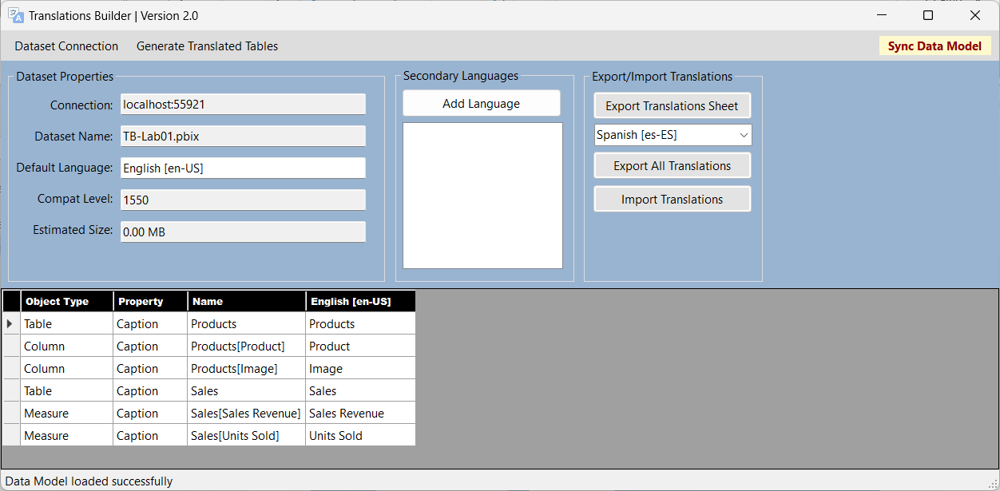

13. The **Dataset properties** section provides details about the
    dataset connection and the PBIX project file.

&nbsp;&nbsp;&nbsp;&nbsp;&nbsp;&nbsp;&nbsp;

14. The translation grid at the bottom of the page displays one row for
    each non-hidden dataset object in the data model.

&nbsp;&nbsp;&nbsp;&nbsp;&nbsp;&nbsp;&nbsp;

Tables, columns and measures that are hidden from report view in the
data model are not displayed. You don’t need to translate them.

15. Click the **Add Language** button to add your first secondary
    language.

&nbsp;&nbsp;&nbsp;&nbsp;&nbsp;&nbsp;&nbsp;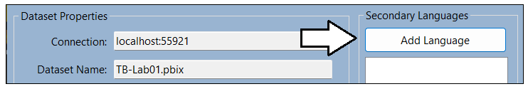

16. Select **Spanish \[es-ES\]** and click **Add Language**.

&nbsp;&nbsp;&nbsp;&nbsp;&nbsp;&nbsp;&nbsp;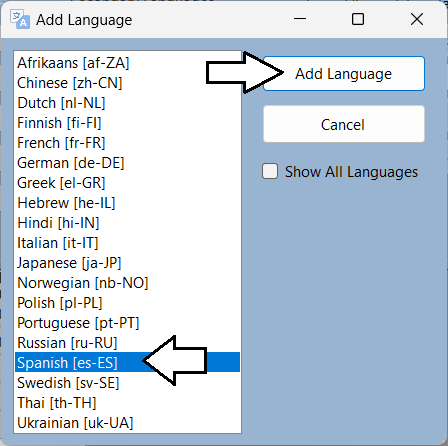

17. You should now see that **Spanish \[es-ES\]** appears as the first
    language in the **Secondary Languages** list.

&nbsp;&nbsp;&nbsp;&nbsp;&nbsp;&nbsp;&nbsp;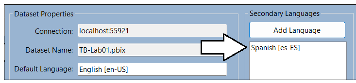

18. You will also notice that a new column has been added for Spanish
    translations.

&nbsp;&nbsp;&nbsp;&nbsp;&nbsp;&nbsp;&nbsp;

19. In the row with the **Products** table, click on the cell for the
    **Spanish** column. It should turn blue when selected.

&nbsp;&nbsp;&nbsp;&nbsp;&nbsp;&nbsp;&nbsp;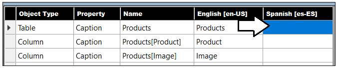

20. Type **Hello World**. You should see that you can just start typing
    in the selected cell to add or edit a translation.

&nbsp;&nbsp;&nbsp;&nbsp;&nbsp;&nbsp;&nbsp;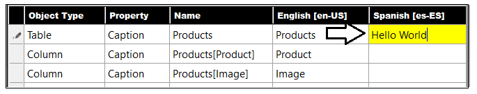

21. Press the **ENTER** key to save your changes. Note that pressing
    **ENTER** will move the selection to the cell below.

&nbsp;&nbsp;&nbsp;&nbsp;&nbsp;&nbsp;&nbsp;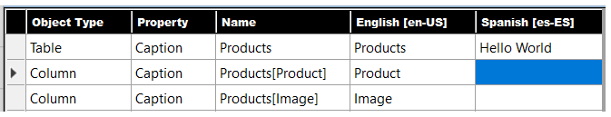

22. Now, type more text and press **ENTER** repeatedly to experiment
    quickly adding text to all cells in the Spanish column.

&nbsp;&nbsp;&nbsp;&nbsp;&nbsp;&nbsp;&nbsp;

> The point of the last few steps has been for you to become comfortable
with the translation editing experience. You can see the grid provides
an editing experience similar to working with Excel. You can even use
the **{F2}** key to move a cell with content into edit mode.

23. Now edit the translations in the Spanish column with better
    translated values. Use the following translations.
  - For the **Products** table, enter the Spanish translation of **Productos**.
  - For the **Product** column, enter the Spanish translation of **Producto**
  - For the **Image** column, enter the Spanish translation of **Imagen**.
  - For the **Sales** table, enter the Spanish translation of **Ventas**.
  - For the **Sales Revenue** measure, enter the Spanish translation of **Ingresos Por Ventas**.
  - For the **Units Sold** measure, enter the Spanish translation of **Unidades Vendidas**.

24. When you are done with your edits, the Spanish translations should
    match the following screenshot.

&nbsp;&nbsp;&nbsp;&nbsp;&nbsp;&nbsp;&nbsp;

25. Return to the **TB-Lab01.pbix** project in Power BI Desktop and save
    your work by clicking the **Save** button.

&nbsp;&nbsp;&nbsp;&nbsp;&nbsp;&nbsp;&nbsp;

> It’s easy to forget to save your changes in Power BI Desktop. Be aware
that any changes made by Translations Builder are just made to the data
model loaded in memory. None of your changes are saved back to the PBIX
project file until you save in Power BI Desktop.

26. Publish the **TB-Lab01.pbix** project to push the changes to the
    project’s translations to the Power BI Service.

&nbsp;&nbsp;&nbsp;&nbsp;&nbsp;&nbsp;&nbsp;

27. When prompted by the **Replace this dataset?** Dialog, click the
    **Replace** button to continue.

&nbsp;&nbsp;&nbsp;&nbsp;&nbsp;&nbsp;&nbsp;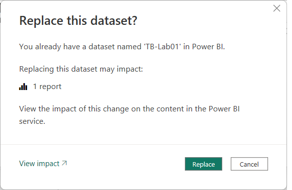

28. Once you see **Success!**, click **Open ‘TB-Lab01.pbx’ in Power BI**
    to view the report in the Power BI Service.

&nbsp;&nbsp;&nbsp;&nbsp;&nbsp;&nbsp;&nbsp;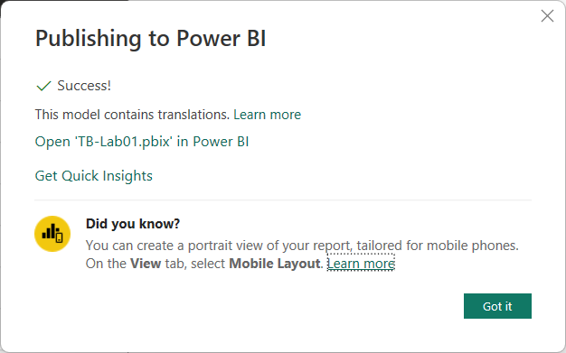

29.  The report should load with its default behavior showing all text in
    English at first.

&nbsp;&nbsp;&nbsp;&nbsp;&nbsp;&nbsp;&nbsp;

30. Inspect the table visual column headers which displays the names of
    columns and measures in English.

&nbsp;&nbsp;&nbsp;&nbsp;&nbsp;&nbsp;&nbsp;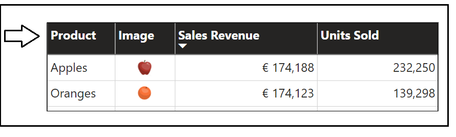

> Now, it’s time to test your translations. You will accomplish this by
using the **language** query string parameter to load the report.

31. Click the browser address bar and add the following **language**
parameter to the end of the report URL.

&nbsp;&nbsp;&nbsp;&nbsp;&nbsp;&nbsp;&nbsp;**/?language=es-ES**

32.  Press **ENTER.** You should see the **language** query string parameter accepted by the browser as it reloads the report.
    

&nbsp;&nbsp;&nbsp;&nbsp;&nbsp;&nbsp;&nbsp;

> When the report reloads, you should see the UI experience for the Power
BI Service UI switch from English to Spanish.

33. Verify the column and measure names in columns headings are
    displayed with the Spanish translations you added.

&nbsp;&nbsp;&nbsp;&nbsp;&nbsp;&nbsp;&nbsp;

> You have now successfully added the metadata translations to display
this report in both English and Spanish. Leave Power BI Desktop and
Translations Builder open as you will continue using them in your next
exercise.

### Exercise 2: Generating Machine Translations
> In this lab you will configure Translations Builder’s support to
automatically generate machine translations using the Azure Translator
Service. While machine translations might not prove good enough to use
in all production scenarios, they do provide a great first step in
generating translations for testing and getting something into
production sooner.

> To complete this lab you will require a **Key** and **Location** which
provide access to the **Azure Translator Service**. If you do not have a
Azure subscription and you cannot obtain your own Key, you can use the
following Key and Location up through February 28, 2023.

> Key: **a75b371ce1fc402ca84a05732cfcff27**
> Location: **eastus2**

1.  Return to Translations Builder and drop down the **Dataset
    Connection** menu.

&nbsp;&nbsp;&nbsp;&nbsp;&nbsp;&nbsp;&nbsp;

2. Select the **Configure Settings…** menu command to display the
    **Configuration Options** dialog.    

&nbsp;&nbsp;&nbsp;&nbsp;&nbsp;&nbsp;&nbsp;

3. In the **Configuration Options** dialog, enter the **Key** and
    **Location** for the Azure Translator Service.

&nbsp;&nbsp;&nbsp;&nbsp;&nbsp;&nbsp;&nbsp;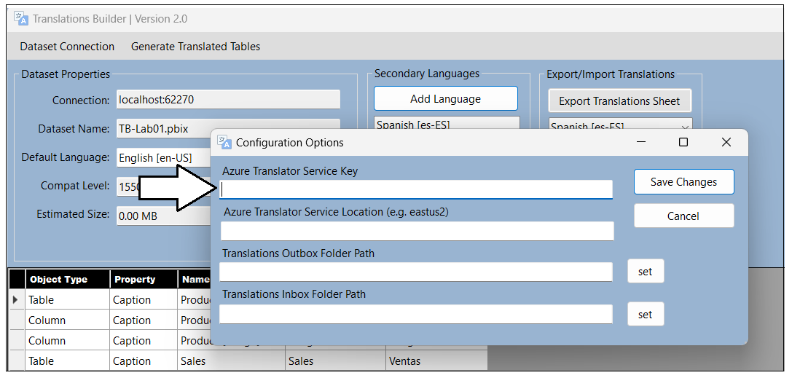

4. Once you have added the **Key** and **Location**, click **Save
    Changes**.

&nbsp;&nbsp;&nbsp;&nbsp;&nbsp;&nbsp;&nbsp;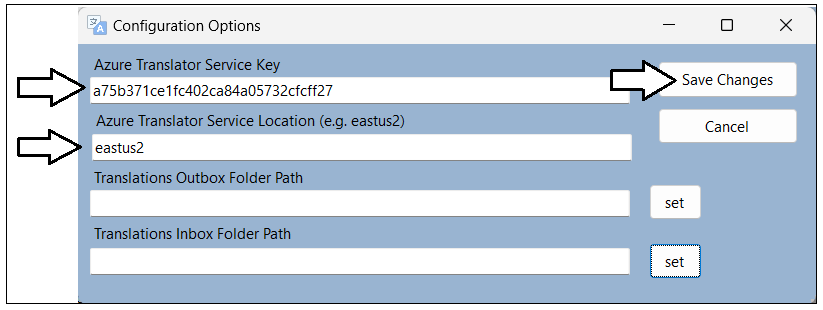

5. After you have configured the **Key** and **Location** for the Azure
    Translator Service, new controls will appear on the main page.

&nbsp;&nbsp;&nbsp;&nbsp;&nbsp;&nbsp;&nbsp;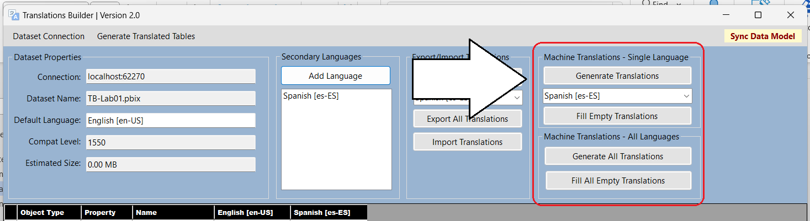

> Now that you have added support for generating machine translations,
it’s time to put that automatic translation support to work!

6. Click the **Add Language** button to add your second secondary
    language.

&nbsp;&nbsp;&nbsp;&nbsp;&nbsp;&nbsp;&nbsp;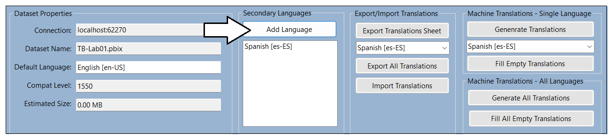

> You can hold down the **CTRL** key in the **Add Language** dialog while
selecting languages to enable multiple selection

7. Hold down the **CTRL**, and select **French**, **German** and
    **Italian** and then click **Add Language**.

&nbsp;&nbsp;&nbsp;&nbsp;&nbsp;&nbsp;&nbsp;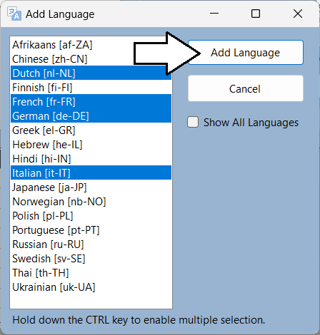

8. You should now see the three new languages appear in the **Secondary
    Languages** list.

9.  You will also notice that new columns have been added to the
    translation grid for each new language.

&nbsp;&nbsp;&nbsp;&nbsp;&nbsp;&nbsp;&nbsp;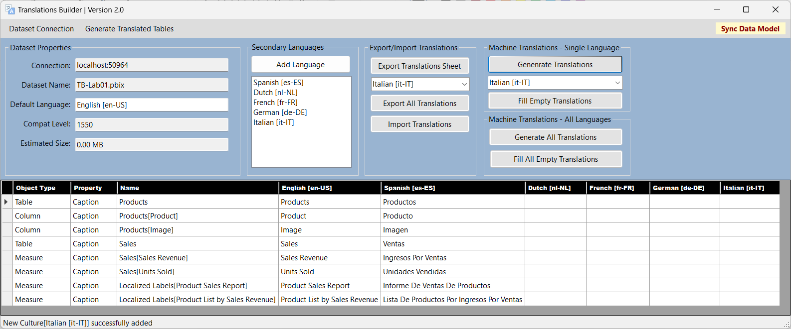

10. In the **Machine Translations – Single Language** section, select
    **French \[fr-FR\]** from the drop down menu.

&nbsp;&nbsp;&nbsp;&nbsp;&nbsp;&nbsp;&nbsp;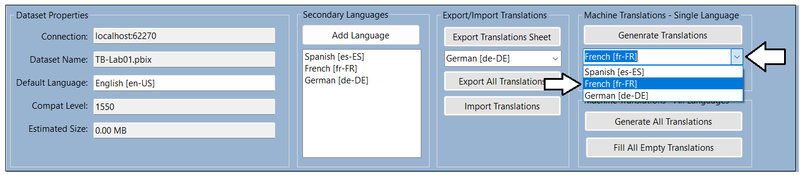

11. Once you have selected **French \[fr-FR\]**, click **Generate
    Translations** to create French translations for all rows in the
    grid.

&nbsp;&nbsp;&nbsp;&nbsp;&nbsp;&nbsp;&nbsp;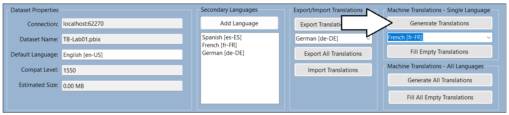

12. As the code runs to interact with the Azure Translator Service, the
    **Generating machine translation** dialog shows the progress.

&nbsp;&nbsp;&nbsp;&nbsp;&nbsp;&nbsp;&nbsp;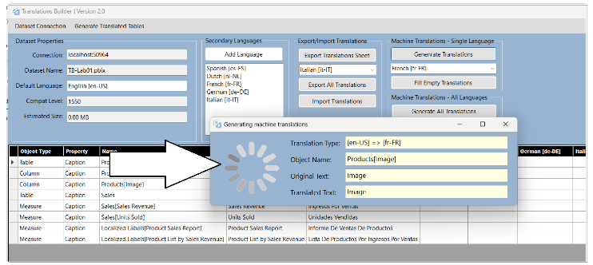

13. Once this dialog closes, you should see all cells the French column
    has been filled with machine-generated translations.

&nbsp;&nbsp;&nbsp;&nbsp;&nbsp;&nbsp;&nbsp;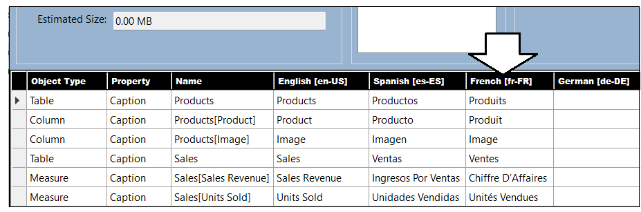

14. Click the **Fill All Empty Translation** button in the **Machine
    Translations - All Languages** section.

&nbsp;&nbsp;&nbsp;&nbsp;&nbsp;&nbsp;&nbsp;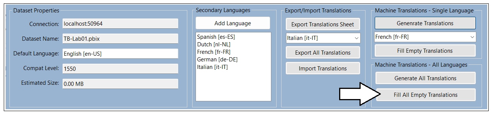

15. You should see that the empty cells for all languages have now been
    populated with machine-generated translations.

&nbsp;&nbsp;&nbsp;&nbsp;&nbsp;&nbsp;&nbsp;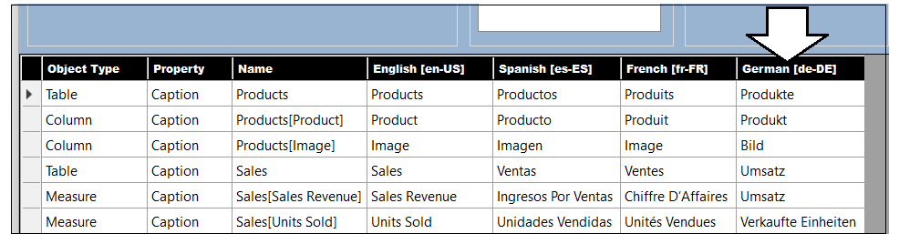

> Now, it’s time once again to test your work in the Power BI Service,

16. Return to the **TB-Lab01.pbix** project in Power BI Desktop and save
    your work by clicking the **Save** button.

&nbsp;&nbsp;&nbsp;&nbsp;&nbsp;&nbsp;&nbsp;

> Don’t forget to save your work! Did we mention it’s easy to forget to
save in Power BI Desktop and to lose your work.

17. Publish the **TB-Lab01.pbix** project to push your changes to the
    project’s translations to the Power BI Service.

&nbsp;&nbsp;&nbsp;&nbsp;&nbsp;&nbsp;&nbsp;

18. When prompted by the **Replace this dataset?** Dialog, click the
    **Replace** button to continue.

&nbsp;&nbsp;&nbsp;&nbsp;&nbsp;&nbsp;&nbsp;

19.  Once you see **Success!**, click **Open ‘TB-Lab01.pbx’ in Power BI**
    to view the report in the Power BI Service.

&nbsp;&nbsp;&nbsp;&nbsp;&nbsp;&nbsp;&nbsp;

20.  The report should load as normal showing all text in English at
    first.

&nbsp;&nbsp;&nbsp;&nbsp;&nbsp;&nbsp;&nbsp;

> Now, it’s time to test your French, German & Italian translations using
the **language** query string parameter to load the report.

21. Click the browser address bar and add the **language** parameter
    value of **fr-FR** for French to the end of the report URL.

&nbsp;&nbsp;&nbsp;&nbsp;&nbsp;&nbsp;&nbsp;**/?language=fr-FR**

22. When the report reloads, you should see the UI experience for the
    Power BI Service UI switch from English to French.

&nbsp;&nbsp;&nbsp;&nbsp;&nbsp;&nbsp;&nbsp;

23. Verify the column and measure names in columns headings of the table
    visual are displayed with French translations.

&nbsp;&nbsp;&nbsp;&nbsp;&nbsp;&nbsp;&nbsp;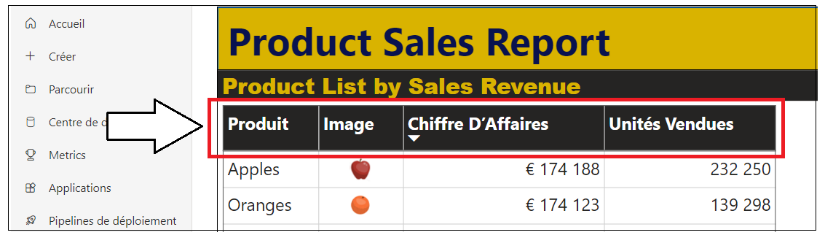

> Now that you have tested the French translations, it’s time to test the
two other new languages.

24. Click the browser address bar and add the **language** parameter
    value of **de-DE** for German to the end of the report URL.

&nbsp;&nbsp;&nbsp;&nbsp;&nbsp;&nbsp;&nbsp;**/?language=de-DE**

25. When the report reloads, you should see the UI experience for the
    Power BI Service UI switch to German.

&nbsp;&nbsp;&nbsp;&nbsp;&nbsp;&nbsp;&nbsp;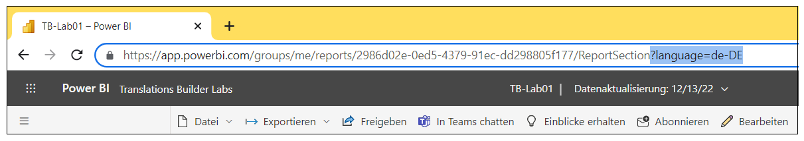

26. Verify the column and measure names in columns headings are
    displayed with the German translations.

&nbsp;&nbsp;&nbsp;&nbsp;&nbsp;&nbsp;&nbsp;

27. Click the browser address bar and add the **language** parameter of
    **it-IT** for Italian to the end of the report URL.

&nbsp;&nbsp;&nbsp;&nbsp;&nbsp;&nbsp;&nbsp;**/?language=it-IT**

28. When the report reloads, you should see the UI experience for the
    Power BI Service UI switch to Italian.

&nbsp;&nbsp;&nbsp;&nbsp;&nbsp;&nbsp;&nbsp;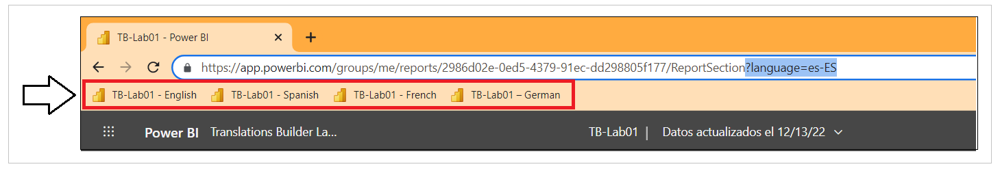

29. Verify the column and measure names in columns headings are
    displayed with the Italian translations.

&nbsp;&nbsp;&nbsp;&nbsp;&nbsp;&nbsp;&nbsp;

> You have now successfully added the metadata translations to display
this report in five different languages. Throughout these lab exercises,
you will continue to test all five languages in the browser as you add
additional translation support.

30. As a final step in this exercise, add a browser bookmark for each
    language with a **language** parameter at the end.

&nbsp;&nbsp;&nbsp;&nbsp;&nbsp;&nbsp;&nbsp;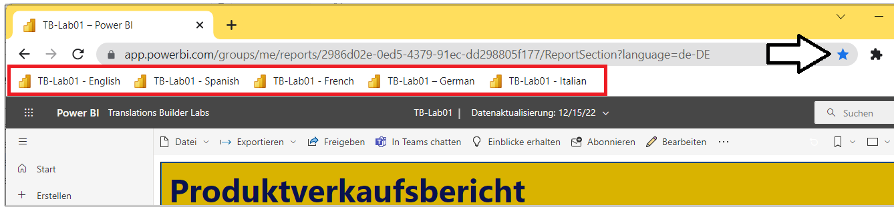

> Creating a browser bookmark for each language might take a minute or two
to set up at first. However, it will save lots of time in the long run
as you continue to test the translations for this report in the lab work
that remains ahead.

### Exercise 3: Creating and Testing Report Label Translations
> In this exercise, you will work through the process of adding report
label translations. You will add translations for the report title which
is **Product Sales Report** and for the title of the table visual which
is **Product List by Sales Revenue**. This will give you experience
working with the localized labels table strategy that Translations
Builder uses to quickly and easily implement report label translations.

1.  Return to the **TB-Lab01.pbix** project in Power BI Desktop and move
    to **Report view**.

2.  Look to see how the text **Product Sales Report** is displayed with a rectangle
    shape object.

3.  Look to see how the text **Product Sales List by Sales Revenue** is displayed using
    the **Title** property of the table visual.

&nbsp;&nbsp;&nbsp;&nbsp;&nbsp;&nbsp;&nbsp;

4. Now, move back to Translations Builder and drop down the **Generate
    Translated Tables** menu.

5. Select the **Create Localized Labels Table** to create the
    **Localized Labels Table**.

&nbsp;&nbsp;&nbsp;&nbsp;&nbsp;&nbsp;&nbsp;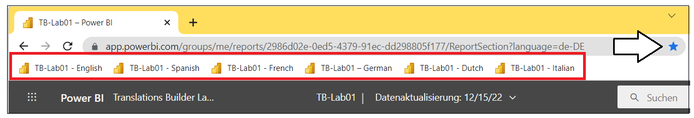

6. When you create the **Localized Labels** table, you will be prompted
    with the following dialog. Click **<u>N</u>o** to continue.

&nbsp;&nbsp;&nbsp;&nbsp;&nbsp;&nbsp;&nbsp;

> If you click **<u>Y</u>es**, Translations Builder will launch a browser
and navigate to [this article](https://github.com/PowerBiDevCamp/TranslationsBuilder/blob/main/Docs/Building%20Multi-language%20Reports%20in%20Power%20BI.md#understanding-the-localized-labels-table)
which explains the localized labels strategy.

7. Once Translations Builder has created the **Localized Labels**
    table, it will also add three sample report labels.

&nbsp;&nbsp;&nbsp;&nbsp;&nbsp;&nbsp;&nbsp;

> Over the next few steps, you will delete these three sample report
labels and replace them by adding two of your own.

8. Drop down the **Generate Translated Tables** menu and select click
    **Add Labels to the Localized Labels Table**.

&nbsp;&nbsp;&nbsp;&nbsp;&nbsp;&nbsp;&nbsp;

> Note you can also execute the **Add Labels to the Localized Labels
Table** command using the shortcut key of **Ctrl+A**.

9. In the **Add Localized Labels** dialog, click the **Advanced Mode**
    checkbox.

&nbsp;&nbsp;&nbsp;&nbsp;&nbsp;&nbsp;&nbsp;

10. Once the dialog is in **Advanced Mode**, click the **Delete All
    Labels** button to remove the sample report labels.

&nbsp;&nbsp;&nbsp;&nbsp;&nbsp;&nbsp;&nbsp;

11. In the **Labels** textbox, type the report label **Product Sales
    Report**.

12. Enter a line break and then type in the second label **Product List
    by Sales Revenue**.

13. Click the **Add Labels** button to add the two new labels to your
    project.

&nbsp;&nbsp;&nbsp;&nbsp;&nbsp;&nbsp;&nbsp;

14. You should now see two new rows have been added to the translations
    gird with the two new report labels.

&nbsp;&nbsp;&nbsp;&nbsp;&nbsp;&nbsp;&nbsp;

15. Click the **Fill All Empty Translations** button to create all the
    translations for both report labels.

&nbsp;&nbsp;&nbsp;&nbsp;&nbsp;&nbsp;&nbsp;

16. At this point, the translations grid should be completely filled
    with machine-generated translations.

&nbsp;&nbsp;&nbsp;&nbsp;&nbsp;&nbsp;&nbsp;

> There is one critical step you must complete after modifying report
labels in the **Localized Labels** table. More specifically, you must
execute **Generate Translated Localized Labels Table** to create the
measures that will be used to surface report labels on a report.

17. Drop down the **Generate Translated Tables** menu and select click
    **Generate Translated Localized Labels Table**.

&nbsp;&nbsp;&nbsp;&nbsp;&nbsp;&nbsp;&nbsp;

> Note you can also execute the **Generate Translated Localized Labels
Table** command using the shortcut key of **Ctrl+L**.

18. Return to Power BI Desktop and navigate to **Report view**.

19. Locate the **Translated Localized Labels** table in the **Fields**
    list.

&nbsp;&nbsp;&nbsp;&nbsp;&nbsp;&nbsp;&nbsp;

> The measures in the **Translated Localized Labels** table are what you
use to display report labels on a Power BI report.

20. Select the measure named **Product Sales Report Label** and examine
    the DAX expression behind this measure.

&nbsp;&nbsp;&nbsp;&nbsp;&nbsp;&nbsp;&nbsp;

> You should not edit the DAX expressions of measures in the the **Translated Localized Labels** table. Any changes you make will be lost as all the measures in this table are deleted and recreated each time you execute the **Generate Translated Localized Labels Table** command.

21.  Select the measure named **Product List by Sales Revenue Label** and
    examine its DAX expression.

&nbsp;&nbsp;&nbsp;&nbsp;&nbsp;&nbsp;&nbsp;

> Now that you have created the measures for translation in the
**Translated Localized Labels** table, it’s time to use them in the
report.

22. In the report layout, select the large yellow rectangle shape that
    displays the report title **Product Sales Report**.

23. With the rectangle shaped selected, move to the **Format** pane and
    locate the **Text** section inside the **Style** selection.

&nbsp;&nbsp;&nbsp;&nbsp;&nbsp;&nbsp;&nbsp;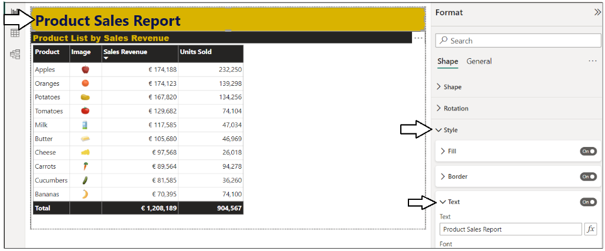

24. Expand the **Text** section to see the **Text** property is
    configured with the literal string value of **Product Sales
    Report**.

&nbsp;&nbsp;&nbsp;&nbsp;&nbsp;&nbsp;&nbsp;

> Literal string values in a report layout cannot be localized. Therefore,
you will replace this literal string with a measure with translations.

25. Click on the ***fx*** button to the right of the textbox to replace
    the literal string value.

&nbsp;&nbsp;&nbsp;&nbsp;&nbsp;&nbsp;&nbsp;

26. In the **Text – Style** dialog, select **Field value** as the
    **Format style**.

27. Drop down the select control with the caption of **What field should
    we base this on?**

&nbsp;&nbsp;&nbsp;&nbsp;&nbsp;&nbsp;&nbsp;

28. Select the **Product Sales Report Label** measure from the
    **Translated Localized Labels** table.

&nbsp;&nbsp;&nbsp;&nbsp;&nbsp;&nbsp;&nbsp;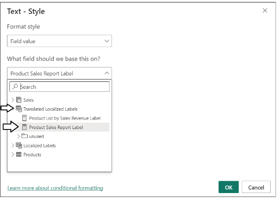

> Now that you have configured the report title to support translations,
you will do the same for the title of the table visual.

29. Select the table visual that display the product list.

30. With the table visual selected, move to the **Format** pane and
    click the **General** tab.

31. Locate the **Title** section and the **Text** property inside with
    the literal text value of **Product List by Sales Revenue**.

&nbsp;&nbsp;&nbsp;&nbsp;&nbsp;&nbsp;&nbsp;

32. Click on the ***fx*** button to the right of the textbox to replace
    the literal string value.

&nbsp;&nbsp;&nbsp;&nbsp;&nbsp;&nbsp;&nbsp;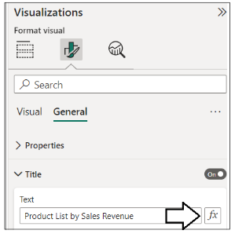

33. In the **Text – Style** dialog, select **Field value** as the
    **Format style**.

34. Drop down the select menu with the caption of **What field should
     we base this on?**

35. Select the **Product List by Sales Revenue Label** measure from the
     **Translated Localized Labels** table.

&nbsp;&nbsp;&nbsp;&nbsp;&nbsp;&nbsp;&nbsp;

> Now, it’s time once again to test your work in the Power BI Service,

36. Save your work by clicking the **Save** button.

&nbsp;&nbsp;&nbsp;&nbsp;&nbsp;&nbsp;&nbsp;

> Don’t forget to save your work! Did we mention it’s easy to forget and
to lose your work.

37. Publish the **TB-Lab01.pbix** project to push your changes to the
     project’s translations to the Power BI Service.

&nbsp;&nbsp;&nbsp;&nbsp;&nbsp;&nbsp;&nbsp;

38. When prompted by the **Replace this dataset?** Dialog, click the
     **Replace** button to continue.

39. Once you see **Success!**, click **Open ‘TB-Lab01.pbx’ in Power
     BI** to view the report in the Power BI Service.

40. The report should load as normal showing all text in English at
     first.

41. Use the bookmark created earlier to load the report in Spanish.
     Verify the report labels show Spanish translations.

&nbsp;&nbsp;&nbsp;&nbsp;&nbsp;&nbsp;&nbsp;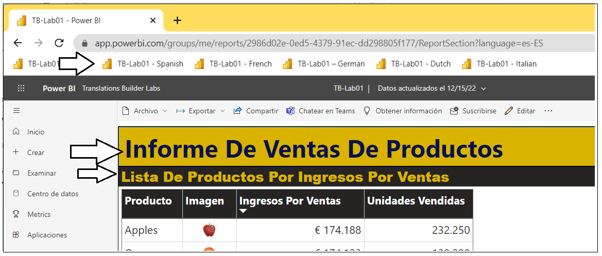

42. Use the bookmark created earlier to load the report in French.
     Verify the report labels show French translations.

&nbsp;&nbsp;&nbsp;&nbsp;&nbsp;&nbsp;&nbsp;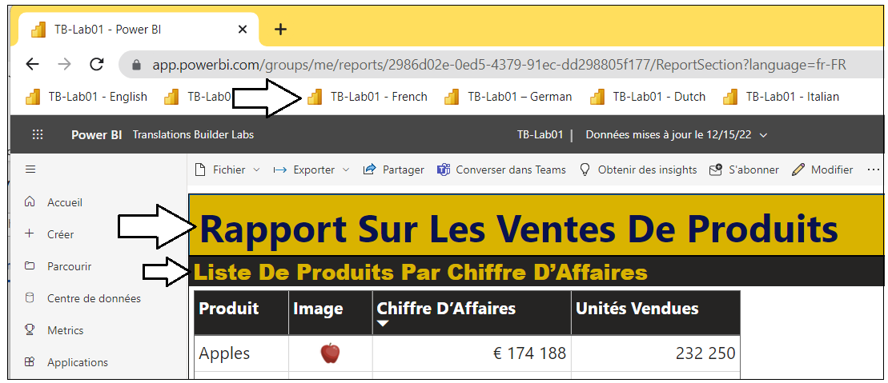

43. Use the bookmark created earlier to load the report in German.
     Verify the report labels show German translations.

&nbsp;&nbsp;&nbsp;&nbsp;&nbsp;&nbsp;&nbsp;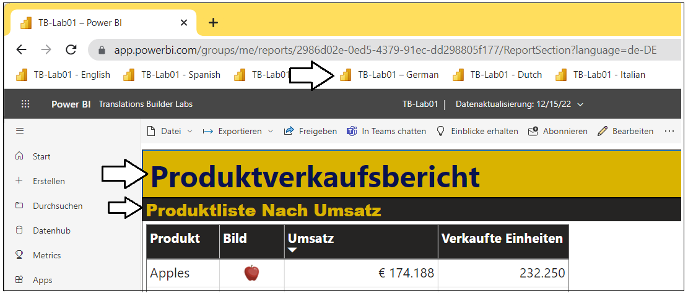

44. Use the bookmark created earlier to load the report in Italian.
     Verify the report labels show Italian Translations.

&nbsp;&nbsp;&nbsp;&nbsp;&nbsp;&nbsp;&nbsp;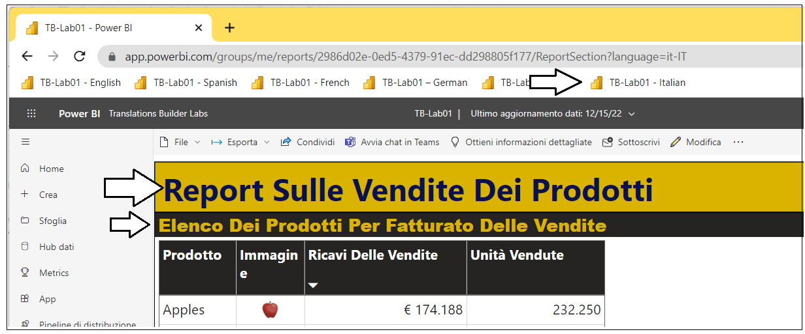

> You have now implemented report label translations using the
Translations Builder localized label strategy. You should be able to see
that this will add a significant level of productivity to your future
efforts to build Power BI reports that support multiple languages.

### Exercise 4: Creating a Workflow Process To Gather & Integrate Human Translations
> Up to this point, you have done the work required to get the report and
its underlying dataset into a structure to support translations for
secondary languages. You were able to complete this work in a quick and
efficient manner using Translations Builder together with
machine-generated translations. However. It’s import to acknowledge that
machine-generated translations alone will not be adequate for many
production scenarios. You will need a way to integrate other people
acting as translators into a human workflow process.

> In this lab exercise, you will with the Translations Builder features to
export and import translations using a CSV file format. This will
provide a quick way to generate translations sheets that can be sent to
human translators. As you will see, translators can make their edits to
a translation sheets using Microsoft Excel. Once you’ve received an
updated translation sheet back from a translator, Translations Builder
provides an import operation to integrate those updated translations
back into the dataset for the current project.

> **Prerequisite**: To complete this exercise, you will need Microsoft
Excel installed on the same PC running Translations Builder.

1.  Launch Windows Explorer and navigate to the folder where you copied
    the project file **TB-Lab01.pbix**.

&nbsp;&nbsp;&nbsp;&nbsp;&nbsp;&nbsp;&nbsp;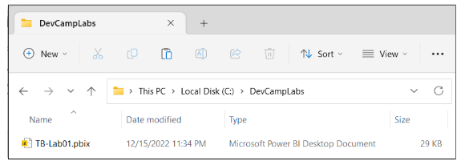

2. Create two new folders inside the lab folder named **Outbox** and
     **Inbox**.

&nbsp;&nbsp;&nbsp;&nbsp;&nbsp;&nbsp;&nbsp;

> Next, you need to configure settings in Translations Builder so that
these folders are used as targets for export and import operations.

3. Return to Translations Builder and drop down the **Dataset
     Connection** menu.

4. Click **Configure Settings…** to display the **Configuration
     Options** dialog.

&nbsp;&nbsp;&nbsp;&nbsp;&nbsp;&nbsp;&nbsp;

5. By default, folder paths for the **Outbox** and **Inbox** are
     configured to target the current user’s **Documents** folder.

&nbsp;&nbsp;&nbsp;&nbsp;&nbsp;&nbsp;&nbsp;

> Why does **Outbox** come before **Inbox**? That’s because you generally
work with the **Outbox** first when you export translation sheets that
you will send to translators. Once you get updated translations sheets
back from translators, you add them to the **Inbox** for import.

6. Click the **set** button to update the setting for **Translations
     Outbox Folder Path**.

&nbsp;&nbsp;&nbsp;&nbsp;&nbsp;&nbsp;&nbsp;

7. Select the **Outbox** folder you created earlier in this exercise.

&nbsp;&nbsp;&nbsp;&nbsp;&nbsp;&nbsp;&nbsp;

8. Click the **set** button for **Translations Inbox Folder Path** and
     select the **Inbox** folder you created earlier

&nbsp;&nbsp;&nbsp;&nbsp;&nbsp;&nbsp;&nbsp;

9. Click **Save Changes**.

&nbsp;&nbsp;&nbsp;&nbsp;&nbsp;&nbsp;&nbsp;

> Now that you have configured the folder paths for the Outbox and Inbox,
it’s time to begin exporting translation sheets.

10. Examine what’s inside the Export/Import Translations section.

&nbsp;&nbsp;&nbsp;&nbsp;&nbsp;&nbsp;&nbsp;

> Let’s start by creating a translation sheet for a single language.

11. Drop down the selection menu under the **Export Translations
     Sheet** button and select **German \[de-DE\]**.

&nbsp;&nbsp;&nbsp;&nbsp;&nbsp;&nbsp;&nbsp;

12. After selecting **German \[de-DE\]**, click the **Export
     Translations Sheet** button.

&nbsp;&nbsp;&nbsp;&nbsp;&nbsp;&nbsp;&nbsp;

> Translations Builder should create a translation sheet named
**TB-Lab01-Translations-German.csv** and open this CSV file in Excel

13. Examine the contents of **TB-Lab01-Translations-German.csv**.

&nbsp;&nbsp;&nbsp;&nbsp;&nbsp;&nbsp;&nbsp;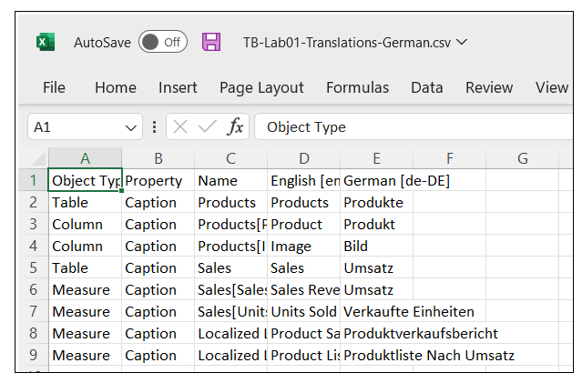

> Over the next two steps you will use a trick in Excel to widen the
columns so you can see all their contents.

14. Click on the top left corner where the row headers and the column
     headers meet. This should select all columns and rows.

&nbsp;&nbsp;&nbsp;&nbsp;&nbsp;&nbsp;&nbsp;

15. Double-click on the column heading divider between the column
     headers showing **A** and **B**.

&nbsp;&nbsp;&nbsp;&nbsp;&nbsp;&nbsp;&nbsp;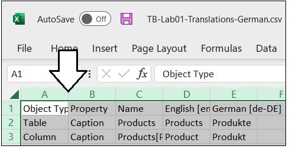

16. You should now be able to see all the text from each column.

&nbsp;&nbsp;&nbsp;&nbsp;&nbsp;&nbsp;&nbsp;

> This translation sheet is what you will send to translators. They can
then use Excel to review the machine translations and make changes
wherever they are required.

17. Close **TB-Lab01-Translations-German.csv** and return to
     Translations Builder.

18. Click the **Export All Translations** button to export a master
     translation sheet with the translations for all languages.

&nbsp;&nbsp;&nbsp;&nbsp;&nbsp;&nbsp;&nbsp;

> Translations Builder creates a translation sheet named
**TB-Lab01-Translations-Master.csv** and opens this CSV file in Excel

19. When **TB-Lab01-Translations-Master.csv** open in Microsoft Excel,
     you cannot see the contents of all columns at first.

&nbsp;&nbsp;&nbsp;&nbsp;&nbsp;&nbsp;&nbsp;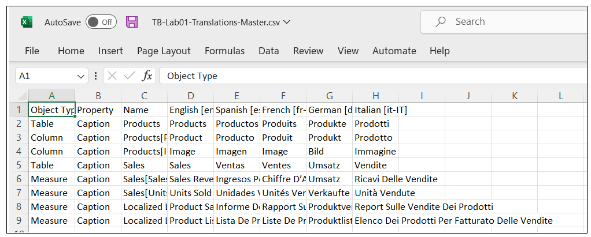

20. Use the Excel trick you learned earlier to expand all columns so
     you can see the entire contents of all cells.

&nbsp;&nbsp;&nbsp;&nbsp;&nbsp;&nbsp;&nbsp;

> Now that you have learned to export translations sheets, it’s time to
examine how to manage translation sheet files.

21. In Windows Explorer, navigate to the **Outbox** folder. You should
     see the two files you generated using export operations.

&nbsp;&nbsp;&nbsp;&nbsp;&nbsp;&nbsp;&nbsp;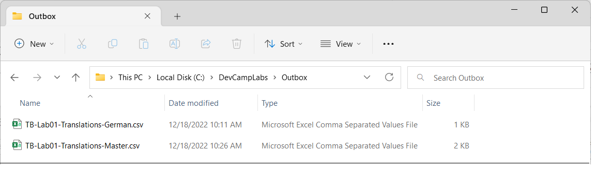

22. Return to Translations Builder and uncheck the checkbox with the
     caption **Open Export in Excel**.

&nbsp;&nbsp;&nbsp;&nbsp;&nbsp;&nbsp;&nbsp;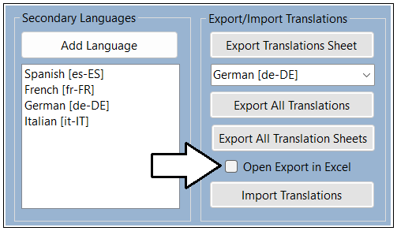

> All three export commands use this checkbox to decide whether to open a
translation sheet in Excel after it’s generated. In some cases, it’s
handy to have the translation sheet open in Excel. In other scenarios
like the one ahead, it’s unnecessary and distracting.

23. Click the **Export All Translation Sheets** button.

&nbsp;&nbsp;&nbsp;&nbsp;&nbsp;&nbsp;&nbsp;

> The **Export All Translation Sheets** command generates the complete set
of translation sheets to be sent to translators.

24. Return to the **Outbox** folder in Windows Explorer.

25. You should see that a sperate translation sheet has been generated
     for each secondary language.

&nbsp;&nbsp;&nbsp;&nbsp;&nbsp;&nbsp;&nbsp;

> Now that you have experienced how to export translation sheets, you will
now learn how to import translation sheets.

26. In the **Outbox** folder in Windows Explorer, select
     **TB-Lab01-Translations-Master.csv** and
     **TB-Lab01-Translations-Spanish.csv**.

&nbsp;&nbsp;&nbsp;&nbsp;&nbsp;&nbsp;&nbsp;

27. Copy the two selected translation sheet files to the Windows
     clipboard.

28. Navigate from the **Outbox** folder to the **Inbox** folder.

29. Paste the two translation sheet files from the Windows clipboard
     into the **Inbox** folder.

&nbsp;&nbsp;&nbsp;&nbsp;&nbsp;&nbsp;&nbsp;

30. Open the translation sheet named
     **Inbox\TB-Lab01-Translations-Spanish.csv** in Microsoft Excel.

&nbsp;&nbsp;&nbsp;&nbsp;&nbsp;&nbsp;&nbsp;

> The job of the translator is to review all translations in the fifth
column and to make updates where appropriate. From the perspective of
the translator, the top row with column headers and the first four
columns should be treated as read-only values.

31. Enter new values for each of the Spanish translations in the fifth
     column.

&nbsp;&nbsp;&nbsp;&nbsp;&nbsp;&nbsp;&nbsp;

> Don’t worry whether the values you are valid translations. You just need
to add any text so you can test the import process.

32. Save your changes to **TB-Lab01-Translations-Spanish.csv** and then
     close the file in Microsoft Excel.

33. Return to Translations Builder and click the **Import
     Translations** button.

&nbsp;&nbsp;&nbsp;&nbsp;&nbsp;&nbsp;&nbsp;

> Remember to close translation sheet files in Microsoft Excel before
importing them with Translations Builder to prevent errors.

34. In the **Open** file dialog, select
     **TB-Lab01-Translations-Spanish.csv** and click **Open**.

&nbsp;&nbsp;&nbsp;&nbsp;&nbsp;&nbsp;&nbsp;

35. You should see that your updates to the Spanish translation sheet
     now appear in the translation grid.

&nbsp;&nbsp;&nbsp;&nbsp;&nbsp;&nbsp;&nbsp;

> Now that you have seen how to how to import translations from an updated
translations sheet with a single language, it’s time to move ahead and
import translations from all languages at once by importing the master
translation sheet.

36. click the **Import Translations** button.

&nbsp;&nbsp;&nbsp;&nbsp;&nbsp;&nbsp;&nbsp;

37. In the **Open** file dialog, select
     **TB-Lab01-Translations-Master.csv** and click **Open**.

&nbsp;&nbsp;&nbsp;&nbsp;&nbsp;&nbsp;&nbsp;

38. You should see that the original, machine-generated Spanish
     translations now appear in the translation grid.

&nbsp;&nbsp;&nbsp;&nbsp;&nbsp;&nbsp;&nbsp;

> You can see that the master translation sheet can also serve as a great
way to backup and restore your translations work. To make this point,
you are now going to delete the column for French. Deleting a column
like this will delete all translations for that language. As you will
see, Translations Builder will automatically add the column back if it
finds the column when importing a translation sheet.

39. Right-click on the **French \[fr-FR\]** column header and click
     **Delete Secondary Language**.

&nbsp;&nbsp;&nbsp;&nbsp;&nbsp;&nbsp;&nbsp;

40. When prompted by the **Confirm Delete Secondary Language
     Operation** dialog, click **OK** to continue.

&nbsp;&nbsp;&nbsp;&nbsp;&nbsp;&nbsp;&nbsp;

41. You should see that the column for French has been removed from the
     translations grid.

&nbsp;&nbsp;&nbsp;&nbsp;&nbsp;&nbsp;&nbsp;

42. Click the **Import Translations** button.

43. In the **Open** file dialog, select
     **TB-Lab01-Translations-Master.csv** and click **Open**.

44. After the import operation competes, the **French \[fr-FR\]**
     column should reappear as the last column on the right.

&nbsp;&nbsp;&nbsp;&nbsp;&nbsp;&nbsp;&nbsp;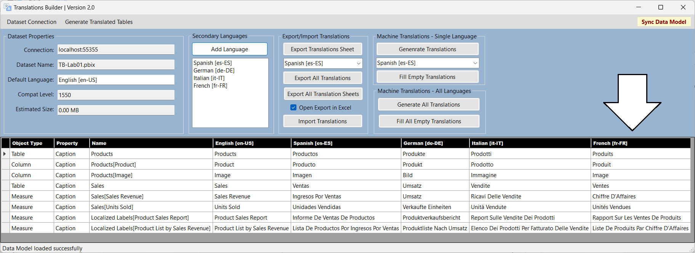

> Congratulations. You have now completed this lab.